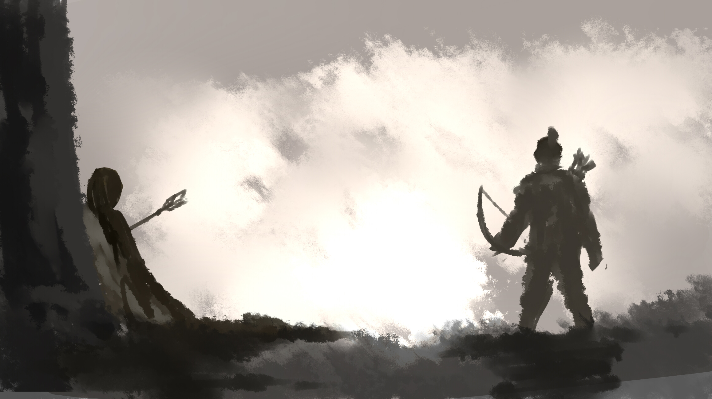
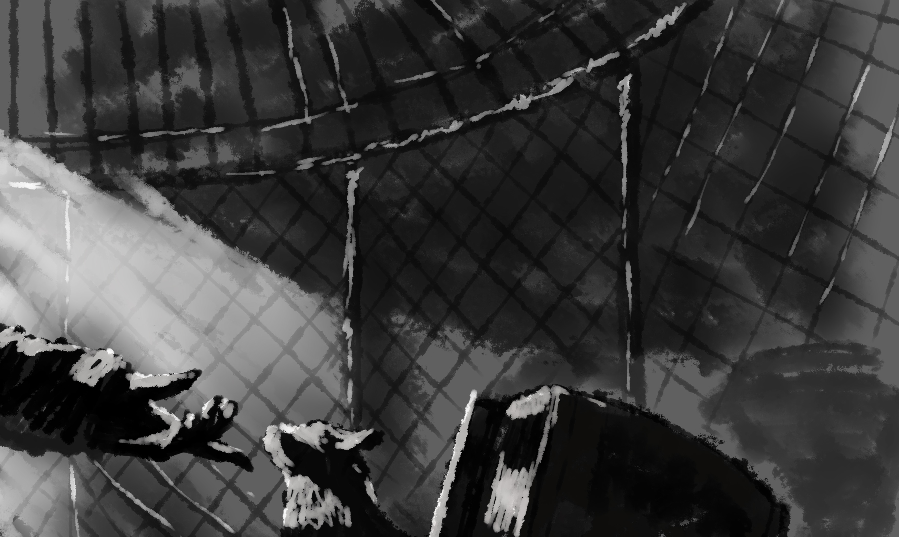
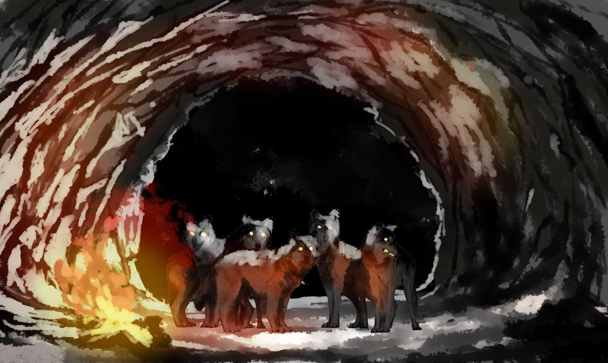
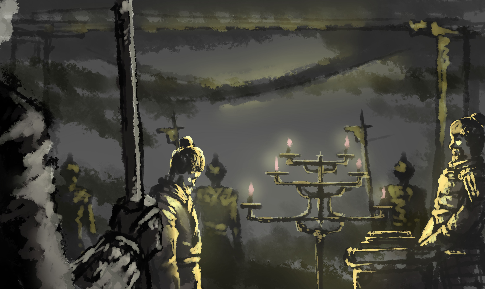
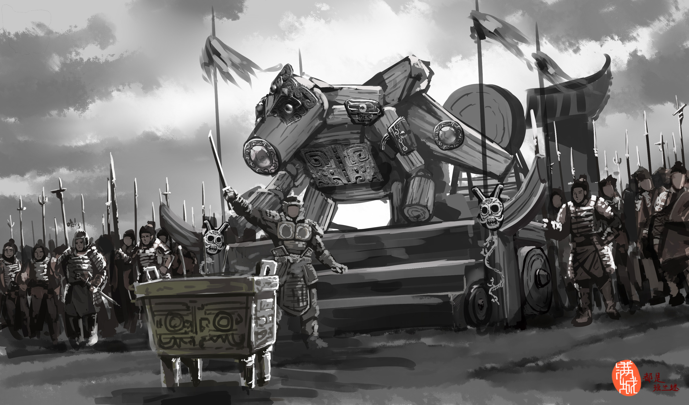

# 命运轮回（壹）

漠北的大草原上，及膝高的野草被徐徐秋风吹得摇摇晃晃，夕阳下，远处传来了一阵马蹄声，越来越近，“哒哒哒哒……”一个腰背弓箭的汉人士兵正骑着骏马驰骋在草原上，西下的落日把他的影子拖得很长，他姓赵，是蒙古大军中的一员汉弓手，在蒙古人手下拼命已经有一段时间了。虽然和南朝皇族同姓，但其实他和那群人并没有关系，至少， 一百多年前，那些皇族们就已经抛弃了他们逃到了南方。他原本是一个读过书的金国秀才，因为得罪当地豪强，家里无奈得把他送到军营避难，因为眼神好，且体格健壮，他的箭术与日俱进，虽不及射雕手那样百发百中，却也足以惹人惊叹了，他在金国的一名将军手下担任过百夫长，并担负守卫着金国北境一个城池的任务。几年前，面对来势汹汹、如乌云一般席卷而来的蒙古大军，将军不想让部下做无谓的抵抗，也同时为保全城中百姓性命，他选择了主动开城投降，因而得以被保留了编制、辎重，继续为蒙古人效力，其中便包括这位赵姓百夫长，还有他的马，他的弓。

对于赵百夫长而言，这似乎并没有多别扭和值得奇怪之处——自己不过是从为金人拼命的汉人变成了一个为蒙古人拼命的汉人而已。虽然他以前读过的书教过他“忠君爱国”“君君臣臣”之道，但此时的他更喜欢用“良禽择木而栖”“君子不立危墙之下”来安慰自己，亦或是麻痹自己？即便南边有一个汉人建立的王朝，然而这对他而言，就好比是对蒙古人一样陌生。一切都如此的顺理成章，几年来，他们的部队总是站在蒙古军阵的最前面，担任着大军先锋，准确来说，在蒙古人挥师向北，发起似乎漫无目的西征之后，他们便成为了蒙古人在中原的征服力量的主力，着实立下了赫赫战功。在连年不断的征战岁月中，他总是对所遇的敌军耿耿于怀——他们和自己还有部队里大多数人一样，穿着同样服饰、束着同样发髻。百夫长逐渐出现焦虑不安的状况，他说不出这种感觉是什么，或许是自己杀的人太多了？亦或许是在梳着奇怪发型的蒙古人面前低三下四太久了？而有一件事，成了压垮他的最后一根稻草。

在一次战斗中，他独自一人远远开弓，纤长的箭拖着羽尾射中了一位在城墙上守城的老人，那个老人握着插在自己胸口上的箭摔下了城墙，而墙上，一众妇女老幼呼喊着、嚎哭着。蒙古人的总攻号角被吹响了，在这座连妇女老幼都登上城墙进行绝望抗争的城里，再没有奇迹能抵挡这如潮水般的蒙古军队了。

赵百夫长坐在马上长吁一口气，但看见摔下城墙的老人动了一下后，他又突然紧张了起来。蒙古人的一发石弹精准地砸开了城门，不善近战厮杀的他这次却纵马冲在了前面。而在别人涌进城池的时候，他却骑着马来到了墙根边，此时此刻，除了这位敌军的百夫长，再也没人留意到这位可怜的老人，他还没死…………他摔在城下，那一堆仍未腐烂的尸骸堆中，他仰天缓慢挪动，挪到了墙根下，背倚着城墙坐了起来。百夫长骑马来到了他的面前，坐在马上的他俨然是一副胜利者的姿态，但脸上却挂满了愁色……

他看见了，那个老人紧紧握着射中胸口的箭，从伤口和口鼻中喷涌而出的鲜血，染红了穿在身上的服装，和他身上一样的服装。老人摔下来时撞掉了发髻的束绳，披头散发地坐在墙根边，奄奄一息。老人喘着大气，死死地盯着他，百夫长的战马忍受不了尸体的腐臭味开始不安分起来，他抖抖缰绳、轻抚战马以让它镇定下来，但却一直和这个死死盯着他的老人对视，他此时此刻竟然被老人那深入骨髓的目光惊出了冷汗。老人缓缓举起右手，费力地指着他，努力地想张开口，但未等说出话来，鲜血便再次从口中流淌出来，随后举在面前的手也无力地摔下、摔到满是血污与碎片的地上。那个老人死了……眼睛没有闭上的死去了，他的眼角滴落了几滴泪水，从被鲜血染红的脸上划出了两道泪痕。

百夫长下了马，拾起老人的束绳，像是没有听到城内一阵阵哭喊和杀戮声一样，为老人绑好发髻。直到他的手离开那正在逐渐冰冷下来的躯体时，他才意识到，自己做了什么。

比起蒙古人奇怪的发型，他似乎更喜欢绑在他和这个老人头上的发髻。

“君子正冠而死”——父亲在成人礼上说的话，忽然就浮上来他的心头，尽管那快遥远得像是自己未曾听过一样了。

他撕下一块布，试着擦去藏在老人脸上皱纹里的尘土，却好像让那张怒目紧张的脸更脏了，只得轻叹一声，轻抚老人的眼皮好让他瞑目。百夫长站了起来，死死地闭上了双眼，良久才艰难的再次睁眼，他翻身上了马，往已经血流成河的城中走去……

自那以后，每当夜深人静之时，他的脑海中经常浮现出那老人的死状，甚至无数次的因此从睡梦中惊醒。

这一天的半夜，他再一次梦到了同样的景象，掐断了他的沉睡，回过神来，赵百夫长发现月亮已经挂在草原夜空之中，今天是满月，浑圆且明亮的月亮洒出一道道银色的月光，将草原照得亮堂堂，地上好似铺满了一层白霜。数月之前，他所在部队被调到漠北草原内部，对他来说，颇有种失去了利用价值的感觉——因为没有了战事，无聊的他只能骑着战马在草原上驰骋，以缓解自己的烦躁。他有点想念自己的家乡，想念那些和自己说着同样的话的人，想念自家的老父母，想念上元节吃过的菜。事实上，他也不知道自己跑到了草原哪里，但他并不会害怕迷失在草原里，因为顺着河流走，总能见到几个蒙古牧民，再靠着学来的撇脚蒙古话就能找到部队，至少前几次迷途之时，这一招他屡试不爽。

他爬上了一个较高的山包，草原的夜十分静谧，然而还未等他回过神来享受夜晚的美景，就发现远处传来了一阵阵微小的厮杀声——在草原腹地也有厮杀？他疑惑不解，揣测了最坏的打算，并策马冲向了声音的源头。

半柱香的时间后，他没能意识到自己已经闯进了蒙古大帐的辖区，看到这几顶华丽的大帐被战火和喊杀声包围，源源不断的蒙古骑兵和侍卫还在一批一批地冲向那里，他不禁打了个寒掺，但好奇心驱使他决定再接近一点以观察发生了什么，百夫长把自己的战马安置在这里，自己爬上了一个不太陡峭的山崖，而此时此刻，他并没有发现背后的满月出现了异样。他已经接近了一个足够观察大帐的距离，喊杀声和……奇怪的“踏踏踏”的声音也越发清晰，站在高处，他清楚地看到，一群奇装异服的人和巨大的怪物被如潮水般的蒙古大军团团围住，中间独自站着一个泰然自若的人，没有头发，如僧侣一般，还不时得指挥着其他怪人；最外围那十几个奇装异服的人手不仅刀枪不入，还手持着会发光的剑和能射出火光的法杖，巨大的几个人形怪物高出蒙古人数倍，眼睛发着荧光，身上长满犄角，活像阎罗王，挥舞着手中发光的长刀向蒙古人砍去，被他们击中的蒙古人无不断成两截亦或是粉身碎骨，很快，怪人们的四周便被尸骸和断肢所包围，白金色的大帐已经被鲜血染红，在火光和月光的映衬下，显得无比骇人和惊悚。蒙古人仿佛被血之浪潮所淹没，如同在烂肉中翻滚的蛆虫。此情此景已经超越了百夫长的理解范畴，他被震撼得说不出话来，只觉得此情此景宛如人间地狱。

厮杀还在继续，哦不，屠杀还在继续，一柱香的时间？半柱香的时间？不知道过了多久，那一声声喊杀声逐渐变成哀求声、哭喊声，一群群外围增援而来的蒙古人继续涌入大帐营地，内侧的蒙古人却因为惊惧极力向往外奔逃，相反的人流撞在一起，营地内乱作一团，蒙古大军就像被狼群驱赶着的待宰羔羊，毫无秩序地簇拥在一起，发出阵阵悲号。

而此时此刻，百夫长听见背后的天际，传来了一阵阵“咻咻咻”的声音，他的心中被恐惧充斥——它们发现我了吗？他慢慢转过头，发现天边本是圆形的月亮已经变成半月，是月食！月亮似乎也化为血色，血月？从云层中冲出了数个像鸟一样的‘十’字型怪物，他们的身后带着长长的蓝色火焰尾巴，就像流星一样，但排列得如大雁般整齐，快速地从他头上俯冲了过来。他赶紧匍匐在草地里，想掩藏自己，像一个无助的孩子一般，连大气都不敢喘。

而真正的杀戮，其实现在才刚刚开始…………

只见那几个盘旋在月色下的“流星”怪物飞近蒙古人时，却突然像陨石般直直坠地，在最外层的蒙古人群中“挤”出了一个个小空地，这一切就发生在他的面前不远处，百夫长在山崖上远远地望着，怪物在山崖下驱逐着蒙古人，他敏锐地发现，这几个从天而降的怪物变成了长吻，长着双翼，四足的惊骇模样，脚下踩着火花。他无法形容自己所看到的一切，只记得自己以前在机缘巧合下听说过这种在《史记》中就被记载了的怪物：

“天狗状如大奔星，有声，其下止地类狗，所堕及炎火，望之如火光，炎炎冲天。其下圜如数顷田处，上兑者则有黄色，千里破军杀将。”

“天狗！是天狗！”伴着血月的逐渐残缺，月光也逐渐黯淡起来，他恐惧地喊了出来，但很快就用手捂住了自己的嘴，颤抖地蜷缩在草地上，死死盯着远处那几个“天狗怪物”。只见那几只“天狗”除了头上的眼睛以外，肩上还有一双眼睛，那双眼睛闪着蓝色的火光，倾泻一阵阵火焰，在天狗面前的蒙古人一个个应声而倒，但那几个天狗怪物仍没有停止杀戮，它们从外围排列着整齐的队伍向大帐营地内进发，在它们面前的蒙古人，不管是在逃跑还是在反抗，无不在蓝色火光的闪烁中倒地而亡，蒙古士兵们被营地内部的一群怪人和外围的天狗怪物进行着单方面的屠杀，遍地都是四散飞溅的断肢与四分五裂的尸骸，鲜血竟然染红了山崖下的草地，汇成了小溪流入了河中，想来在经受血液的灌溉与尸体的滋养后，来年此地的牧草将会格外茂盛。

天狗怪物们在人群中清出了一条血路，向营地内那群怪人飘去，剩下的蒙古人已经无力再阻挡那群怪物前进，能跑得动的人一哄而散，不能跑的蒙古人也在拼命地在尸山血海中爬出了营地。消失的月亮再次出现，但变成了血一般的颜色。

一切……又恢复了平静，在血色的月光下，大地竟然再度恢复了静谧，哦不，是诡异的静谧。

他呆呆地趴在草地上，已经说不出任何的话了，脑子似乎也停止了思考，那群奇装异服的人开始停止杀戮，为首僧侣模样的人拍了拍刚刚踏过蒙古人尸体而接近他们的天狗的头，一阵白光闪过，他被闪得闭上了眼睛，当他再睁开眼睛时，那群怪人和天狗，都消失了。山崖下，只有一堆堆蒙古人的尸骸，如同小山般堆积在已经被染成红色的草地上，还有一条被血染红的小河。

他懵懵懂懂地缓缓站了起来，除了自己脚下的草地，眼前的任何场景都变成了血红色，他喘着大气，急迫地喘息着。

他脑海里有闪烁出那个被他射死的老人的惨样…………

此时，他突然听到了背后有异响，百夫长的脸上刹那间变得无比惨白，冷汗如雨滴般掉落，面颊上的汗滴流淌到下巴，然后滴落在草地上。迟疑了一会，什么都没有发生，他缓缓转过头，却发现只是他本来放在远处的战马走了过来，可他并没有在看到是自己的战马后放松下来，相反，而是反常的哀嚎起来…………

“啊！！！！！！！！！！！！！！！！”

他的战士意志已经荡然无存，仿佛变回了曾经的那个柔弱书生。

哀嚎声响彻山崖，在山谷中回荡，他身边的战马被惊得跃起，可他并没有安抚自己的战马，而是迅速跨上马鞍，策马向远处的地平线跑去。

“天罚！！！！！！！是天罚！！！！！！！！！！！！”他崩溃了，怒吼着、面目狰狞地纵马疾驰，消失在地平线上。

那一夜，几乎所有的蒙古高层都被那个“天神”化为尘埃，同样的，无数蒙古军主力和侍卫也陨落于此，葬身在漠北的草原上。

空旷的草原上，夕阳依旧，沿着一路被踩塌的野草，能看到一人一马缓慢地走着。距离那个恐怖的月食之夜也就几天过去了，百夫长已经在漠北草原逃亡了几天，草原是如此的大，大到似乎他再怎么走都走不到尽头。

遭遇恐怖经历的那晚之后，他回到了军营，却发现部队已经撤走，穿过满是垃圾和杂物的废弃营地，来到营地校场，却看到在旗杆上挂着几具被吊死的尸体。下面用着蒙汉双语写着“蛊惑军心者杀、叛逃者格杀勿论”。他无法想象，军队撤走的时候得有多么混乱，更无法想象他若是在部队撤走之前回到军营，并说出他看到的一切，旗杆上会不会多一具尸体。

根植于对“天狗”的恐惧，他并没有再想那么多，只想着离开这个是非之地，这次的撤离如此混乱，或许是因为将军也听到了风声从而带着军队跑掉了。这些被吊死的倒霉蛋不过是用来稳定军心的替死鬼而已。事到如今，失去了与军队的联系以及自己上司的庇护，以后一切的一切都得靠自己了。天狗再怎么凶恶，此时此刻应该也还在追击大部队，属于自己的“天罚”应该还没降临，现在他唯一的任务，就是逃，不择手段得逃，而逃亡之路上最不能缺的，就是食物。

“凡是立过战功的人，无论因何而亡，只要带回来了尸体，都给他放几个胡饼供着，黄泉路上也不能让他饿了肚子。”这是他部队的将军在金国时就立下的规矩，此举确实是让下面那些视死如归的士兵们产生了一丝丝的归属感。但带回尸体这个条件太苛刻了，大多数时候的胡饼，都是给病死在军营里的老兵或者犯事被处决的罪兵，久而久之，这胡饼也就没多少人想要了。但此时的他那里管得了这些？他的脑子已经被饥饿占领，动物的本能驱使着他的眼光扫过旗杆下的高台。果然，他隔着旗杆，发现在台子上的另一边，垒着很多的胡饼。他激动地跑了过去，却被围在旗杆高台四周的拒马挡住了。

他没有多想，拖着疲惫的身体一点一点挪开堵在面前的拒马，冲上旗杆下的高台，翻到了另一面，但不慎被木板绊倒，重重得摔在了高台上。

“啊！”

他痛苦地在台上挣扎了一下。但发现自己刚好摔在这堆胡饼的面前，他没有站起来，而是快速爬了过去，趴在地上拿起不知道多少块胡饼，狼狈地塞进了嘴里，把两腮都撑得鼓鼓的，没有咀嚼、没有停顿，就往肚子里吞。或许是趴着吃东西难受，他吞了几口后坐了起来，大口大口地啃着胡饼，因为被噎住了，他不知轻重地拍了拍自己的胸口，胡饼渣子从他嘴里一块一块掉出来。因为塞了太多的胡饼，他饥渴难耐而且难以下咽，便抄起面前给这群死人的祭酒，大口地喝了起来。

壶里的祭酒逐渐见底，他为了喝到剩下的酒，只能仰头倒灌。然而，他的视线，却被面前旗杆上这双华丽的靴子吸引。顺着靴子向上看，一个死状凄惨无比的男尸出现在他的视线里。男尸双目就像要爆出来一般，布满血丝，瞳孔失去了亮光，甚至开始发白。脸上的肌肉块已经凝固了，凝固在他死亡时狰狞的瞬间。嘴巴张得特别大，舌头好像一只大蛇一样冲出口腔。这是一个熟悉的面孔，面前这具冰冷的尸体，是他的上司，他家里人拜托照顾他的人。

酒壶脱手了，摔在地上，把剩下的酒全洒了出来。

百夫长的嘴张的特别大，大到嘴里的食物掉到了地上，他颤抖了起来。

他颤颤悠悠地仰躺下来，迷茫的嚎啕大哭，一切的一切都在一夜之间变得如此陌生，此时的他比任何时候都感到绝望与无助。

他的上司是所有被吊死的人里官职最高的，想必这一堆供奉的胡饼中，起码一半是属于他的。这位在战场上冲锋陷阵、果断杀伐、投降蒙古之后也拼命履行命令，而且爱兵如子的老上司，最终没能如愿地死在战场上，而是死在自己人的绞绳下。讽刺的是，老上司即使是死了，也在用胡饼“照顾”他，将他允诺过的事情履行到底。

他开始胡思乱想，精神崩得紧紧的。一夜之间的剧变冲击着他的大脑，此时的他睁开眼睛看到的是他老上司狰狞的死状，而闭上眼睛脑子里全是之前死在墙头那个老人凄惨的死状。

“将军杀了太多人……天罚……天罚已经降临了。”他吞吞吐吐地说着，恐惧属于自己的天罚的到来，望着他面前死状狰狞的上司，他想再做一点什么报答这个照顾了他这么多年的人，尽管一切都太迟了。他最终跪了下来，磕了三个响头，然后站起身，伸出发抖的双手想让男尸瞑目。

“快逃！”男尸突然用突出的双眼望向他，张开的嘴巴中似乎透出一句话？

幻听了吗？

“啊！！！！！！！！！！！！！！”百夫长刚刚伸到男尸脸边的手抗拒地弹开，一个踉跄摔倒在高台上，然后迅速地缩起身体，双手抱头地蜷缩在高台的角落。

良久，什么也未曾发生，他喘着大气，吞了一口唾沫，强装镇定地放下挡在眼前的双手。一切都没有变，男尸也没有看着他，原来只是他的幻觉，此时此刻只有几只苍蝇在胡饼上盘旋。他一跃而起，挥手赶走苍蝇，迅速把剩下都胡饼都揣进衣服，连滚带爬地下了高台，头也不回地冲向营门，跃身骑上战马，向远处奔去。

这茫茫的大草原似乎比以往更加的荒凉了。天空中的太阳不知又东升西落了几次，几队大雁排列着整齐的队伍往南飞去，而下面则行着一个满脸沧桑的人。

百夫长身上的衣服和皮甲布满了灰尘，因为长期担惊受怕导致的神经衰弱，让他仅仅在几天的时间里就苍老了几岁，皱纹爬满了脸，眼神黯淡无光，胡子乱糟糟，发髻虽然没有掉，但一条条发丝早已挣开束缚，垂落在头上。或许，他和路边乞丐唯一的差别，就是这头上的发髻了吧……

他与他的战马早已精疲力尽——这几天的逃亡是没日没夜的，人或许还能坚持住，但战马是绝对不能如此长途奔袭的。

看不到尽头的草原让他仿佛失去了灵魂一般，如行尸走肉般走向南方。他不知道自己有多渴望……多想要能有一个安全的地方，一张舒适的踏床，能让他躺倒在上面，卸掉一切的疲惫，他的意识渐渐虚弱，视线渐渐暗淡。突然，带血的天狗怪物在黑暗中转过头来盯着他。他突然睁开眼睛，眼前在黑暗中的天狗被夕阳刺破消失。又是这样……他在马背上绝望得仰着头，这症状已经越来越严重了，严重到闭着眼久一点点都不行，闭上眼，那怪物的样子就出现在眼前。

他看了看前方，却发现了一点异常——远处一点奇怪的圆型吸引了他的注意力，他紧张又疑惑地坐在马上，把头探的很前，眯着眼，试图远远望清楚那个奇怪的东西是什么。

远处的白点越来越大……是一个不大不小的蒙古包！刹那间他欣喜若狂，仿佛在久旱中找到了一眼溪泉。“驾！”他激动地用马鞭抽着马腿，胯下的战马因为疼痛而蹦了一下起来，原地踉跄了一下，卷开及膝盖的野草冲向远方，只留下一路被踩弯的嫩草。

前方的蒙古包越来越近，他也越来越激动，像抓住了救命稻草一般，他已经迫不及待地想进入这个蒙古包，在主人家的照顾下休息一晚，忘掉那些恐怖的东西。

百夫长逐渐失去理智，挥舞马鞭的频率也越来越快，他的战马已经精疲力尽，再也不能维持这么快的速度，战马喘着大气，速度逐渐慢了下来，四条腿青筋紧绷，他甚至能听到战马发出的呜咽声。

离蒙古包越来越近，自己的战马却越走越慢，他地夹紧着马背，变本加厉地抽打着挥舞着马鞭，“驾！！驾！！”他嘶吼着、责骂着、疯狂地嚎叫着。“驾！！驾！！！”马鞭抽得越来越重，抽得马腿血肉模糊，鲜红的血液顺着马腿流了下来，染红了后面的足迹。

一步……两步……三步……蒙古包就在他的眼前，已经到了近乎触手可及的距离，他的嘴扭曲地上扬，幻想着受到牧民款待的情景。但还没等他跳下马，胯下的战马便轰然倒下，把骑在上面的他重重地摔在地上。他下意识地在地上翻滚了几圈，以缓冲摔下来的伤害，却撞到了蒙古包旁边拴牲畜的木桩上，摔了个七荤八素的百夫长回过头来，却发现那匹陪伴他征战多年的战马，已经奄奄一息的倒在蒙古包前。

它双眼圆睁，舌头从嘴里伸了出来，口吐白沫，右后腿早已被马鞭抽得血肉模糊，他终于意识到自己刚刚做了什么，百夫长顾不上浑身的阵阵痛感，紧张而又懊悔地爬到了战马身边，抚摸着青筋暴起的马脖子。

“对不起…………对不起…………兄弟”他越说越快，却想不出别的话来。

“兄弟……某求求你……别这样……兄弟……对不起……某错了……别死好吗？别死……”他恳求着，却断断续续地啜泣起来。

战马发出了一阵痛苦的嘶鸣，后腿突然踢了一下，便直挺挺地悬在空中，慢慢地落了下来……

再也没有了战马的喘息声……

“啊！！！！！”他趴在马身上嚎啕大哭了起来，他这才明白自己刚刚犯下多大的错误，求生的欲望撕碎了他的理智，让他变成了一个只为自己而活的野兽，让他不择手段地生存下去，即使是逼死他最亲密的战友也在所不惜。

夕阳渐渐接近山包，金色的晚霞洒在苍茫的草原大地，将洁白的蒙古包点缀得闪闪发光。蒙古包边上，一个无神的男人呆呆地跪在死掉的战马身边，整个草原，仿佛只剩他孤身一人。

蒙古包内一处阴暗的角落，蜘蛛静静地趴在一个大陶罐旁的蜘蛛网上，一只毛茸茸的小动物颤抖地躲在陶罐里，仅仅露出鼻子小心翼翼地探向外面的一点光芒。突然，一声声“咯吱、哗啦”的挪动声把它吓得缩进陶罐里。远处的光点越来越亮，也越来越大，一个人影出现在那里。

是他搬开了堵着蒙古包的门，百夫长走进了这个蒙古包，令他惊讶的是，里面的东西大都堆放得很整齐，但已经有了一层浅浅的灰尘，还有刚织的蜘蛛网，但却不见有一个人，这十分反常，因为他在漠北生活了这么久，很清楚只要有蒙古包在，里面至少有一个牧民在守着，而牧民要走的话，会把蒙古包拆掉一起搬走。眼前的一切，都如此的奇怪而反常，他敏感的意识到，这个蒙古包的主人可能遇到了一件很紧迫的事情，以至于他离开的时候甚至来不及收拾自己的屋子，甚至可能已经在某个地方遇害了。

想起自己那一夜的遭遇，与之后在军营里的所见所闻，他相信这一切都可能发生。“天罚……天罚降临在他们身上，这个屋子的主人，或许发现那些天狗怪物追杀了过来，连自己家里的这些物资都未曾来得及收拾，便急冲冲地骑马逃走了。”他尝试说服自己，随后便躺在了满是灰尘的毛毯上，但他顾不上有多脏，因为他现在早已狼狈不堪，百夫长喘着大气，身体久违地得到了放松，他的眼光一撇，却发现旁边的一个倒下的大陶罐稍稍动了一下……他翻过身，右手放在腰间握着匕首，一点一点地挪向那里，头紧紧贴在地上，盯着大陶罐黑暗的内部。

一个毛茸茸的小脑袋伸了出来，是一只饿的瘦骨嶙峋的小狗。他长舒了一口气，“哈哈哈……”沧桑而又憔悴的脸上露出了久违的笑容，他从胸前的口袋摸出一小块胡饼，捏在手里，伸到大陶罐前，这个小小的脑袋闻了闻他手中的胡饼，便咬住了这块不可多得的食物。百夫长顺势把这个小家伙从陶罐里拉了出来，虽然这只小狗还很怕生，但求生欲驱使着它狼吞虎咽地吃着这块胡饼。

这个可怜的小家伙的主人走的是有多匆忙，以至于连自己的家都没有收拾，更别说这只可怜的小狗，它便被关在了蒙古包里，直至今日。

他把在吃东西的小狗抱在怀里，喃喃着、抚摸着，两个孤独的灵魂在此时此刻都得到了依靠。他们是如此的相似，被自己依赖的人抛弃，被饥饿占据大脑，还有孑然一身。

百夫长怜爱地抚了抚小狗的头，他把手便伸进怀里，但什么也没有摸到，他这才意识到什么，从废弃军营里带出来的胡饼已经被吃完了，他甚至想从小狗嘴里掰下一块，但手尚未伸过去，小狗便把这块胡饼整个吞掉了。

“诶！你都不嚼的吗？”他有些急躁且无奈地说着，并轻轻摸了摸它的脑袋，他突然发现了异样，翻过手掌，百夫长发现自己的右手上粘着很多黑色的粉末，他再搓了搓手指，然后放在鼻子下闻了闻。

“炭？”他把小狗放到一边，将倒下来的陶罐扶正，把手进陶罐里掏了一下，“木炭！”他欣喜若狂，好像握住了救命稻草一样，再看了看附近，还有好几个这样的大陶罐堆着在墙边，里面都放着木头、木炭，其中一个还放了生火的燧石和火绒。

他激动地往屋子中心的火坑里倒了一堆煤炭，然后娴熟地生起了火堆，之后，便缓缓走出了蒙古包。

太阳已经落入山后，只剩那一片黄白，他站在他曾经的战友——那匹朝夕相处的战马的尸体前，神色凝重地发着呆，小狗也偷偷跑了出来，好奇地看着他。突然，他猛地跪倒在尸体前，磕了几个响头，把小狗吓得躲进了帐篷，只探头看着他。恐惧和饥饿让他丧失自我，帐篷和小狗让他恢复理智，他此时非常清楚，现在已经没有剩余食物了，而能利用的，只有战马的尸体。

他抽出腰间的匕首，狠下心来，将匕首插入了战马的尸体……

多么像他的老上司啊，即便是死了，也在“照顾”着他……

深夜的草原，繁星点缀着夜空，从地平线远端刮来的微风吹得野草起起伏伏，偌大的天地间，只有一点火光在黑暗中闪烁。

火堆旁的他，正忙着处理剔下来的马肉，十分庆幸蒙古包里的材料充足，这些肉只要及时做成烟熏肉，那足够支撑他逃出漠北的草原，小狗爬在烘干了的马皮上熟睡，有了这个蒙古包的庇护，此时此刻的他比之前逃亡时的任何一天过的都要安心，踏实。战马的内脏和骨头被他葬在蒙古包的旁边，这或许是他能为战友做好的最后一件事。往木架子上挂上最后一块马肉，他疲倦地躺倒在毯子上。尽管他恐惧着梦中会再次出现天狗怪物，但此时的他，已经完全顾不了这么多了，“怪物若是来了，那便死掉罢了”他本能的安慰着自己，最终闭上了眼睛……

---

他独自在黑暗的山洞里走着，慢慢走进深邃的黑暗里，石壁上渗出的水珠滴落下来，响声在原本安静的山洞里回响到他的耳边。他屏住呼吸，不断得深入，即使他不知道为什么会这么做。

“飒——”

一阵异动惊到了他，只见眼前出现无数个发光的红点，他感受到了无以伦比的压迫感，冷汗一阵阵得冒了出来，而随着光线慢慢变亮，映入他眼帘的，是数只面目狰狞的天狗怪物。发光的红点，是天狗怪物脸上和肩上的四只眼睛。他与怪物们隔着一段距离相互望着，诡异的气氛蔓延开来。他紧张的深呼吸起来，膝盖弯曲，把脸正对着怪物一点一点得后退。而那群天狗怪物也开始慢慢向他移动。他后退的速度开始逐渐加快，但怪物们依旧紧跟着他不放。

突然，他的脚好像被什么东西牢牢固定住一般不能动弹，他本能地低下头，却发现两支血手死死得抓住他的双脚，只见左边一个双眼突出甚至开始掉落舌头像蛇信子一样吐出的男尸，那是他的上司。右边一个披头散发，满脸是血，眼睛翻白而面目狰狞的男尸，那是被他射杀的老人。

“啊！！！！！！！”

他惊恐得呐喊着，双脚想挣脱束缚，却因为重心不稳而坐到了地上，面前的天狗怪物见到此情况，发了疯的冲过来扑住他，在他面前张开了血盆大口！他无助得用手臂挡住脸，害怕见到怪物们的狰狞面目。

突然，面前的一只天狗怪物舔了他一口……

---

他猛地睁开眼睛，明媚的阳光从门缝中照在他的脸上。那只小狗正在焦急地舔着他的脸，一线阳光从缝隙里照进了房间，洒在他的脸上——原来已经是新的一天了，他一个激灵坐起来，摸了摸小狗的脑袋。虽然昨天还是做了噩梦，但已经是他从逃亡开始睡得最香的一次了。

短暂的安逸并没有让他松懈下来，他很清楚自己如今的唯一使命——逃，向南逃。

离开之前，他在这个蒙古包里翻遍了每一个角落，希望能得到一些对自己有用的东西。在角落里一个很小的坛子里，他翻出了六小块碎银与几枚铜钱，虽然现在远离人烟，但他觉得逃亡路上，迟早会遇到需要用钱解决的问题，往南走，定然会遇上人。他把银钱揣进怀里，眼睛的余光却发现旁边正竖放着一个可以拖行的撬车。

意外之喜！他惊喜地把撬车拿了出来，把做好的、已经裹在马皮革里的熏肉和剩下的煤炭放上车，拉出了蒙古包。他走到马冢前，郑重地磕了三个头，然后便把小狗抱上撬车，拉着撬车消失在延伸至南方的茫茫草原上。

太阳与月亮在天空中来来回回，漫长的逃亡消磨了他的时光，不知已经过来多少个昼夜，不知他的双脚丈量了多少漫漫长路。白天赶路，晚上找地方休息，在洞口、在谷底、在山包上、在岩石后。军人的体魄和意志让他在如此恶劣的环境中仍能艰难的活下来。多年戎马生涯，让他早已忘记自己曾经是个读过书的秀才，即使他能想得比普通人更深一点，但在这个由蒙古人统治的底层军营里，这些又有什么用呢？

即使有一只小狗的陪伴，他依旧感觉很疲惫，这种疲惫更多的是心理的疲惫。疲惫到出现了一丝丝的侥幸，逃向南方的念头时常会被突然的“说不定天狗已经走了，不会回来。”念头冲击着。看着陪伴着自己的小狗一天天长个，自己也有一点慰藉，陪伴，让他保持着人性，不至于被脑中的怪物撕裂理智。

今晚的休憩点，是一个天然的山洞。他很欣喜发现了一个别致的小山洞，洞口朝向南方，能在夜晚保证空气流通的同时避免来自北方的寒风。他熟练的往山洞的一个角落铺上马革，在一边围上石头生起篝火——就像之前的每一晚一样。

又是月朗星稀的一晚，银色的月光撒满草原，点点星光洒布天空，底下的野草随着风摇晃着，远远看起来就像被风吹动的银色毛毯。景色别样的美丽，但他却觉得不寒而栗，这样的景色，总能让他想起那恐怖的一晚，那一幕幕血腥的惨状，还有那群恐怖的怪物。

百夫长不敢再多想，回到篝火前用手上拥有的食材做着今天的晚饭。得益于他的行营经验，他能在野外辨别并采集可以食用的植物，寻找露水和泉眼，这也让他今晚的晚餐十分的“丰盛”。香味从陶锅里蔓延出来，炊烟从洞口散出，小狗静静地坐在旁边看着，此情此景让他放松且愉悦了起来，长时间枯燥的赶路，着实让他怀疑自己当初的想法与决断。几十天的赶路，他应该即将走出漠北草原，这几十天的赶路中，除了自己吓自己以外，就没有再发现任何的危险。他敏感急躁的心也逐渐安定下来，安定到他如今只想逃出这人迹罕至的草原，然后找一个地方躲过战乱，平淡的度过一生。

“怪物必然找不到我，说不定，这些事根本与我无关。”

他舒适满足地吃完晚饭以后，往篝火里摆上几根剩余的干柴和一点木炭，便躺在马革上陷入了梦乡，小狗也乖巧的趴在他的身边，蜷缩着闭上了眼。

——不知过了多久——

身边的小狗突然变得焦躁不安，仿佛魂魄受到了拷打一般，挣扎着从他的怀里蹦了出来，对着洞穴外疯狂吠叫。

百夫长被小狗的异状惊醒了，顺着篝火的光往洞外瞧去，所见之物把他吓得一个激灵站了起来。原本睡意刹那间消失得一干二净，身上的每一个毛孔都冒出寒意。他看到了，洞口站着数只野狼，正直勾勾得看着他。在篝火摇摇晃晃的火苗的映衬下，野狼们的眼睛发着绿莹莹的幽光，缓缓向里面走来。

他果断地从腰间拔出略微生锈的匕首，半弓着腰警戒着。野兽明明得避开明亮的火焰，但此时的狼群却一反常态得走向他。事实上，几十天的逃亡生涯中他是第一次遇到这种情况，即使是更久之前的行营打仗时，自己也是呆在安全的行营里，亦或是全副武装地和战友们一起，肆意围杀着这些所谓的“猛兽”，但如今，“风水轮流转”用来形容他此时的遭遇简直是再恰当不过了。

他的脑子一片空白，只是本能地向面前不远处的狼群架着刀。狼群与他隔着篝火对峙。

狼群呲着牙，流着唾液低吼前进，小狗在他面前用稚嫩的声音向狼群狂吠，全然不知它后面的主人已经因为恐惧在不断向后挪动。

瘦弱的小狗在狼群面前显得不堪一击，即使最前面的狼正低伏在地面上，也比小狗高出许多。他与小狗就像曾经被他与战友围入死路的猎物一样，绝望地对峙着强大的敌人。

悲剧意料之中得上演了，最前面那匹低伏着的狼，其实一直在准备猎杀。就在一刹那，它敏捷地越过篝火冲向小狗，咬住小狗的一只前腿，还没等小狗反应过来，它就已经把小狗拖进狼群。

那一刻，小狗才发出响亮而凄厉的惨叫，不断在狼群里猛烈挣扎，刹时尘土飞溅，碎石弹起。他终于在小狗的惨叫声中回过神来，大喝着冲向狼群，可没走几步却被狼群的吼叫喝住，他不知为什么，自己的双脚仿佛被禁锢一般动弹不得，小狗的惨叫让他理智清醒，可他却只能眼睁睁地看着面前的惨状。

狼群分工明确地施行着杀戮，两只狼分别咬着小狗的一个前腿和后腿往反方向拉，其余的三头狼扑向小狗撕咬着弱小的身躯，小狗因为撕裂的疼痛大声地悲嚎，滚烫血液开始渗出，染红了地面，纵使它万般挣扎却怎么也挣脱不开。嚎叫在空洞的山洞里不断得回响，将恐怖的气氛渲染到极致，就像一把把敌人的钢刀捅在他的身上。

啊，这所见之景象，竟然和他在蒙古包里做的梦如此相似，同样得被束缚住，同样得被怪物扑过来撕咬，只是这次，他变成了旁观者，可身为旁观者看到的画面却比身为亲历者看到的更让他恐惧绝望，刹时，他所恐惧的一切事物都仿佛从远端由小到大得冲撞向他，并不断伴随着一阵阵沉闷的幻响，那晚的血色、破碎的尸体、尽情杀戮四眼狰狞的天狗怪物、被吊死的老上司、被射杀满脸是血的老者，最后再是梦中扑向他的那只怪物，这带给他一种诡异到说不出来的震撼，并一直冲击着他的大脑。

较大的一头狼用力扑咬住小狗的脖子，一声清脆的骨头折断的响声之后，小狗响彻山洞的嚎叫戛然而止，血液染红了它的弱小的身体，狼群把他丢在地上，任凭它在血滩上无声地抽搐。小狗张开的眼睛失去高光，在一阵伸腿之后，咽下了最后一口气。伴随着篝火里的一声干柴炸裂声，山洞中重新恢复静谧。

整个杀戮的过程他在篝火的映衬下看得一清二楚，如此场面轰击着他的大脑，让他握住刀的右手在剧烈颤抖，他很想叫些什么，但仿佛喉咙被用钉子钉住一般怎么也喊不出声音。狼群将小狗分尸，并当着他的面大快朵颐，鲜血和内脏被撕扯得到处都是。他开始不受控制得大口呼吸，每一次吐气都伴随意识模糊和剧烈抖动，这种剧烈抖动从他的右手蔓延至他的全身。

“啊！！！！！！！！！！！！！！！！”

他突然从山洞的深处咆哮起来，本来安静下来的山洞再次被突然的巨响填满，刺入山洞内每一个生物的耳膜，狼群被突然的咆哮震慑住。或许恐惧到极致就是愤怒，他仿佛一点一点挣脱了锁链的束缚，一步一步地踏向狼群。一切都是下意识的，仿佛他被注入了一股热血一般，他的大脑被愤怒占据，红着眼睛，兽性被眼前的悲剧彻底激发。此时的他，就像曾经被他围猎的野兽，在绝路中奋起，向强大的敌人反击！

他冲到篝火的旁边，并没有停下来，而是迅速下蹲抄起一把燃烧的干柴，借助惯性奋力向狼群丢去。干柴带着火焰砸到狼群里，摔碎后带着火苗飞溅起来，把狼群吓得四散开。霎时，他冲刺着举刀一跃，整个身体砸在了一只离他最近的狼身上，手中的刀顺势快速刺入那只狼的胸口，深深得扎了进去。

就在小狗被吃剩的尸块前，狼的血液飞溅开来，沾染在他的身上。

“天罚！是天罚！这就是天罚，是叛徒的下场！”他不断得用带血的刀刺杀着身下的狼，脑中不断闪过之前的一切经历，脑中的一个想法如热泉一样喷涌出来，“杀光你们！”

如果把那晚的血色惨案和天狗怪物代入此情此景，那么一切的一切，都解释得通了。天狗怪物的屠杀，就像此时狼群对他和小狗的围猎。犬本为狼，近人为犬，近狼为狼。自己在给蒙古人效力，自己不过就是蒙古人的一条走狗。天狗怪物会屠杀蒙古人，更会和此时分尸小狗的狼群一样虐杀自己，让自己死无全尸。

一切就在电光火石之前，其他狼群扑了过来，他顺势往后退，胯下受重伤 的狼趁机挪入狼群，在其他狼的掩护下哈着热气一瘸一拐地跑掉，只留下地上一滩血迹。他瘫坐在篝火前，靠着石壁喘着大气，手一直在颤抖，尚在滴血的匕首也脱手而出，“哐当”地摔在地上。

到头来，小狗死了，自己却活了下来，往日的噩梦和经历一直回荡在他的脑海，对此时的他来说，这一切都是上天的旨意。

---

为什么天狗怪物会屠杀蒙古人的部队？天狗来源汉地传说，那必然守护汉地的神兽，屠杀他们，是因为他们是侵略者，烧杀抢掠，无恶不作。

为什么天狗将会惩罚他？因为他背叛了汉地的百姓和王朝，协助侵略者屠杀自己的同胞。

为什么几乎每天都梦见天狗怪物？因为上天提醒他，惩罚一直还在，也即将到来。

为什么会有狼群不惧明亮的火焰袭击了他？因为他松懈了，妄图逃出草原就找地方隐居，这不过是上天在警告他——惩罚逃避不掉，也终将降临到他的头上。

为什么狼群的袭击只把小狗杀死？这还不清楚吗？这是上天告诉他！这就是叛徒的下场！

那……怎样才能获得上天的饶恕，让惩罚不至于要了他的命？犬本为狼，近人为犬，近狼为狼。如果小狗回归狼群，而不是为我而战，那它就是一头狼，它就不会狼群分食，死的人也就只是我。

所以，我该怎么做？赵百夫长思索着，捂着脸沉思着，作为汉人，回到属于汉人的军队……就像让小狗回归狼群，背负真正属于自己的职责，保护真正需要保护的人。这一切，都是神的旨意！

一句句反问和回答，就像钢印一般钉入他的思想，他已经不清楚自己是疯了还是依然保持理智。只觉得，他活着的使命，就是遵从神的旨意，让神兽饶恕自己的恶行，他在一阵阵深呼吸中失去了意识……

遵照神谕，保国安民，赎清罪孽！

---

黄河之水滔滔不绝，迸涌向远端，雄壮的场景和某位诗人所写“黄河之水天上来，奔流到海不复回”如出一辙，一位黄河上的老摆渡正把自己的羊皮筏子荡到一个站在岸上的年轻人面前。

距离他在山洞里遇险那一晚，已经过去了快一个月，就在那晚之后不久，他成功地走出了草原，用自己的双脚逃出了天然的牢笼——即便那儿广袤无垠得不像是牢笼。之后的他在逃亡的路上遇到了几户人家，幸亏他之前拿走了蒙古包里的碎银，正如他当初所想，他终究还是遇到了需要用钱解决的问题。百夫长向村民买了干粮，换了件新衣服，也把自己乱糟糟的头发和胡子打理了一番，他渴望改头换面，与曾经罪孽无比的自己划清界限……

“我是汉人，我该去哪儿？”他总是迷茫得问。

“往南走……有个国家，叫宋、大宋……”村里的老者回答道。

如今，他已经往南走了不知道多久，却被一道天堑阻隔了去路，涛涛的河水浩浩汤汤的冲向东方，势不可挡，如此的河流，或许也只有经验老道的摆渡才能把握渡河的诀窍。正当他在河岸发呆时，那个老摆渡娴熟地将羊皮筏子靠在他的面前。

“年轻人，过河吗？”老摆渡打量着这个没等他说完话就登上筏子的年轻人。

“过！”

“好嘞~过大河嘞~”伴随着一声吆喝，小筏缓缓离岸，在湍急的、土黄色的河中向对面那片苍茫大地“游”去。

“老伯，此处……是大宋吗？”他躺在船上，望着天空迷茫的发问。

“这里？这里曾经是大宋。”老摆渡一边撑桨一遍说，“后来金人来了，这里成了大金的地方，再后来蒙古人来了，这里是蒙古的地盘。”

“大金……蒙古……”熟悉的名字进入了他的脑海，原本的他说不定会欣喜若狂，但如今的他，却怎么也提不起兴趣。

“若想去大宋，还得往南走。”老摆渡往南指了指，“但是……这里，或许不久后又是大宋了。”老摆渡意味深长地说。

“为什么？为什么？”他不明所以，坐了起来，直勾勾地看着正在划船的老者。

“过河的人形形色色，听他们说，有个大宋的将军带兵打过来了，已经攻占了不少地方，打来这里相必也只是时间问题喽~”老摆渡怪笑了起来。“反正这地啊，谁来都一样，这大宋啊，啥都好，就是税太多。”

听完这句话，他突然对面前这个老人心生一丝厌恶，但乱世中的人，不就是这样吗？与浮萍一般苟且，若不是天神的旨意，他可比这个老人还要无所谓，他的手中可是沾满无数同胞的血。

船一靠岸，他便丢给老摆渡最后一个碎银，虽然老摆渡只收十枚铜板，但如今的他，铜板已经用光了。即使老摆渡一直奉承着、天花乱坠地感谢他，但百夫长还是头也不回地消失在山路上。

几天后，他出现在南宋的一个边境行营外，没有人知道他是从漠北草原逃过来的，只知道他累得倒在野外，被民众救醒，却吵着要去将军营。

“我要见将军，有重要的事情要跟他说！”他一直向周围的人重复着这句话，一位老马夫实在是不堪骚扰，便委托斥候将他带到大营。

进入熟悉却又陌生的军营大门，在一位亲兵的带领下，他穿过被一个个整齐站立的持戟或是按着长刀的卫兵把守的小道，卫兵们冷峻地盯着这个奇怪的陌生人，深怕他又会是一个图谋不轨刺客。事实上，在此之前，卫兵们就挡下了太多为蒙古效命的汉人刺客，这些亡命之徒在金钱名利的熏染下将杀器伸向卫兵们敬仰的大将军，他们十分不理解 为什么这次大将军还能执意接见这个新的奇怪的陌生人？

百夫长被简单的搜身之后，便在亲兵的带领下走进了大帐。大帐内，数十个都虞候、都指挥使，以及边上的亲兵们都紧紧地盯着他，他只被允许站在大帐中间的空地里，与所有人都保持几步的距离。面前不远处的书案后，一个身着华丽盔甲的中年人正冷冷地看着他，那正是这支部队的最高统帅。这个将军的眼神极具压迫感，犹如一只健壮的雄鹰死死盯着他的猎物，这让他不由得打了个寒掺。

“来着……何人？”大将军远远打量着这个看起历经沧桑的年轻人。

“汉人。”他不知道为什么，脱口而出道。

“再问一遍，你……是何人？”

“汉人。”

“本将在问你的身份！”

“……汉人”他一直在重复回答，或许是被气场压得慌神，或许是心中的执念，他再没有多说半句话。

“啪！”大将军狠狠地往桌上一拍，响声让大帐里的氛围严肃起来，众将士都站直了身子，目视前方。“本将姓岳，是大宋北伐军的最高统帅，为大宋效力。给我学着点，重新介绍一下自己！”大将军的嗓音加大，犹如老虎咆哮一般震撼人心。

“某……姓赵。”他不由自主地用上了谦称。

“哟？跟咱狗皇帝同姓呢？”大将军别有用心地嗤笑了一下，将士们也笑了起来，帐内突然充满了快活的气息，对皇帝的戏谑可谓把对朝中昏君的不屑与不满体现得淋漓尽致。

“一位马弓手百夫长，效力于大宋……”他无视他人的嘲笑，淡淡地说了出来。

“效命大宋？觉得本将未曾见过金人？听你口音就知道你自北方而来，怎么？亡国了

便想投靠大宋？呵呵，你不是第一个，也自然不是最后一个。”大将军轻轻抚摸着宝刀，甚至都没有看着他，“能否为大宋效力由不得你……说不定你还只能去种地。”

“金国人，汉人，为蒙古人卖命，杀了很多汉……同胞……”他闭着眼睛从嘴里一点一点地挤出这些词来。其中敏感的字眼“蒙古”把帐内卫兵和部将惊住了，还没等他说完，电光火石间，数把戟和长刀就已经架在他的脖子上了。

大将军右手轻轻一挥，紧张的卫兵和部将们都听令地回到自己的位置，凝重地盯着他。

“早这样不就行了吗。”将军靠在椅子上。“说吧，来此处，有何打算，有何目的，倘若是来投降的，且拿来你们蒙古头领的信物吧。”

“没有，没有！我是汉人，我要为大宋效力，我杀了太多同胞，我要赎罪！”他说的很快，很急躁，仿佛在辩解一般。

“有趣！各事其君，各为其主，作为武人，冲锋陷阵是自己的功勋，你在蒙古人手下，自然为蒙古人卖命，何需赎罪？”岳将军就饶有兴趣地站起来向他发问了。

“不！汉人不能杀汉人，杀汉人……会遭天谴的……”他吞吞吐吐、含糊地说出这些话，原本还算是镇定的他突然紧张了起来。

“哦？天谴？何谓之天谴？”岳将军将手撑在书案上，身子前倾，死死地盯着他。

“……”他没有回答，只是又闭上眼睛沉默着。

“不说？行，那就不说，你想效命大宋，可以，但必须有投名状。”将军绕过书案，走到他的面前，打量着他。

百夫长突然反应过来，惊讶地盯着将军：“真的吗？需要什么投名状？”

“现在就走出大营，到附近到村子里杀几个汉人，然后把他们的人头带回来。”将军冷冷道。

将军刚刚说完，百夫长突然暴起，一个飞扑就扑倒了将军，一股夹杂恐惧与不理解的愤怒涌上心头，他青筋绷起，怒目圆睁，咬牙切齿地想说些什么，但还是死死地压住将军，双手紧紧揪住将军的衣领。

反应过来的卫兵和部将们立马冲过来，把他从将军身上拉开，将他的双手反铐，死死把他按在地上。

“你们疯啦？！为什么要杀同胞？！你们就不怕天罚吗？！！”他被压在地上，但身体一直在挣扎，并向将军愤怒地咆哮着。

将军被部将扶起，在他面前不以为意地拍了拍铠甲上的灰尘，整了整自己的衣领，轻蔑地微笑着，甚至索性坐在他旁边的台阶上。“我要是不信，并且去多杀几个呢？”将军不断地挑衅着他，甚至把脸凑过去，冷冷地盯着他。

“畜牲！混蛋！屠杀汉人，漠北的蒙古人就是你们的下场！你们会被天神降下的惩罚碎尸万段，被天狗活活咬死！”他仿佛是一个受困的野兽一般，妄图反抗撕咬面前猎人，他把眼睛睁圆，甚至能看到眼白上布满可怕的血丝。

“哈哈哈哈哈！！！有趣。”将军拍着自己的大腿大笑了起来。“早说出这些就不用受苦了，何必呢？放开他！”将军挥挥手，压制着赵百夫长的卫兵与部将们纷纷回到自己的位置，只留这个年轻人跪坐在大帐中间。“说说吧，这是怎么一回事？”

他喘了喘气，用不太逻辑的朴素语言极不情愿地描述出将军好奇的情报。

“我所在的军队，撤到了漠北……蒙古人的大帐……被天神惩罚了，神兵天将把在场的蒙古人全杀了，他们被碎尸万段，满地都是血和残肢断臂。还有天狗！他们在天上吃完月亮，就飞了下来！他们长了四个眼睛，肩上的两个眼睛会发光！！！被光射到的人会被撕碎！成百上千的蒙古人！连同他们骑的马，一起被天狗撕碎或者咬死了！”他歇斯底里地说着，神情紧张而恐惧。

“此话当真？”将军好奇地问，旁边一位幕僚提醒了一下，“将军，某记得一个多月之前，密谍确实说过蒙古军军中大乱的消息，乃至十天后蒙古大军开始全面撤军。假使他所说属实，某怀疑和此事有直接关系。”将军听完幕僚的提醒，转头又看着他。

“你是如何知道的？”

“我……误闯进蒙古人大帐的辖区，远远看到的……”

“那你为何来到了此处？”

“怕……因为害怕，我逃走了……”

“逃走了？在漠北？”

“在漠北……”

“你是说，你从漠北草原深处，逃到了此地？”

“嗯……是的……是的。”

“就你一人？”

“就我一个人……”

将军对于将士们的惊讶声置若罔闻，平静地问道：“那你为何认为汉人不该杀汉人？你要赎罪？”

“天神降罪于蒙古人，天兵屠戮那些曾经屠戮汉人的蒙古人。”

“这和汉人杀汉人有什么关系？”

“天狗降世追杀逃亡的余孽……包括那些帮着蒙古人杀汉人的汉人，他们是蒙古人的走狗……狼群会捕杀和人在一起的猎狗……天狗会惩罚背叛汉人的汉人！！！”他的话已经乱成一团，不知道该如何整理自己的思绪。

“那赎罪又是什么意思？”

“这是天神的旨意！猎狗要想活下来，只能回归狼群！当蒙古走狗的汉人想活下来，那就只能回归汉人……”

“所以……这就是为何你想效命大宋的缘故？”

“我杀了太多的汉人，逃不掉的……我要杀蒙古人！杀很多蒙古人！杀蒙古人的走狗！让天神宽恕我，减轻我的天罚！”他的的声音变得越来越大，原本入帐时面无表情的他像换了一个人一样，变得敏感，情绪多变，歇斯底里。因为过度恐惧，他甚至说着说着，瞪大的双眼逐渐湿润了，还没等眼泪落地，他便开始在将军面前磕头，解释逐渐变成了哀求。“求求您……求求您……我不想被天神惩罚！我要偿还罪孽！我想为汉人死在战场上！我不想死在天狗的嘴里！”

他的嘴里不断重复着“天狗！”“天神！”“不想被天罚！”“偿还罪孽！”的奇怪话语，祈求着加入这个将军的部队，连头都被磕破了，地板上留下来一淌淌血迹。

见多识广的将军是第一次被这种反常的情况稍微惊到。他刚开始看到这个逃亡来的人，以为和往常的那些投靠者一样，不过是想来军营里用命换口饭吃的。因此从刚开始，就一直在用之前在用的心理攻势敲开这个年轻人的嘴，妄图套取一些有用的情报。

故作镇定地进帐，他和之前的很多人一样。但被将军的心理攻势击溃后如此反常，他确实唯一一个。而他的描述更是语出惊人，甚至让将军怀疑他是不是已经疯了。

古代圣贤曾说过：“使人之所恶莫甚于死者，则凡可以辟患者何不为也？”恐惧也是勇气的来源之一，他作为主将，十分明白底下的步卒们大部分能在战场上忘我拼命杀敌靠的是什么，也明白营中严苛的军中刑法有什么作用。

于情于理，不由得让将军感到一阵寒意，也对刚刚的“天狗、天神、天罚。”颇感兴趣。

将军思量了一会，便从台阶上站了起来，走到行营帐门前，夕阳西下，落日的红色余晖洒在他的铠甲上，显得金光鳞鳞，大宋旌旗在行营的旗杆上迎风飘起，将军望了许久，若有所思。

百夫长一直面向书案叩跪，头紧紧地贴在地面，什么也没有说。

“来人，把营中的徐木匠叫来……”将军安排了一个卫兵去叫人，然后转头面前年轻人，对他说：“你想赎罪吗？”

“想！”他听见将军的发问，欣喜地转过身，跪在地上跟将军说，“做梦都想！只要让我杀蒙古人！让我做什么都可以！！”

“好！希望你言出必行，你说你见过天狗，对吧？”

“是的，我是马弓手，眼神还行，天狗们落在我不远处，我看得一清二楚！蒙古人的部队在几只天狗的屠杀下死的死，逃的逃。”

“也就是说，你还记得天狗的样貌？”

“是…………是的。”

“效命大宋之前，你需要做一些事……”

“将军！你还不明白吗？！不能杀汉人！！”他突然气愤了起来。

“没说要屠杀汉人，等下会来一个木匠，你在效命大宋之前，必须指导他做出一个和真的一样大小的天狗木塑，不需要多逼真，远远看着像就行了……”将军叉着腰冷冷地说着。

“将军，这样会不会有失偏颇？”一位部将向将军请教。

“不偏颇，军中有的是木头，等下次蒙古人来的时候就抬出来，要他说的是真的，蒙古人军中必然大乱，我军也能多了一个制胜法宝。他要说的是假的……大宋北伐军不需要投机取巧的骗子。”将军的话如钢刀一样锋利，把场内的众人都震慑住了。

“你……你……这…….”他开始支支吾吾得想反驳什么，但是怎么也说不出口，只是呆呆地望着将军，浑身颤抖。

“怎么？不愿意？那本将也不杀你，趁早滚蛋！”将军轻蔑地呵斥着他。

“遵……遵命……”他恐惧地望着将军踌躇了许久，最后抹了抹泪，郑重地点点头。

不久后，他就被赶来的徐木匠和几个士兵带走了……

一个月后，木雕顺利做好了，那天，他傻傻的跪在木雕前，盯着这个所谓的“天狗”一整天，没人知道最后的他是怎么想的，只知道他向将军主动请缨到阵前。

蒙古人如期而至，那个巨大的天狗木塑放在推车上被十几个壮汉推到阵前。隔着宽阔的战场，阵前的蒙古人内心深处最恐惧的记忆被彻底唤醒，有不少蒙古士兵甚至开始溃逃，他们拉扯着战马四处溃散、尖叫、怒吼，冲撞着不知所以的其他人，歇斯底里的军官砍杀了几个慌乱之人，却依然无法阻止溃兵的乱蹿，原本整齐的蒙古军阵霎时间混乱不堪。

百夫长突然发现，对面混乱的人群中，出现了几个束着发髻的人——和曾经的他一样，是为蒙古人拼命的汉人。

他就骑着马，站在那个“天狗”旁，他的脑海再次闪现出那个老人的死状和那晚的血色海洋，他丢下了自己的弓，拔出来别在腰间的刀，青筋暴起，还没等将军下令，他就拍马冲进了敌阵。

汉人，什么是汉人？

日出而作，日落而息，普天之下，除却戎狄之外便是我们。

他只身陷入了已经乱成一团的敌军之中，如同落入涛涛黄河之中的蚂蚁，旋即被人流淹没。

“敌军已然丧胆，全军出击！”

---

“父亲，我们为什么要束发髻啊？”

“孩子，记住了，'君子正冠而死'，那是我们老祖宗教的东西，祖祖辈辈不可遗忘……”

《史记·天官》载：“天狗状如大奔星，有声，其下止地类狗，所堕及炎火，望之如火光，炎炎冲天。其下圜如数顷田处，上兑者则有黄色，千里破军杀将。

> 原稿 / 插画：满城
>
> 监修：宁海
