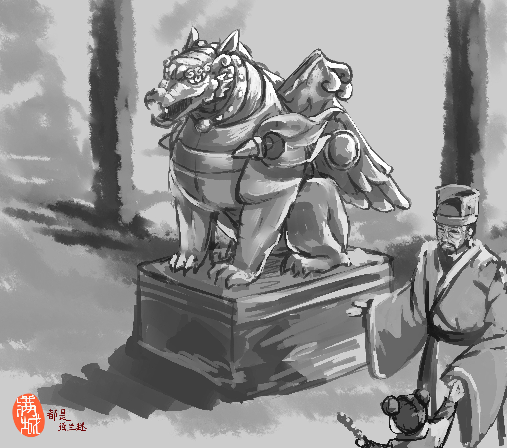

# 命运轮回（贰）

又是一年的上元节，宿州迎来了冬日的一场大雪，洁白晶莹的雪花从灰蒙蒙的天空中悄无声息地飘落，把大地洒成了一片银装素裹，让人不禁联想起了“白雪却嫌春色晚，故穿庭树作飞花”的诗句。

一夜之间，原本五彩斑斓的州府变成了黑白两色，这是一个寂静的冬日，刘老伯已经早早地命令下人布置了自己的庭院，在当地不算奢华的的院里，都挂满了灯笼。白墙青瓦，在灯笼的闪烁的红光照耀下显得格外温馨，窗台上堆着一层薄薄的积雪，仿佛铺上了一层柔软而又无瑕的棉花。窗框中间半透明的玻璃上结着冰纹，因为内外的温差让玻璃蒙上了一片雾气，看起来黯淡而又凄清。这份静谧着实令让人难以忘怀，踏着吱吱作响的地板，刘老伯缓缓走向了窗边，他轻轻抹去了窗户一角的雾气向外看去，屋顶上早已是一片白雪皑皑，是谁为自己的屋子盖上了一层羊毛毯子呢？屋檐下垂着十几根如同钟乳石般的冰锥，最先落下的雪花一落到瓦片上就化作了雪水流淌下来，在环境的冷却下逐渐凝结成了晶莹剔透的冰挂，让人想起了夏日解暑的冰棍。

刘老伯有些走神，陪他一路走来、厮守多年的老伴在十几年前也染上了瘟疫走了——在那个兵荒马乱的年代，实在是再寻常不过了。但素来乐观的他很快就从中年丧妻的悲伤中回复过来，不过他之后并没有再婚，刘老伯知道情义的重要，只要回想起和她从底层一路走来的那段艰难的人生之路，他的良心便让他把再婚的念头打消得一干二净。刘老伯独自靠几亩田地把儿子拉扯到成年并参加科举，即便他儿子对待科举非常用功，但或许是没有科举命，亦或许是家境的限制让他无法冒头，六艺中的“乐”和“御”实在是让他为难，连续考了三届都没有中举。对通过科举为官这条路，儿子逐渐心灰意冷，而家里也再没有余钱支持他继续科举了。幸亏刘老伯人好心善，平时积累的人缘与恩情在此时得到了应有的回报，当地的乡绅与富豪出手相助。

就这样，他的儿子登上了出海经商的海船，毕竟，在那个官场趋于饱和的年代，下海就变成了许许多多不得志的年轻人拼搏未来的新出路。伸出援手的乡绅和富豪并没有看错人，虽然刘老汉儿子不通音律，也不善于诗词，但精通算术且脑子灵活的他似乎特别适合做生意？几年的时间，优秀的业绩让儿子成为了神州在三兰国的一个农场的总司。

刘老伯的生活，就在那时开始慢慢变好……这个大院子、身上的精锻丝绸……还有这个今早刚刚运到家的石像——这个摆在院子中间的石像，是神州人最熟悉的神兽 长吻、虎眼、笔直的翅膀、肩上有一对凸起的眼睛。

而刘老伯的院子，其实是几年前他儿子刚刚购置的，由于儿子常年在外经商，需要一个好一点的地方安置他们一家，刘老伯便迁到这个新院子里，包括他的儿媳妇还有他刚上县学的孙子。刘老汉怎么都没想到，上半辈子在田里汗流浃背的自己仅仅能勉强养活自己和儿子，下半辈子却住进大院子，还有足够的闲钱雇佣几个仆役。

似乎一切都变得好了起来，哦不，不是似乎，这就是现实。

刘老伯给这个大石像点了三支香，插在了石像前面的石墩上。他双手合十在石像前参拜，喃喃着保佑自己一家人能平平安安，新的一年儿子的生意也能红红火火。这个石像在他面前是如此的巨大，心灵手巧的工匠把它雕刻的栩栩如生，就像一个端坐在店堂上的佛像。这个雕像比他原来土房里的那个还大，新院子太大了，显然原本的小雕像镇不住场面，刘老伯也舍不得丢掉，一向勤俭节约的他把小雕像摆在了自己房间的桌子上，日夜供奉的同时，也提醒自己曾经经历过的日子，警示自己富裕之后不忘乐善好施，节俭勤劳。

“怪物，翁翁！有大怪物！”

他循着声音往门口看去，发现他的小孙子欢快地一边说着一边跑了进来，今天一大早，他的儿媳妇就带着两个佣人和小孙子去城外的寺庙参拜祈福，还在庙会里购置许多年货，一直忙到现在才回来，这也是小孙子第一次参加庙会。

“诶！不可胡言乱语，此乃神兽！是‘天狗’，是庇佑我们的神灵，神像面前不得无礼！”虽然童言无忌，但刘老伯还是佯怒地提醒了孙子，刘老伯牵着小孙子的手来到雕像面前，示意小孙子参拜雕像以赔礼道歉。

儿媳妇和佣人们进后厨置办晚宴了，院子里就剩下了他和小孙子。

“神兽在上，小辈不懂事，无意冒犯，还望体谅……”刘老伯给他的小孙子做了示范，示意该轮到他了。

小孙子虽然有点不服气，但还是礼貌地照做了，参拜完，便嘟着嘴说：“孙儿又不是故意的。”

“怎么，可是不服气？”刘老伯摸摸他的头，笑着问道。

“今早和娘去庙会的时候，看到好多人都在参拜这个东西，可我问他们这是什么，他们都说我不懂事……孙儿不服，就问了娘亲，娘亲说等回来以后翁翁您会跟我说的……”小孙子越说越来劲，毕竟这个年纪的小孩子，对任何东西都充满着好奇心。

“孙儿可是想听大神兽的故事吗？”刘老伯微笑着，眼角挤出了皱纹。

“想听！想听！翁翁你快说吧！”小孙子拉着他的衣袖，仰着头祈求着他。

“哈哈哈，那可要认真听哦，翁翁这就说。”他摸了摸小孙子稚嫩的脸庞，随后清了清嗓子：

“在很久很久以前啊，就是你翁翁的翁翁都还没出生的时候，神州还是两个国家，一个叫金，一个叫宋，他们虽然算作兄弟，但却很不合，经常相互打架。”

“哇！我们以前是两个国家吗？”小孙子激动了起来，很显然，他并不知道两个国家是怎么变成一个国家的，只觉得这样非常好玩。

“还没完呢，金和宋打架的时候，在更远的北边……嗯……也就是现在的岭北，有一个邻居，叫蒙古，这个国家很小心眼，它呀，看上了两个国家有吃不完的食物和肥沃的土地，就想乘我们打架的时候过来抢东西。”

“蒙古好坏呐！怎么能抢别人的东西！？他们的爹爹没教过他们不能抢别人东西吗？”小孙子满是疑惑，显然，在他眼里，一个国家就像一个人。

“大概……它是个野娃娃吧，哈哈哈，”刘老伯笑了笑，其实他也不太清楚那些故事的背景，只不过是人云亦云的传说，没必要深究太多。

“然后啊，蒙古就开始偷偷攻打金国，而宋国当初看到有人帮他打金国，就和蒙古人一起合力制服了金国。”

“宋国为何如此？金国是自己的兄弟，爹爹告诉我，亲人即使再闹别扭，也不能帮外人打自己的亲人啊？”小孙子又好奇的问。

“没错，之后金国被蒙古吞掉了，成为蒙古的一部分。蒙古虽然得到了金国的东西，但并没有满足，转头啊，就来打宋国了。”

“宋国活该，谁让他帮蒙古打自己的兄弟啊。”小孙子不满的说道。

“对啊，所以在蒙古把宋国打得措手不及，很快宋国就败下阵来。然后宋国人日日夜夜祈求上天，并发誓说只要能拯救他们，他们就和金国永远和好，成为一家人。无论春夏秋冬，每天早上都会跟上苍祈求，宋国人的诚意和毅力终于感动了一位没有头发的天神。”

“那位天神是聪明绝顶吗？”小孙子仰着头，抖了个机灵。

“哈哈哈哈。”刘老伯和小孙子一起笑了起来。

“那位天神啊，养了好几个天狗神兽，这些天狗神兽从小保护着这位天神，根据天庭的规矩啊，神仙不能直接干预凡人的事务。所以聪明的天神就想到了一个方法，他降临到蒙古人的京城啊，蒙古人看到之后开始亵渎天神，然后这个天神养的天狗神兽因为看到天神被蒙古人欺负啊，都生气了，把蒙古的大汗给一口吞掉了。”

“哇！一口吞掉，好厉害的天狗！”小孙子很惊讶，张着嘴比划了一下，然后看了看面前的雕像。

“然后啊，蒙古就不敢进攻宋国了，然后天神还托梦给了岳忠将军……嗯……就是大燕的开国皇帝。”

“岳忠将军！爷爷之前说的那个百战百胜的大将军！”小孙子按耐不住激动，拉着刘老伯的衣袖说。

“就是他，大名鼎鼎的岳忠将军，天神托梦给岳忠将军，说自己不能直接干预凡人的事务，而自己的养的天狗吃掉了蒙古的皇帝，现在蒙古人都怕自己的天狗。天神就让岳忠将军记住天狗神兽的样子，然后做出一个假的天狗出来，和蒙古打仗的时候就摆在前面。这样，蒙古人就会被吓跑了。”刘老伯摸了摸胡须，安静的说。

“聪明绝顶！聪明绝顶！”小孙子起劲得称赞。

“那是！岳忠将军照做了，蒙古人果然被吓跑了。之后啊，岳忠将军便让百姓们做一个天狗的雕像放在家里，这样的话，就算蒙古人来抢东西，也会被吓跑。因为蒙古人给金国和宋国带来了灾难和病痛。而天狗把蒙古人吓跑，就是把灾害和病痛给吓跑，所以啊，天狗一直在保佑我们哦。百姓们很感激天神和天狗，直到现在，我们在上元节都要祭拜它们呀。”刘老伯说着说着就笑了起来，虽然他知道，当年的两国并没有达成妥协，更没有在短时间成为一家人，随着南北两大国的重新建立，混战也再度展开。但面对一个孩子，这血淋淋而又黑暗的真相还是不要捅出来为好。

“哇！”小孙子跑到天狗雕像的面前，学着大人虔诚地将双手合十，“大天狗，大天狗，你好厉害，刚刚我不该叫你怪物的，见谅见谅，作为赔偿，我会把今年最最最好吃的东西，都给你。”小孙子说完，本来想摸一摸天狗雕像的肚子，但是太矮了，即使踮起脚来也只能摸到天狗的脚。

“诶，这就对了嘛，哈哈哈。”刘老汉被面前的场景给逗笑了。

“咻！”一点又一点的火光窜上天际，炸出了一个又一个绚烂的礼花。

“烟花！烟花！翁翁！我想看烟花！孙儿要看漂亮的烟花！”小孙子被突然出现的美景吸引了起来。刘老汉抱起小孙子，“好！烟火晚会开始了，在就去看烟花！”刘老汉抱着小孙子，跨出门槛，消失在满是灯笼的小巷里……

“哇，翁翁，灯谜耶！我要猜！”

“一家十一口，打一字。”

“十……一……吉！吉祥的吉！”

“对了对了！”

“哇，大狮子！舞狮子喽！”

“看，那朵烟花好漂亮呐！”

一朵又一朵的绚烂烟花绽放在如黑墨一边幽深的夜空中，盖过了点点繁星，映照在刘老伯院子前的大天狗上，大天狗雕像仿佛在凝望着这美丽而又缤纷喜庆的夜。

“东风夜放花千树。更吹落、星如雨。宝马雕车香满路。凤箫声动，玉壶光转，一夜鱼龙舞。”

想必，对于立国不过十载的神州来说，新的一年，必然会是风调雨顺，国泰民安。

> 原稿/插画：满城
>
> 监修：宁海
