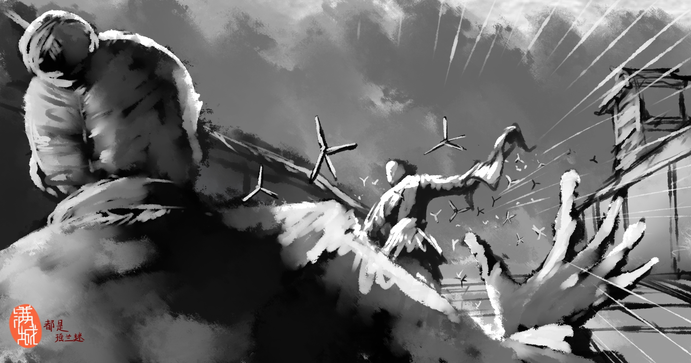
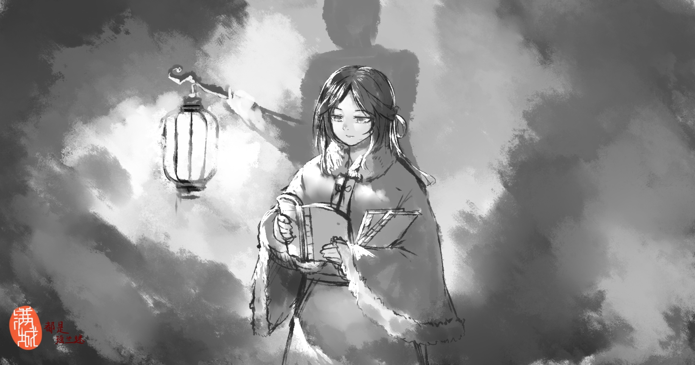
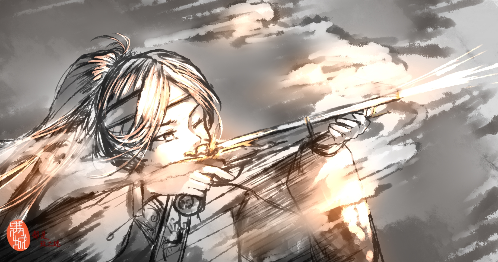
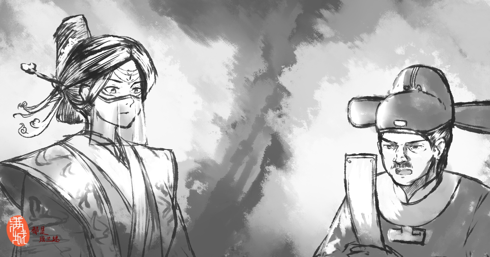
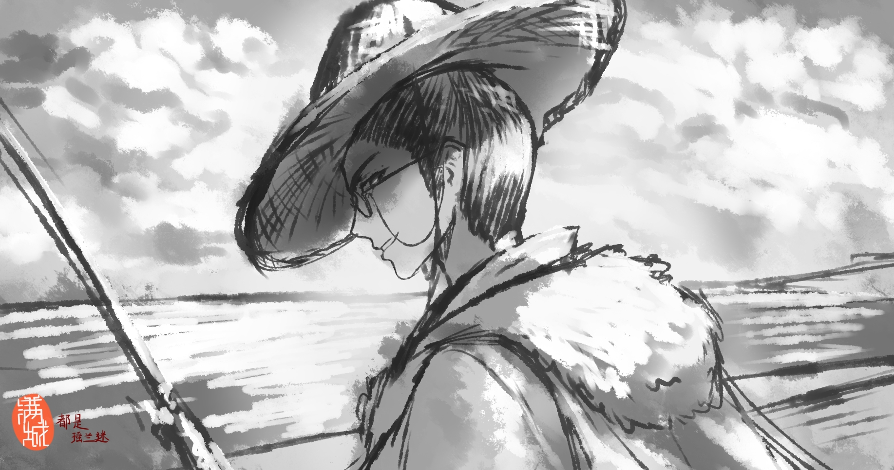

# 燕之冀歌

这一年的雪来得格外早，或许还称不上是初冬，凛冽的寒风就早已席卷了孤独的燕京城。傍晚时分，北征大军覆灭的告示一经张贴就引起了一阵骚动，城里人大都明白这大军陨落对于燕意味着什么。但没过多久，暮鼓响起，巡夜的军士吆喝着把街道上围观告示的人群哄散，赶回家中，城中便只剩下孤儿寡母的哭丧声。或许，连年的天灾和战火已然让他们有些麻木，但城中人都明白，大燕，已经不再是那个大燕了。

黝黑的夜空显得愈发深邃，如同一张黑色网兜，套住了偌大的帝都，将一切都笼罩在这寂寥的苍穹之中。一纸宵禁令让帝都的夜晚失去了烟火气息，即便连年的疫病早已让她不复百年前的繁华与辉煌，但如此凄清的夜晚也诚然罕见，着实令人深感不安。飘忽而过的乌云不时遮蔽着黯淡星空，让今晚的燕京更显孤寂。

巡夜的巡检司军士踏着略显凌乱的步伐穿梭在各个街巷，喊叫着、踢打着流浪汉以及忘形犯夜者。城楼上，守卫们巡视城内外的情况，偶尔萌生的松懈念头也在听到校尉的骂声后烟消云散；身着夜行服的皇城司密谍静默地隐在黑暗之中，时刻提防着可能出现的意外。

皇城后，一条几近漆黑的巷子里，负责此处的密谍打了个哈欠，却忽然睁开了眼睛，他拍了拍同伴的肩膀，悄无声息地翻上了一堵矮墙。果不其然，一道黑影一闪而过，他笃定这不是幻觉，立即喊道：“何人？！止步！”

密谍没有丝毫犹豫，拔出长刀径直追了上去，紧跟着的同伴随即吹响了警哨，凄厉的哨声划破了夜的沉寂。不用想，是潜伏在燕京城的蒙古探子！随着双方距离的拉近，刚刚掏出了两把飞刀的密谍却见蒙古探子顺手扔下了些什么，他下意识的闪避并未奏效，滚落在地的铁蒺藜直接刺穿了密探的脚底，让他直接摔了个四仰八叉。

“追，快追！”密谍忍痛喊道。可身后的同伴却停了下来，俯身搀扶他。坏了！要让那家伙跑了！难堪至极的密谍刚想破口大骂，抬眼却看见了自己的“猎物”已然腿部中箭，摔倒在地，被两名看不清相貌的士兵粗鲁地拖拽了过来

“你们……是？”疼得龇牙咧嘴的密谍问道。

“皇城的侍卫罢了，不该问的别问。”他们平淡的语气中却透露着冷酷的气息，“此人，你等带去审讯吧。”

闻声而来的巡检司军士和皇城司密谍们已将此处围得水泄不通，望着那两个不知名的士兵渐渐消失在了黑暗中，密谍有些忿忿地埋怨同伴道：“众目睽睽之下别想着冒功了，你先前若是早一步动手，这厮的功劳就是咱俩的了……”

同伴瞟了一眼那个被五花大绑的探子，幽幽道：“来不及的。其实，你摔倒之时，他们就已经出手了。”

子时，黯淡的弦月升至夜空中央，燕京城似已沉沉睡去，而皇城之中，却仍灯火通明，战火未平，新帝未立，百废待兴，对于皇宫上下，这注定是不眠之夜。

礼部送来了匆匆起草的即位仪注——择显元十四年十月初八卯时即位，以及后续一系列流程。登基大典被删减得仅剩十余项仪式，礼器冠服也简陋至极。几个时辰的时间，尚衣局通宵达旦赶工也难以完成一整套衮冕服，迫不得已只得裁改先帝遗留的冕服。一排排粗大的蜡烛将屋内照得灯火通明，不时发出噼里啪啦的杂音——连皇室专供蜡烛的质量都大不如前。织机嘈杂，人影晃动，宫女们忙的不可开交，时间紧迫，此时已近丑时。

皇城里的一处角落，面无表情的统领伫立着。相比起另外几名隐匿在阴影中的军士，他似乎并不介意黯淡的月光洒落在自己身上。

“情况如何？”统领仿佛在对着夜色自言自语。

“有两家似乎颇为不满，我已经留人盯着了，其余的，暂时尚未有异状。”阴影之中传来了疲惫的声音。

“无妨，你且去歇息。”

“是。”

不远处的永宁宫中，年轻的女皇坐在桌前。这或许是她在此座宫殿中度过的最后一个夜晚了。一封又一封的奏章像山丘一样堆积在案几上，她仍有些生疏的翻阅着这些奏折，思考片刻，随后小心翼翼地盖上大印。事务繁多，千头万绪，身心俱疲的她终于也支撑不住，趴在桌上陷入了梦乡。

……

那是很多年前的事了吧，听闻父皇忙里抽闲，幸临仁宁宫看望母亲，许久未见父皇的她不顾内侍‘要遵从礼法’的劝告，径直奔向宫中，宫女内侍只得紧跟其后。宫中侍卫察觉到了脚步声，见是公主殿下，便不加阻拦，目送着她穿过一个又一个长廊。

轻盈的身影来到了仁宁宫踏跺之下，她一眼便望见正在往外走的父皇。

“父皇！”她兴奋的喊道，正想拾级而上，但突然被身后匆匆赶来的宫女拉了一把，这才想起师保关于礼教的啰嗦，便赶忙收回迈出一半的脚步，恭敬又略显滑稽的像父皇行礼。

“参见父皇！”“参见陛下！”她和身后内侍宫女一齐行礼道。

“茹兰呐，今日怎么擅自离宫？”刚若有所思的皇帝愁眉一展，微笑着看着脸蛋红扑扑的她。

“兰儿才没有擅自离宫呢……他们……他们都没有拦我。”公主一回头，指着殿外的侍卫们。

“哈哈哈，无碍无碍，”皇帝笑道，公主身后的侍从这才松了一口气。

“那你今日赶来为何啊？”

“爹……啊不……父皇，孩儿想您了，父皇您能多来看看我和母后吗？”她拘谨的问道。

“茹兰啊，近日北方逆贼作乱尚未平定，朕必须以大局为重啊。”

“可是……”公主眼圈微红，但她已模糊地能理解父亲作为天子的责任，便没有再说下去。

“还有一件事，父皇，我想学骑马，就那种小马”她伸手比划道“娘不答应，说马是很重要的东西，要您同意才行。”

“这样啊，兰儿为何想到骑马呢？”

“嗯……骑马好好玩呢，宫中整天都要听师保教习礼教，不是背诵就是练习拜礼，有些无趣……”皱着眉头的公主回忆着，“我上次出游的时候，看到好些人都骑马咧，然后，泠岚姐姐说她进宫前也会骑马呢。父皇，兰儿也想要……”

皇帝没有回答，方才太医所述着实令他有几分怅然失神。

没有得到答复，公主眸中闪耀的期冀逐渐黯淡，“父皇，可以吗？还是说兰儿骑马，又不合礼制吗？”

皇帝恍得回过神来，思索良久却不知道怎么回答为妙。“那自然不是，茹兰且回去吧，朕要先回殿理事了。”

“好吧……那兰儿先退下了。”没有得到肯定答复的公主有些沮丧，规规矩矩的倒退了几步，行礼过后便转身离去。

仁宁宫后的御花园内，面色有些惨白的皇后在宫女搀扶下走进廊亭，静坐在宫墙旁望着一片斑斓的花园，她微笑着注视着走来的女儿，见她有些低落，便摸摸她的头，问道：“如何？陛下答应了吗？”

“没有呢，”公主气鼓鼓地埋怨道，“娘，上回出去玩，我看到也有女子骑马的嘛……”

“兰儿莫要恼火了，”皇后轻声安慰着，“且等你再大些。”

“娘，我已经很大了……”

而此时的大殿内，皇帝刚落座便继续批注着那无穷无尽的奏章。直到夕阳斜射入殿内时，一阵沙哑的声音让垂首不语、有些走神的大太监反应过来。“去，让太仆寺寻一匹小马驹，送去围猎场。”

“是。”

当见到那匹温顺的小马驹时，她的惊喜早已溢于言表，“啊？！马！小马！”

特地抽空而来的皇帝默默的看着兴奋的公主，目光却渐渐变得游离，他侧首问道：“出征大军的调遣如何了？”

“陛下，各地开拨的军队全数抵达，军械、粮食亦在陆续运来。”

“嗯，各军尚需些时日来磨合，兵部趁操练这段时间抓紧囤积给养吧。”皇帝回答道，只见公主围着小马转了几圈，却又走了过来。

她走到皇帝的跟前，拉着他的袖角，只是望着不远处的小马，但又不敢打断父皇。

皇帝看出了她的小心思。他知道，虽然公主从小就说自己喜欢骑马，但事实上，她哪骑过真马，深宫之中只有木匠们做的木马。纵使他们的手艺鬼斧神工，栩栩如生的木马终究也只是一段坚硬且冰冷的木头。

面前的真马，虽然与宫中的木马模样类似，却多了木马没有的灵气，这是一个鲜活的生命，一只高大的活物站在面前，如此之近，人都会本能保持敬畏，此时的公主也一样。心愿实现令她满心欢喜，但面对这只从未接触过的“生”物，她还是怕了。

“可想去摸一摸小马呀?”皇帝微笑道。

“想!”公主欣喜地仰头看向皇帝。

“走，父皇带你去摸它。”皇帝说完就拉着公主的小手走向小马。

“来，把手放在它的脖子上。”皇帝半跪了下来，从后面搂住公主的腰，扶着她的右手慢慢走向小马。此时的皇帝早已忘却了四周的侍卫近臣，更忘记了所谓的礼节法度。本想劝住皇帝的年轻侍卫还没说出话便已经被一旁年迈的大太监拦住。或许越出尊卑礼法，才可见燕人本性。数十年前，大太监也曾见过无比神似的此情此景，只是那时无知而欣喜的少年早已长成了一国之君。正如几十年前他的父亲一样，此时的他，早已忘记自己是大燕的皇帝，此时的他，只是一位慈爱的父亲，而面前的人正是他亲爱的女儿。

她的小手在皇帝引导下摸到了小马的脖子，小马温顺的站在那，静静得等待着。这一切都让她感到无比的新奇。透过手，她能感受到小马呼吸的节奏，也能感受到小马温暖的体温。她开始小心温柔地抚摸起来，“原来真正的马是这样的呀！毛好短，好滑，就像冬天穿的貂裘一样。”

“哈哈哈，不错，还像什么呢？”皇帝笑着问道。

“还像毛梳子，但不像我那把，我那把太硬了。嗯……像母后那把，滑滑的，柔柔的。”她看着小马说道，霎地迟疑了一下，转头向面前的父皇问道，“母后的风寒好些了么？她以后能陪兰儿出宫吗？御花园的花虽是好看，但时间长了还是有些单调”

皇帝的微笑突然凝固了，不过还没待公主反应过来，他的脸上又再次挂上了笑容，只是多了几分别扭。“好啊，好多了，你母后的病已经好的差不多了，她还在宫里修养呢，当下寒凉之际是不切可出宫的。”皇帝都觉得自己的谎言是如此的粗劣，或许仅仅只能让孩子信服，他知道实情远比他说的糟糕，既不是风寒，也没有好转……

公主听到回答后，若有所思的点点头，然后向皇帝露出了天真的笑容，道“兰儿以后也要陪母后骑马！”

她转头看向小马，不断抚摸着它，激动地说着：“小马小马！从今以后你就是我的伙伴了~我们要一同征战沙场！像太祖皇帝一般，打败坏人，保护弱小。”

皇帝笑了起来，双手抱起公主，“来，上马！”他将公主稳当地放在马鞍上，温顺的小马驹温顺地承住背上的公主，显得无比乖巧。马背上的她感到相当新奇，这种感觉与她在宫中所玩的木马大相径庭。喜悦跃然于她的脸上，“父皇！这就是骑马的感觉吗？！好有趣！”

她虽十分高兴，但还是因为略微的害怕夹紧了双腿，放低身子趴在了马背上。皇帝见状便用左手牵着马绳，右手扶着公主的后背，“来，挺直腰，像个将军一样！”

坐在小马上的她刚好和皇帝一样高，她颤颤巍巍地挺直身板，努力克服着本能的恐惧。皇帝似乎早已不在乎自己是位尊贵的君王，他亲自牵着那匹温顺的小马，慢慢地走了起来。

公主逐渐适应了在马背上的感觉，“爹！我像不像一个将军？”

“像！兰儿就是个小将军。”皇帝放下一直搀扶着公主的右手，摸着自己的胡子思考道。将军？啊，朕何时才能有一个生龙活虎的皇子呢？

“众将士听令！随本将杀敌！”公主高兴地高喊起来，学着从小就耳闻的、传说故事中、岳家先祖的口吻。

“好！谨遵号令。”皇帝脸中盈着老父亲的宠溺，他把小马的缰绳交给一名亲卫后，便熟练地跨上了宝马，“走，回宫！”

……

又过了许多年，一个秋高气爽的傍晚，藏书阁中突然出现了一个少见的身影。

在内侍的带领下，裹着厚袄的少女看着有些臃肿，穿行在这由书籍组成的山间，扑面而来的墨香味让她有些陶醉。走着走着，于前带路的内侍回头却发现，她正止步于一书架前，盯着最上面的一排古籍。

“殿下，您……”内侍循着少女的目光看去——难以置信公主会对那些书感兴趣。

“你可知这几本书？”她问道。

“回殿下，呃……分别是《太公六韬》、《黄石公三略》、《神机制敌太白阴经》。”内侍有些忐忑的回话，并补充道，“皆为兵书。”

“都拿下来。”

“是……是。”

将几本尘封已久的书籍取下递给了她，内侍小心翼翼地问道：“殿下，这些书不是您……”

“你无需多管。”她的语气虽然平淡，但却显得不容置疑。

消息传到皇帝那儿时，他正眯眼听着汇报，战战兢兢的户部左侍郎在陈述着今年的收成：“……今岁各地亩产麦已不足一石……陛……陛下，粮食缺口尚有一千四百一十万石。”他十分担心皇帝桌上那块刚换不久的白玉镇纸会在砸到他的身上——上一块就因陛下大怒摔得粉碎。

“一千四百万石？”皇帝的目光凛冽，抬头与他对视了一眼的左侍郎像被马蜂蛰了一般，收回目光垂首不语。

“军粮供给可够？”

“啊……够，够的，屯田足以解决半数军粮。只是……只是……”左侍郎的心跳的很快，因为他或许都猜到了接下来的对话，“一千余万石的粮食，这……”

“着令礼部遣人去南方，问问他们可否加大出口。”

“陛下，这南楚蓄意抬高粮价，都已经翻了两番了，国库银两……银两实在不足呐……”左侍郎的声音越来越轻，或许御案上的皇帝只听清了“银两”二字。

“那就以物易粮！还需朕亲自教你吗！？滚！”

待狼狈的户部左侍郎离开了大殿后，在一旁沉默不语的大太监看皇帝气消，才把公主借书之事告诉了皇帝。他注意到正在批阅奏章的皇帝愣了一下，但却没有任何表示。

直到几天后的清晨，在前往垂拱殿的路上，皇帝冷不零丁地向身后的大太监问道：“公主这几日在做什么？”

“回陛下，殿下这些天未曾出宫，一直在看书，呃……就是几天前在藏书阁借阅的兵书，兵书可能有些晦涩难懂，之后殿下便又叫侍从拿了些关于剑术与火器的书来读。”

皇帝的语气听不出喜怒哀乐。“兵书，剑术？火器？她能看得懂？”

大太监摸不清皇帝的意图，只能含糊的敷衍道：“有女官的帮助，想必是能看懂一些的。”

“嗯”了一声的皇帝垂首继续走着，跨上垂拱殿前第一级台阶的时候，他突然道：“告诉司空昭羲，换个身份去御剑坊，之后且看公主可想学学，若是想，那便让他抽空教授，若是无意，那就此作罢。”

“……是……是。”大太监对皇帝的决断有些摸不着头脑，但他还是遵旨执行了，即便他很清楚那人的职责是什么。

……

早晨，天才刚刚亮，一群人便匆匆赶来京城外的皇家御剑坊。管理御剑坊的几位官吏被这群人的到来惊得不知所措，他们十分清楚有权来这里的人大都身份尊贵。因为没有事先知晓他们的到来，自己毫无准备，甚至连接风洗尘的仪式都没有，这不会被责罚吧？

小吏们战战兢兢地跪倒在这群人的面前，期冀来到这里的那位大人能饶恕他们的失职。

一匹小马被驱使着，从人群让出的缝隙中踱步到跪倒的领头小吏面前。

“起来吧，来时仓促，你们无事。”一个清脆的女声从马背上传出。

“谢殿下大恩，殿下金安。”不必多想，有资格带领着一群人来这里的女孩便只有公主殿下了，众小吏迅速起身，不敢有半点松懈，然后头也不敢抬地紧跟在人群之后。

“此处可有我能用的兵器？”公主望向不远处的兵器架说道。

“回殿下的话，近期兵甲奇缺，皇上下令把不少兵器都送到军中去了，剩下的可能都有些沉重……不过仍有些稍轻的细剑，您或许可以试试。”

“好，你去取来。”

“遵命。”领头的小吏连忙跑进库中取剑，递给公主身边的一位内侍

其余小吏把公主的队伍领到练武场旁，便被公主命令退下。公主熟练的下马，走上练武场，其余人全都规矩的站到规定位置待命，唯独一个二十多岁的年轻武官仍跟在公主的身旁。

站在空地上的两人，一男一女，一高一矮，但此时，他们都心事重重。

公主记得很清楚，从数年前塞外的一场大败开始，皇帝便得了心病，郁郁寡欢。狼狈归来后，她的父亲就像变了个人一样，有时沉默寡言，有时又急躁易怒，这一切的一切，她都看在眼里。

“不就是一群蛮人吗？！父亲为什么会败的如此狼狈，又为什么会变成这样。”她不断地以一个视角被局限于京城的皇女身份，去揣测着那时的战况。明明，在先祖的故事里，敌人是如此的不堪一击，仿佛先祖的部队还未到，敌人就早已闻风丧胆。而她的父亲为什么反被打的旗靡辙乱，败阵而逃？“兵书上所写战阵谋略，明明看上去不难啊！”

之后的皇帝变得异常的亢奋，他日理万机，夙兴夜寐，甚至常常在文德殿的御案上伏身而睡，日夜在公乃至于数月都没来看望她与皇后。这一切的一切，她也都看在了眼里。

“不理我还好，可母亲都病成这样了，为什么他现在反倒连看都不看上一眼的了。”她不断地问着自己。从皇后患病起，皇帝就不断在用所谓的风寒、发热来搪塞她。但谎言听多了，就不会再信了，她很聪明，伤寒哪需要被锁在行宫内不许随便进出，怎么会在治愈后还依旧身体虚弱卧床不起？皇帝对她们漠不关心，让宫中的流言逐步侵入了她的脑海，动摇了皇帝在她心目中的形象——皇帝想毒害皇后以提早再立新后。

至于为什么要这么做，她再也不敢想了。

公主的思绪又回到了面前的场地，她看了看自己纤细的双手，又握紧了拳头，“来人！拿剑。”

拿剑的内侍从走上练武场，将一柄细剑端在公主的面前。她拿起剑，将剑从剑鞘中拔出，熟练地在场中舞剑。这是她从小就学习的技法，几乎每一个燕国小孩子都略知一二，这技法就和她手中的兵器一般简单，简单到连乡下孩子在田野里捡根树枝都能轻易操练。

……

“为什么要害死母后？”

皇后病逝不久后，她第一次在皇帝的面前如此责问，这年，公主十三岁。

“你说什么？胡言乱语！”愣了一刹那的皇帝突然暴怒地站了起来，旁边的内侍与宫女们全部吓得跪倒在地，却唯独没有吓住面前的女孩，她就与皇帝仅隔一书案对峙着。

“若不是你想害死母后，为何你连母后最后一面都不敢见！为何母后的丧礼办的如此简陋！你骗我！母后的病根本不是什么风寒！你为何要骗我！”她无视礼法、不顾一切的喊出了自己的心声，只因她回想起，在无数的夜晚，病重的母亲在病床上不断重复着她父亲的名字。可直至生命之火燃尽，那个男人也没有出现……一切似乎都历历在目，仿佛一切的一切都是因面前的这个男人而起。

“无法无天，你可知你在和谁说话？！还敢口出狂言！不要觉得你是公主就能在这里无理取闹！”皇帝的面部狰狞紧绷，颈部的青筋因为怒喊而凸显出来，跪倒在旁的宫人们缩在一旁，冷汗直流。

“是因为母后生不出皇子吧！所以你怨恨她！想尽快除掉母后，再立新后！”她面对一国之君，面对这个愤怒到极点的男人，莽撞地用她幼稚的思维结合宫中的流言蜚语揣测着。

毕竟，对于一个直到皇后病死都没有去探望过，连丧礼都不按规制准备的皇帝而言，似乎这一切都在情理之中？因为她听说过，历朝历代的皇帝都是无人情可言的。

“闭嘴！！！”皇帝全然不顾自己形象，一把将书案推开，冲到那个女孩的面前，举起右手狠狠地扇了女孩一巴掌。清脆的响声响彻了书房，把跪在地上的内侍与宫女们吓得几乎趴倒在地。

“陛……陛下息怒！保重龙体啊！”见惯大风大浪的大太监也是头一次见皇帝对公主动手。

“是谁和你胡说八道的！？朕要诛他三族！”皇帝恼怒地盯着面前捂着左脸落泪的女孩，只见泪珠滑过她的面颊，而她竟坚强的没有呜咽。

皇帝的心里五味成杂，这是作为父亲的他，第一次对自己的孩子下这么重的手。

“这是我自己说的！那你杀了我吧！”公主的话虽然斩钉截铁，但疼痛与心碎让她早哭已红了眼眶，她觉得自己不再熟悉面前的这个男人，他还是曾经那个自信勇武又慈爱的父亲吗？她不断地在自己的脑中重复着这句话，直至最后她捂着左脸跑回寝宫，而皇帝亦未叫人阻拦，也未再吩咐什么，只是站在大厅中气的发抖。

她只是想，获得一个答案而已，一个解释一切的答案……

……

零星的记忆片段不断回荡在她的脑内，苦涩的回忆让她的剑舞得越来越快，章法也逐渐杂乱起来，到最后，甚至一气之下挥剑砍向了练武场上的木桩。

武官望着背对他的公主，只看到她站在被劈入的木桩面前，久久没有回身，手中的细剑死死的卡在了木桩中。

“殿下，你的步数乱了。”武官走了过来，抱拳道。

“无需你提醒！”公主转过身来，眼眶依然湿润，虽然她没让眼泪落下，但比她高得多的武官还是看出了她年轻的脸上盘踞的感情，是委屈、是迷茫、是不甘……

“试试其他的兵器吧？”武官谨慎地劝谏着，可在眼睛的余光中，他看到她又背过身去悄悄抹掉还未溢出的眼泪。

“你可经历过战阵吗？”

武官觉得这个问题非常滑稽，甚至有点想笑，不过他依旧坦白地回答道：“大战、小战都有参与过。”

“剑……在如今战场上用处已大不如从前了吧？”她平静了下来，用力拔出了那柄劈入木桩的细剑，随即想起了前不久自己所看的兵书，其阵法之精妙，即使幼稚的自己还未完全了解字句中的精髓，但还是让她赞叹不已，只觉得其中的奥妙无穷无尽，只是这阵法兵种中，弓箭兵、长枪兵、火铳手、骑兵、刀盾兵应有尽有，却唯独没有剑兵。

“回殿下，诚如殿下所言，战场之上，剑只做自卫之用，论劈砍不如刀，论距离不如弓，论穿刺不如枪，不到万不得已，绝不会拔剑作战。”武官回答道，他其实并不乐意在大庭广众之下亮相，哪怕是乔装之后。

“那为何你们出征时还会带着佩剑？”公主想起了数年前目送皇帝出征时的场景，只觉战马上的皇帝举剑誓师，不怒自威，许多将军也随身带着佩剑。。

“这个……”武官摸了摸自己腰间的佩剑，思索了一下。“有些东西难以言表，我只知道，我们即使使用再多其他的兵器，忘不掉的，还是自己的剑。对战士而言，无论是长剑还是短剑，它们都是我们最后的依靠，更是大燕将士们军魂的寄托。就算大刀卷刃了，长枪折断了，弓矢射尽了的时候，我们还有剑，那一切都还有机会。”

“即使它不如其它的兵器吗？”

“毕竟，这是最后的一线希望。”

“嗯……”一个侍从走了过来捧走她手中崩了口的剑，又将一把长枪递送进她的手中，另外几个侍从将几乎被劈成两半的木桩从练武场上抬了下去。

她再次走回练武场中央，凭着记忆里《枪术集录》中的枪法不太娴熟地挥舞着，尽管僵硬生疏了几分，但步法还算端正。

“殿下，枪法，某略知一二，可教予您。”武官拱拱手。

“那……请吧。”公主停下了动作，平静地对他说。

“殿下且看。”武官拿起一支练习用的木枪，在空旷的场地上干练地挥舞起来。木枪挥舞时划破空气，发出了刷刷的破风声，将他的思绪带到了不久前的一个夜晚。

……

“让你见笑了……”皇帝瘫坐在地板上，摔倒在地的杯盏散发出酿造酒特有的香甜，四处都是散落的诏书和奏章。深夜中，透着书房上微弱的烛光，皇帝憔悴的面容隐约可见。

“不敢……陛下若是不便，我便先撤下了。”一个武官半跪在皇帝面前谨慎地说。

皇帝秘密的亲卫拥有可以自由出入皇城的特权，而作为其统领的司空昭羲，紧急情况下即便皇帝已经下令没有他的命令任何人都不许进入书房，他仍可破格参见皇帝。这本是为保护皇帝人身安全，而今天却让皇帝封闭已久的内心展露在了他的面前。

“午夜而来，是有要事吧？”皇帝看着随风闪烁的烛光，目光涣散地说着。

“密报，关宁方向的大军已收复两座州府，但再无力量继续出击……详细的捷报应该明日下午就到。”

“好……”皇帝的眼神亮了一下，随即趋于平静，因为皇帝知道，这种事情犯不着他半夜而来。

“但是……”

“嗯？但说无妨……”

“西北的瘟疫卷土重来，安西和凉州……许多村镇十室九空，南边的瘟疫也尚未停歇。本季度的粮食欠收……很难再供给前线了，所以……只得全线罢兵了。”武官半跪在地上，平静道。

皇帝惊讶地盯着面前的武官，待回过神来，他紧闭双眼，沉思良久，书房里寂静的有些诡异，只剩下两个人的呼吸声。突然，皇帝深吸一口气，把手臂猛地锤在书案上，将剩下的文书案牍一股脑地扫落在地。

“陛下息怒。”司空昭羲的语气还是一如既往的淡然。

“朕……或许是大燕至今最无用的皇帝吧……”皇帝靠在书案旁，双手捧遮着脸说着。

“陛下无需妄自菲薄……您所做所为，臣民们皆看在眼里。”

“国事啊，罢了，且不提国事。今日……公主竟然斥责朕！竟说皇后是朕害死的……是因为皇后生不出皇子而让我怀恨在心，是因为我想趁早另立新后……她才十三岁啊！”皇帝痴狂地大笑起来，“她就会耍些小聪明，她知道什么……她本不该了解那么多……朕不想让她知道太多宫廷世故……朕只是不想让她这么小一个女孩去接触那么多不该接触的。”

“她怎知朕与她母亲有多恩爱！若不是太医担心我也染上那顽疾，若不是这天灾人祸弄得国库多年入不敷出……”皇帝亢奋地大喊起来，两支竖指颤抖地指向远端。“帝王无私情，帝王无私情，可千年以来又有几位帝王真能如此呢？！”

“朕不知如何是好……”皇帝泪流满面。“萨浒尔大败，燕军如此狼狈窜逃，是从未有过啊，大燕立国至今从未有过如此惨败呐，朕不甘心！！！为什么先帝们能破阵杀敌，开疆拓土，朕却败得一塌糊涂，连先帝打下的疆域都守护不住！朕是个无用之人，朕只能不断地弥补自己的错误……”皇帝越说越悲痛，甚至最后站了起来，捡起一卷文书又狠狠摔到地上，发出清脆的响声，“如今看来，朕连错误都无力弥补。”

“爱妻的病是治好了，但却落下了病根，朕本可以及时去照看她的，可那么多奏章，前线战报、调拨粮草、全国各地的工程，一个个都需要朕来批阅。我已经精疲力尽，可我不想成为大燕的罪人！不想被后人耻笑！！”话还没说完，皇帝的泪已缓缓流过脸颊。

“朕总是说下次一定，下次一定，下次一定要抽出时间看望爱妻！可到头来，竟没有一次成真！先贤皆说有国才有家，可大燕还在，朕的家，朕的家何在呐……”皇帝终于失声痛哭了起来，哭声在书房里久久回荡，甚至溢出房外。在外守候的大太监也不禁黯然神伤，默默地擦拭着泪水，作为一个从小照顾皇帝生活起居的人，他十分清楚皇帝为人性格，也十分清楚他痛哭的缘由。

“请陛下节哀顺变……”武官向面前这个泣不成声的男人行了个礼，虽然他只是一个冷峻的军人，但此情此景还是让他神伤。

“皇后病逝那天，我在哪呢？我在通州视察运河漕运……”皇帝仿佛失了魂一般呆呆地坐在那，烛光还在不断闪烁，点缀起他脸上的泪光。“连夜赶回宫中，却未曾见上最后一面……文德殿与仁宁宫相隔不过数里，却如同天堑般遥远。我只听闻兰儿的哭泣……羞愧？懊悔？不甘？害怕？责备？我乱作一团，我无法预想跨进门后会发生什么，朕该怎么面对自己的女儿，朕只能逃避，朕害怕面对这一切，朕只想躲进书房，在奏章中麻痹自己。”皇帝的眼泪已不再下落，但他却还呆滞地望着远方，这些话，都不知道是在对谁说的，更像是思绪混乱之际的自言自语。

“……”司空昭羲无言以对。但面对一个崩溃的人，或许能做的就仅剩下静静倾听了。

“朕欠她们的太多了，朕也想偿还她们……为什么没有皇子？这或许是天意吧。朕绝不怪罪皇后与嫔妃们，朕不想再立新后了，可这一切只不过是做给活人看的。朕想还给公主一个童年，一个女孩应有的童年，似乎也来不及了。”皇帝长叹一口气，擦了擦脸上的泪痕。“朕能力有限，不知史书会如何描写朕，朕渴望一个国力强盛的国家、一场酣畅淋漓的大胜、一个幸福美满的家庭，可到头来，朕没有一个做到……”皇帝自言自语着，甚至讥笑了起来，全然没有在意司空昭羲的在场。

司空昭羲意识到，钢铁打造的皇权面具下，藏着一个不能被外人察觉的柔软内心……在此时，他是位将军，是位丈夫，是位父亲，却唯独不像是位皇帝。

“罢了！公主天资聪慧，只是爱妻的离去让她有些混乱罢了……等她长大了，自然会懂其中苦涩……唉……要是朕有皇子……就好了……”皇帝坐在地板上，低着头狠狠地叹了一气。“皇子……”半晌，皇帝突然站了起来，背过身去，望着墙上的神龙挂画犹豫了许久。司空昭羲微微抬头，只见皇帝的背影在巨大的神龙挂画下显得格外渺小，但又威严十足。书房里，只剩下从缝隙中闯入的阵阵风声。

“司空昭羲……”

“臣在！”年轻的男子迅速回归了军人的严谨状态，他恭敬地抱拳，等待命令。

……

“喂！喂！”

武官被突然响起的叫嚷拉回现实，随即微微躬身道歉，“在下走神了，还请殿下恕罪！”

“无妨，你刚刚的枪法着实令人赏心悦目，只是对于本公主来说，还是太过困难了。试试其他兵器吧……”她略微不耐烦地说着，把手里的长枪丢给了后边的内侍。

公主在武官的指导和演示下，接连继续试了许多不同的武器，戈，矛，弓，戟，斧，刀，兵器铭琅满目，但或是因为技法复杂，或是因为重量惊人，略显娇弱的公主掌握得有些吃力，当然她本来的目的，也只是想稍微了解些新奇的东西罢了。

“你说我们大燕兵器强劲，兵法玄妙，为什么还会打败仗呢？”累了的公主望向不远处的一颗松树，呆呆地说。

“书是死的，人是活的……”武官放下手中的兵器答道。“战阵之上，变数无时不在，天地人三者，无不关系着最后的战果。你与敌人的强大与否，并不是决定胜利的唯一契机。但战术与兵器，在战场上确实是重要因素，运用得当，甚至能扭转乾坤，反败为胜。只是并非只有大燕的将领才善用战术和兵器，人外有人，天外有天，殿下还需更旷阔的视野。”

“想不到你个护卫宫门的小武官，还懂这么多兵器和大道理……”公主撇撇嘴，说道。

“殿下过奖了。”武官微微一笑，稍稍作了个揖。

“那是何物？”公主再次望向练武场外的那颗松树，用手指了指树根边上，一个灰影正悄悄躲在那里。

“是野兔。”武官倒是没有惊讶，而身后的仆人们的赞颂之词已经接踵而至——“不愧是殿下，竟然轻易发现了如此之远的东西。”

“我想杀了它，能做得到吗？”公主转过头了，用不合年龄的口吻说着。“这种距离，我用刀剑肯定伤不了它。弓箭的话，我射不准，而且拉弓也着实费力。”

“殿下，可试试此物……”武官取出了一个精致的木匣子，拆开后递给了公主。这是一个装饰琳琅满目，如同手把一般的奇怪物体。“此乃火铳，可以远程射杀敌人。火铳种类繁多，此种是楚国产的短铳，我们常是单手持握，殿下尚小，双手持握亦可，在下教殿下怎么使用吧。”说完，武官便简单地介绍了持握方法与姿势，在公主面前给短铳上了火药，塞入了铅弹，然后小心翼翼地递给了公主，他十分清楚这么做有多冒险，但他觉得值得一试。

公主在武官的指导下小心地捧起短铳，随即沉下气，双手紧紧握住短铳，双腿拉开，侧歪着头紧紧盯着树冠中的灰色小点。每次的深呼吸，都会让枪口上下抖动，她用力地憋上一口气，鼓着嘴安静地瞄准着猎物，犹如一位蓄势待发的猎人。

“砰！”清脆的炸裂声顿时响起，一股白烟迅速从短铳的缝隙中弥漫出来，公主只觉有人推了她一把，但所幸她还是稳住了脚步。透过尚未散去的硝烟，她看到那团灰影踉跄着跑了十几步，随即停了下来。

“打中了么？”公主有些将信将疑，武官回道：“打中了。”仆人们的夸赞随即到来。向来波澜不惊的武官眼中也闪过一抹异色，单单只是运气吗？

“短铳，真是个好东西！我要定它了！以后就练它！”

一阵阵夸赞和喝彩中，那晚的画面正不断地冲击着武官的脑海，他只觉现实中的一切东西都逐渐模糊，随即消失，他又回到了那个只有风声回响的夜晚，皇帝正背过身去，望着墙上的神龙挂画。

“司空昭羲……”

“臣在！”

望着画像犹豫了很久的皇帝转过头来，仿佛下定了决心，皇帝眼神如画中的神龙般炯炯有神地望着他。

“朕老了，该为以后谋划了……老大和老三都不成器，内忧外患之下，大燕的将来岂能做儿戏？朕，想让公主……”

“……”

“成为朕的剑，成为大燕的主人……”

……

“陛下、陛下。”

混乱的梦境戛然而止，门外的呼声让打断了女皇浅浅的睡眠，她几乎是下意识地护住了脖颈和胸口，试图翻身下床，不过旋即便反应过来，这是女官的声音。

“泠岚姐姐？”仍有些游离的公主缓缓坐了起来，“我这便起来了。”

“陛下言重了，”门外的声音有些困顿，“请陛下沐浴。”

脱衣时渗入的寒气让女皇打了个喷嚏，把她彻底从先前的梦中扯回现实。温暖的热水浸润着她娇嫩的肌肤，在缓解因睡眠不足引起的头痛的同时，给了女皇些许思索、回味的空间。

“爹，娘……”女皇的眼睛湿润了，不单单因为升腾的白色水汽，还有滴落下来的泪珠。但是她很清楚，从今天起，接下来的时间里，她都不能再哭泣了，帝王无私情，一个合格的君主，不需要感情的存在。

“臣请陛下更衣。”早已过了花信之年的女官看着成熟且丰满，她浅笑着招来了两名端着孝服的侍女，女皇从她看向自己的眼神中，捕捉到了一丝似曾相识的感觉。

女皇伸开双臂，闭上了眼睛，两名侍女在为她穿戴孝服，尚湿的秀发被女官用毛巾轻轻擦干，然后用木梳捋直。就在这时，女皇的记忆被触动了，她突然明白了女官看向她的目光中那熟悉而又陌生的感觉是什么——那是对晚辈的慈爱。

原来，她一直把我看做亲人的吗？

……

初冬，寅时的天空还是那么的漆黑，笼罩于帝都上空的幕布尚未撤去，但是皇城之中的一颗颗灯笼依旧明亮，照亮了宫中的路。在走向太庙的路上，一阵阵凛冽的寒风穿过女皇薄薄的孝服，时刻提醒着她，凛冬将至。

太庙之中，跪在太祖皇帝牌位前的女皇心里涌上了一股莫名的热潮，那是一种难以言表的、跨越数百年时空、物是人非的沧桑，以及血脉传承的荣耀——数百年前，那追亡逐北、所向披靡的太祖皇帝，正是我的先祖。

五拜三叩之后，接下来是太宗的排位，相比起戎马一生的太祖皇帝，太宗亦三次亲征，彻底荡平了岭北的蒙古残部；宪宗皇帝，虽然多次出兵南征却无功而返，但在他在位的九年里，彻底堪平了内乱，确确实实稳定了大燕；仁宗皇帝，传闻那是一位胖胖的宽厚长者，正是在他温和的政令治下，大燕才彻底从连年的兵荒马乱之中恢复了元气，并积攒了足够的力量；武宗皇帝，小时候，除了太祖皇帝外，女皇最常耳闻的便是他了，她依稀能够回忆起童年时，父亲在聊及武宗皇帝的时候，眼中闪烁的热切。相比起亲身征战于沙场之上的几位先帝，女皇觉得武宗更像是一名运筹帷幄、决胜于千里之外的谋士，他未曾亲征过哪怕一次，但他旨意之下的大燕军队三路出击，北抵北海湖畔(贝加尔湖)，西达天山山脚，东渡库页岛之上。通过一幅幅流传下来的图画，女皇能想象到那些北驱千里、深入不毛的大燕将士在清澈见底的北海湖畔纵马驰骋的畅快景象……

不知过了多久，女皇已参拜完孝宗皇帝的牌位，父皇尚还没有牌位，谥号也未确定，甚至连衣冠冢都还在置备。女皇只能在心中默默道：“爹，我必定会找回大燕的荣耀，一定。”

返回寝宫后，女皇换上了那件连夜裁改之后依然稍显肥大的冕服，她甚至觉得自己眨眼间年长了十岁。这算是传承衣钵吗？她苦笑道。

……

大庆殿外，密密麻麻的官员们已经顶着黑蒙蒙的天色等候于此，他们按照“文东武西”的规制跪在殿外的御道之上，此时皇帝正在叩拜上天，众臣尚不能进入殿内。

宫殿之间的角落里，司空昭羲暗中注视着文武百官，他能清楚的感受到他们的焦躁和不安，更多的是由于未知和不解。这时，他听到了一阵窸窸窣窣的脚步声，很轻，但很熟悉。

“查清了？”

“报，老家伙自以为天衣无缝，呵呵……他家的钱来路不正，再加上他儿子时常往返于西北行商……某担保，他家绝对有猫腻。”

“我知道了。”

“不动手吗？”

“再等等吧，现在为时尚早。”

……

官员们上表道贺的奏章已经递入，他们正默默地等待着进入大庆殿的皇帝落座。

“诸君，请进。”鸿胪寺的官员引导着百官们进入大庆殿，他们或是白发苍苍的老臣、或是在宦海摸爬滚打多年的中年高官、亦或是新任不久的年轻官员，但他们的脸上，再无以往帝王更替时的无限憧憬，只剩下忐忑与不安。

龙椅之上的女皇第一次体会到了这种睥睨众生、高高在上的感觉，可这确实让她有些紧张，只得努力让自己保持平静的神色。

司礼太监打开即位诏书，放声念道：

“诏曰，先帝崩于疆场，归于五行，朕承皇天之眷命，列圣之洪休，奉大行皇帝之遗命，承即玉玺，登基为帝。内外文臣武将，宰辅丞相，合词劝进，至于再三，辞拒不获，谨于今时祗告天地，即大燕皇帝位……大燕而今内外交困，困窘不堪，唯君臣相依，同进退，方可中兴。今大赦天下，与民更始。所有合行之事，条列于后。

自显元十四年十月一日前，官吏军民人等有犯除谋反大逆、子孙谋杀祖母父母、妻妾杀夫、奴婢杀主不赦外，其余大小咸赦，显元十四年十月以前拖欠、及亏兑未完税粮料豆户口盐粮、及有报数在官而未曾送纳者，尽行减免……

钦此！”

数千字的诏书朗读完毕，躬身听令的文武百官们齐齐跪下，五拜三叩的大礼过后，“吾皇万岁万万岁的”的恭贺之声响彻大殿。

从现在开始，龙椅之上的那个女孩，不再是往日只穿梭于深宫之中的公主，而是大燕名正言顺的皇帝了。官员们已无闲心待到文德殿议事，兵部尚书也不顾可能导致的尴尬场面，当即出班道：“陛下，居庸关守军至此已四度来信求援，可否……”

官员们或许也忘记了该有的君臣礼仪，上百道目光齐刷刷地聚集到了女皇身上。旁边的内侍们甚至被这难得一见的场面惊地目瞪口呆，“非礼勿视”的话却无人道出。

“燕京周郊，还剩多少兵马？”女帝的声音不大，似乎还有一丝颤抖，但起码前排的大臣们都听清了，他们并未注意到她声音中透露的紧张。

“回禀陛下，”统领禁军的靖北候出班，他微微躬身，抱拳道：“京城尚有禁军九千，皆齐装满员，西山与通州各还有一军，总计两万余人。此外，北征之后退回京城的溃兵至今已收拢六千余人。”

“西山与通州不容有失，那二军不可调动。”尽管御座之上的女孩还是有些踌躇，不过她很清楚在这种情况下，自己不能表现出一丝一毫的犹豫与举棋不定，而幼时所读的兵书与地形图便在这时起了作用。“京城之中，再计入巡检司军士，总兵马可有三万？”

“两万一千余人。”

“太少，远远不足。各地驻军如何？”

兵部尚书对这些数字早已烂熟于心，沉声道：“天津府，步兵七千、骑兵两千；济南府，步兵八千，骑兵一千；太原府，步兵八千，骑兵两千；开封府，步兵一万，骑兵一千……”

“嗯……”女帝还是没有学会掩盖自己思索的表情，她沉吟片刻，下达了自己即位后第一条诏令：“令开封府、济南府，即刻抽调半数步兵，开赴京城，自旨意送达之时算起，十五日，克期必至。”

接下来的议事中，众人都逐渐进入了状态，大家都试图抹去那一丝丝神秘的隔阂，负责撰写圣旨的官员奋笔疾书，一封封写好的旨意宣读过后，随即快马加鞭送往各地。几近正午，就在众人汇报完主要事务之后，沉思许久的首相缓缓说出了他的疑虑：“陛下，各地兵马赶赴京城尚需时日，且来源混杂、数量不多，虽人有为国尽忠之念，然燕京之得失仍不得而知。”

或许所有君王都讨厌仅抛出问题，却不出谋划策的这一类臣子。不过经过先皇精挑细选，首相显然不是那类无能之臣，他严肃的说出了自己的想法：“陛下，必须早做打算，唯有两手准备才能安邦定国，我们……当请南国出兵。”

刚刚还有些窃窃私语的朝堂霎时安静下来，不过无人跳出驳斥。对于能否守住燕京城，也许大家都没有万全把握。见没人反对，首相便继续说道：“倘若仅靠我大燕仅存之力，能否守住京城尚未成定数，更何况其余城池呢？蒙古人可以肆意纵横，我京畿方圆千里，怕是得尽数沦为焦土。”

大家都深知这样的后果有多严重，即便今年能苟且偷生，但国力凋零的大燕是遭不住如此的劫掠的。先帝拒绝按兵不动而是主动出击也是基于此考虑，他们绝不能拿帝国的未来开玩笑，向南方求援，这可能是唯一的办法了。

随着大臣们的附议之声响起，女皇忽然想到了一个至关重要的问题，不过已经有人快她一步了。

“且慢”两鬓斑白的礼部尚书出班，“南国唯利是图，趁我大燕之危抬高粮价也是有目共睹，如今我大燕国库空虚，如何说服南朝皇帝发兵？”

“哼，京城之中，南国探子可不少，我北征大军覆灭与先帝驾崩的消息此时都快过黄河了吧，唇亡齿寒的道理南朝皇帝不可能不知。”首相看懂了众臣的目光，他们都在担忧请南朝出兵相助最后却是引狼入室的境况。

“怕他们趁虚而入？我们……必须承担这个风险……毕竟，若不如此，对大燕而言都是相同的下场，结局不言自明。”

可大臣们仍分为了两派，原本还算和谐的朝堂顿时变的混乱不堪，女皇知道，她应该下定论了。

“草拟国书，去信南方。”

……

傍晚，一位使者带着几名骑兵冲出了即将关闭城门的燕京，他不舍的回望着宏伟的城墙，喃喃道：“此去前途未卜，不知何时能归呐。”领队的骑兵提醒道：“大人，今夜至少要到保定府，尚有三百里路呢。”使者轻叹了口气，扶了扶信筒，转过身来，一路向南疾驰而去。

皇城之中，详读完各地奏折的女皇倒吸了一口凉气，北燕已然千疮百孔，陷入死局，她思来想去也无法破开这纷乱交杂的僵局，如何才能下活这盘死棋呢？思绪万千的她苦笑着起身，有些迷茫地望着殿外，半晌，她才轻轻叹道：

“蓟城三千里，陈云暗甲弓。

关外乱朱碧，蒿里叹平生。

枭骑死郭北，思妇对孤灯。

南雁应有信，胡马断归风。

我生尚无为，何以罹此凶。

安得金羁子，长驱破龙城。”

在一旁的女官能感受到女皇的惆怅、焦虑与无助，但在这种情况下，或许千言万语也难以慰藉，她只能默默地记下了这些诗句，或许千百年后，依然会有人记住它们。

……

南方的冬天并不比北方暖和多少，宫廷之中也难免被寒气侵袭，这着实让年迈之人倍感不适。直到再也看不清奏章上的字以后，白髯老者摘下眼镜，站起身来，脑海中却依然在思索着种种事务。

“陛下，有急事求见。”

急事？是哪里又爆发瘟疫了？还是泰西又在哪处刁难我国了？

亲卫接过门外递来的信封，查验一番，确认安全后随即将密信递到皇帝的手里，皇帝拆开信封，再次戴上眼镜，将这封不算太长的信读了两遍才放下，他低声自言自语道：“荒唐，真是荒唐。”

……

对于使者而言，一路南下的景象变化之大实在出乎他的意料，本以为在此乱世，南朝的日子也不会好过，但显然，他错的很彻底。从哀鸿遍野的北方，来到还算是安居乐业的南方，这反差让使者联想到如今自己的使命，不由得再次发出世事变迁的悲叹。

早晨的金陵城沐浴着刚刚升起的太阳洒出的金色阳光，楚人以邦交之礼相待，这让使者忐忑的心稍稍安稳了一些。

“我等何时能去觐见贵国皇帝？”使者向前来迎接的官员问道。

前来迎接的官员摇头道：“诸位长途跋涉身心俱疲，还是先去住处歇息一阵吧。”

精疲力竭的骑兵们沐浴完便倒头就睡，但隔壁房间的使者却仍坐立不安。门外的小吏对那官员道：“大人，他们应该是累坏了，但是那个使者好像还在屋中踱来踱去。”

“士兵的任务已经完成了，但他的使命尚未成定数，他自然不安。”

直到申时，他才获准入朝觐见。整顿衣裳，心虑重重的使者记不清走了多远的路，迈过了多少级的台阶，只知，他终于来到了南朝的大殿内。

“见过大楚皇帝”使者十分焦虑紧张，但邦交礼节依旧娴熟于心，他单膝下跪，朗声道：“外臣乃大燕使者，携国书送予皇帝陛下。”他取下挂在胸前的精致的信筒，双手交给了前来的侍卫。

呈上的国书皆在皇帝意料之中，根据前几天的密信他已能揣测个大概，唯一没料到的是这国书并不是规整的楷书，而是略显凌乱的娟丽小楷。事态已经急迫到连专人誊写的步骤都省略的地步了吗？

当国书在大臣们中传过一遍以后，看向使者的目光就变得纷繁复杂起来了。

使者紧张道：“陛下，大燕局势危如累卵，还请贵国速速发兵救援！”

御案后的皇帝闭着眼睛，淡淡道：“使者，且退下吧。”

不甘心的使者还想说些什么，但终究将一大串没说的话咽了下去，形单影只的离开了大殿。

“北朝的十万大军就这么一击而溃？这蒙古实力……我等尚不得知，切不可妄下定论，诚应仔细考量。”

“一旦出兵北援，我们至少需出兵二十万甚至更多，这耗费不菲啊。”

“是啊，北方久经战乱，贫乏不堪，怕是无力承担。而今水患未息，瘟疫未平，怕是经不起这等开销啊。”

“我海外精兵尚未归国，国内部队多年未曾与骑兵作战，怕是经验不足，还需操练些时日。”

闭眼沉思的皇帝并没有理睬议论纷纷的大臣们，他只是唐突的说了一句：“诸卿还不知道吧，北朝即位的是位公主。”下面的气氛为之一滞，众人面面相觑，不过惊呼声之中，已经有反应快的官员想到了什么。

“都准备起来，先集结十万人马，两个月后开拨。”皇帝思索许久后做出了决断，他已然有了一个更加长远的计划。

……

航行于南洋的一支小船队正借着洋流北行，旗舰上，一个年轻的男子正在坐在船舷上垂钓。漫长的航行极其无聊，当携带的书籍看遍后，剩下的时间或许只能靠钓鱼来消磨了。

“殿下，今天这天气不好，风浪大，您还是回舱吧。”身后的侍从道

“也罢，那回去吧。”海天相接处的天空已经变成了灰色，看来免不了一场大雨了。男子简单收拾了下钓鱼的玩意儿，然后交给几名侍卫放好，便转身走向自己的舱室。“估摸着还要一个半月才能到吧。”

“殿下英明，咱们快到琼崖一带了。”

“嗯。”

“殿下……我还是不明白，您执意要脱离大军私自回京，这样会不会不合适？”

“如何不好？”男子打了个哈欠，淡淡道：“又不是没有派信使，只要信使比我等先到京城，就没什么忌讳的。况且大食战况已然明朗，几次战役下来，我等研究的战术还是卓有成效的，所以我没必要再继续坐镇了。那天干物燥的鬼地方，谁想去谁就去吧！反正我是要回去歇息了。”

只是这位被称作“殿下”的男子不曾想到，待无趣的航程结束以后，他将在这个风起云涌的时代激起何等汹涌澎湃的巨浪。

> 原稿：宁海
>
> 监修：满城、塞班
>
> 插图：满城
