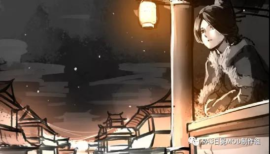
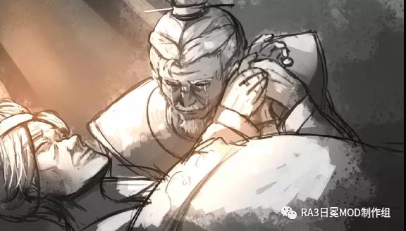

# 燕之楚歌

太子抵达保定府时，已是半月后了。

穿过城外林立的拒马，便有北燕的侍卫接引一行人前往行宫。

步入正殿，只见正坐上是一略显娇弱但气度不凡的女子。虽觉女子当政略显荒谬，但太子自然深明礼节，上前躬身行礼道：“外臣即是大楚皇太子，觐见大燕天子。”

“免礼。”女皇和太子目光相遇，她感觉到了对面这位皇子眼神有些异样。

公主即位，国都沦陷，恐怕他在眼中，现在的大燕就是个笑话吧。

“陛下为何不去济南府重设朝廷？”太子自然有几分好奇这有史以来第一位算是正统继位的女皇帝是何等人物，“保定距前线不过百里，敌骑若是突进，半日即至。”

“军情疾如火，不可怠慢”女皇的回答有些生硬，燕京沦陷时冲天的火光依旧历历在目。

“陛下言之有理。”太子笑了笑，点头称是。

待安置好大军后，定国公也到了行宫之中，随行的侍卫和副将推来了一辆悬挂着巨大地图的小车。当南北两国的重要人物悉数到齐后，临战部署随即展开。

“当今局势非比寻常，紫荆关已由周将军（首批北援军主将）夺回，易州、定兴、容城也在我军手中。”定国公敦厚的声音回荡在行宫的正堂，“沿线现有燕军千余、我楚军一万。紫荆关北接大房山与拒马河，东边易州至容城沿有白沟河所阻，沿线共计燕军一万一、我楚军六万余人。如此看来，我军左翼倒是无忧，中线亦不失稳妥……

……今燕京已失，蒙军势必南下，而南侵之路无非东西二线。若蒙人于西线沿白沟河南下，那倒是正中本公下怀。”定国公看向周将军，“容城、定兴二城乃重中之重，不容有失，你当全力坚守，一旦遭遇敌军主力，立刻汇报，不得延误，亦不可擅自出击。”

“末将领命。”将军抱拳。

定国公继续说道：“倘若敌军走东线、沿大运河南下，便颇为棘手。”

“确实，东边坦途辽阔，蒙军在此较为灵活，难以捕捉其主力的动向。”太子指着地图，“蒙军大部为骑兵，日行三百里不在话下，我军则多为步卒，一旦扑空，便成疲于奔命之势。”

“殿下所言不错。”定国公轻抚胡须，“既然如此，我军何不固守城池、守株待兔？如今蒙人一统漠北各部，后金、朝鲜皆俯首称臣，蒙军可谓兵强马壮，气势正盛，此次南下自然不同以往，乃是携灭国之势，而我大楚援军与这坚固城池便是其最大的阻碍。如若我军主力弃守城池、于野外与之决战，反倒是正合敌意。”

“诚如定国公所言，蒙军不可能在我军尚有十几万兵力之时强行攻城，只能尝试于野外决战，”女皇的眸子有些黯然，“但放眼中原以北，漠北已然一统；中原以西，乌斯藏、西域亦为丹图汗（大蒙古国可汗）所控。现今蒙人对我中原已成合围之态，若放任蒙军，必然遗患无穷，待其站稳脚跟，中原怕是要面临更大的祸乱……”

……

数日后，太子正在玄玑卫的大营中巡查，转到营门前时，却巧合般遇到了女皇一行人。

“见过陛下。”太子随即行礼，见女皇至此应是有事相谈，他便又补充道“还请陛下移步大帐”

一行人穿过玄玑卫驻地，来到营帐，见玄玑卫训练有素，装备精良，女皇不由道：“此军，倒是和神机营相仿。”

太子制止了沏茶的侍从，亲自动手，随口问道：“神机营如今驻守何处？”

当他抬头将茶递上时，却见女皇望向帐外，平静道：“算是全军覆没了吧……神机营、神枢营都随父皇葬身关外，燕京之战中，重建的神机营也损失殆尽。”

“这……是外臣失言了。”太子呡了一口茶，见女皇似乎有些犹豫，便好奇道：“不知，今日陛下因何事而来？”

“朕……想知晓，贵国皇帝意欲何为。”

太子不敢直面她的目光，他苦笑了一下，他能说他爹已经盘算好了怎么一统北方了么？

其实这几个月来，北燕已经连续派出多名使者南下与南楚商议，只不过双方的分歧繁多，往往不欢而散，北援的事自然是一拖再拖。

父皇应该是巴不得这样吧，拖的越久，北国的筹码越少，如今连国都都丢了，太子想。

他思来想去，只能轻声道：“父皇……意在还天下太平。”

“天下太平……吗。”女皇听闻，略显无力的一笑，似是在自嘲，随即便缓缓起身，向门外走去。

太子知道，对面的这位皇帝，已然料想到了一切，这个问题，怕只是单纯的想让自己死心罢了。

犹豫了一下，太子又模棱两可道：“父皇说……他累了。”

女皇身形顿了一下，回望了他一眼，思考片刻后道：“朕……知道了。”

……

从历法上言，初夏将至，可如今在这北地，冰雪才刚刚消融。雪水携着昔日的悲痛记忆浸到了大地之中，滋润着大地，同时也期冀着多年未见的祥和到来。

十五万人组成的庞大军伍在平原上缓缓的向北行进着。

“不知细叶谁裁出，二月春风似剪刀。”太子放下了望远镜，“本宫在海外三年，倒是许久没见过九州大地生机勃发的情境了。”

“海外如何？”骑着大白马的女皇问道。

“海外……”太子觉得这个问题太宽泛了，谈及南楚与海外诸地，他觉得自己可以讲上几天几夜，一时间竟然不知从何说起。

皇帝似是意识到了太子的难处，于是随口道：“朕听闻，近些年楚商在倭国发掘了几处金银矿藏，可有此事？”

“确实如此，否则我们也铸不起那么多金银币，”太子笑了笑，“南起江淮、北至燕赵，唯缺金银铜三者。近几十年来海外贸易愈发繁兴，是得了不少金银，但铜钱还是不够用、金银那就更缺了，退而求其次的纸钞也只是缓兵之计……现在到好了，倭国的金银之多令人咋舌，称之为金山银山亦不为过。”

“竟这般之多吗？”

眼看着行程差不多了，太子拱手道：“是时候了，外臣该出发了。”

“朕祝诸位旗开得胜。”

“谢过陛下。”

他随即领军从大队伍中分离开来，两万多人马很快便消失在天际线。

中午时分，远处几名骑兵来报，为首的楚军斥候身上还沾着血迹，马脖子旁挂着的布袋圆滚滚的，还在往外渗着暗红的液体。他斜挎着燧发枪，拱手道：“报！国公爷，大半个时辰前，正北方向二十里，下官所部遇敌游骑二十余人，已将之尽数围杀。”

定国公颔首，挥手道：“休息片刻，再探！”

他转头对侍卫招了招手，“地图。”

“看来是从静海方向来的，八九不离十了。”他接过地图，看了两眼便笃定道。“如实转报太子殿下，另外下令，大军继续缓步北行。”

“得令！”

小规模遭遇战，在这几天已经屡见不鲜了，而发生的频次也逐渐攀升，今日才至晌午，却已有三次。

……

几天前，当定国公提出的破局之计告知众人后，关键人选便成了最大的问题。

“国战，不动则已，动则一鼓作气一击毙命，”定国公踱步道，“如今蒙军兵力众多，行动灵活狡诈，以我等兵力，的确能将之暂时驱逐，但着实难以重创蒙军。一旦大军撤下，其必有余力再度来犯，所以不战则已，战则要彻底击溃其主力。而敌军灵活，我军臃肿，若要破敌，势必需诱敌来攻。从蒙军动向来看，这丹图汗行事激进，屡屡得胜更是让他居功自傲，意欲一举拿下黄河以北。今日海津卫来报求援，称数万蒙军围城数日，城中余粮只得支撑半月。算上海上调度过去的援兵，几经大战海津卫的驻兵也所剩无几，敌军一举拿下城池理应不在话下，可这蒙军却围而不攻，想必是想围城打援，逼迫我军分兵作战。而除去这数万蒙军，丹图汗所率的蒙军大部依旧动向不明，正可谓敌在暗我在明。”

“若我军只分出数万兵力支援，这丹图汗必然道中杀出，围剿援军。而如果我军派主力出击，与蒙军正面交战，除海津卫方向迎敌外，蒙古大部从哪个方向杀出还是个变数，我军势必两面迎敌，正中蒙军下怀；而若蒙军自觉不敌，丹图汗也可借我军主力出击之际偷袭保定，再不济也可全身而退。我军若放弃海津卫，蒙军则既可威胁我军补给粮道，又可对我保定形成两面包夹之势，之后的战局我军便失去了主动权。可以说无论怎么选皆对我军不利。既然如此，我们不如将计就计，分兵两路，一路作为诱饵，佯装支援海津卫，引敌倾巢来攻，另一军则为奇兵，待丹图汗所率大部出现，从其侧后翼突袭之，断其后路。”

没有人有异议，但侧翼出击的任务交由谁呢？

“定国公，这侧翼突袭就交由我吧。”

“殿下，”看着对面这位年轻人跃跃欲试的样子，定国公就知道他想冒险，“此事凶险异常，殿下不可以身犯险。”

太子摇摇头，他低头摸了摸配剑，然后抬头认真道：“此战重在固守，野战之时应对敌军大部，兵力不可不足。所以我不能多带兵马，一万即可，定国公则统领大军诱敌决战。”

“敌军少则十万，多则近二十万，仅用一万兵力击敌侧后……不可！”

“定国公，如果增兵，主军就危险了，”太子坚持道，“我率一万人马绰绰有余。不入虎穴、焉得虎子？”

“本公不允。”

“一万三！”

“不行！”

“一万五！”

“不行！”

太子咬牙道：“两万！”

“两万大军……”定国公叹息道，他深知太子在海外虽也有苦战但从未战败，着实担心第一次独自领军的太子会因过于轻浮而陷入险境，“纸上谈兵不可取……兵，死地也，而括易言之。殿下，领军作战，最忌讳的就是只考虑胜，不预想败。”

太子自然是领会了他的意思——赵括吗？他笑道：“定国公，本宫自然不会忘了留后路。既然国公意在诱敌于青县与静海一带决战，假使情况有变，我亦可舍弃辎重向西南方向脱离。”

定国公沉默了，整间屋子亦无人出声，不知道过了多久，他叹息一声，艰难的点点头，“好吧，殿下，老臣只能劝诫，万万莫要轻敌。这世上，火器并非无往不利，大楚也从未百战百胜。”

太子舒了一口气，凝重的拱手道：“谨遵定国公教诲。”

散会以后，有将领追问道：“公爷，殿下跟着丰城伯在大食历练数年，本事不差，您何须如此？”

“殿下……太爱行险了，他于大食那一战，何不也是死中求活啊。本公虽知晓他自不是赵括之流，面对危局也能从容应对，但常在河边走，那有不湿鞋啊。”

“国公爷，您且安心，两万精兵，还有玄玑卫压阵，此等军力放在别处足矣随意灭国，而那蒙古，亦不过土鸡瓦狗……”

定国公斜视了他一眼，冷冷道：“轻敌！轻敌者，大都是丢盔弃甲的结局。那丹图汗也绝非等闲之辈！二十棍，自己领罚去。”

“啊？得令！”

……

至于皇帝，她本应坐镇保定，但是首相放不下心来，便匆匆写了一封信托附给司空昭曦。

皇帝看完了这封信后，起身将其放进了一旁的炭火盆中，看着升腾而起的火焰吞噬了整封信，她突然问道：“你说，去、还是不去？”

统领沉吟了良久，最后说：“该去。”

首相的担忧自然来自于另外两位藩王，那位骄奢淫逸的晋王、和早已南逃的平王。当他们得知自己的侄女承袭帝位后，怕是早已捶胸顿足、绞尽脑汁的想着怎么把她拖下来吧。

这几天，姗姗来迟的几支勤王军队也抵达了保定沿线，这些军队理应一个多月前就赶到，但却现在这个时候才磨磨蹭蹭抵达，这其中自然有蹊跷。

如今南楚援军即将出发迎敌，保定沿线的生力军就只剩这两支“迟到”的勤王燕军了，先前跟随皇帝撤出燕京城的残军，一部分还在一线驻守，另一部分亦分散驻防在附近的城中。

“……陛下登基已有数月，然朝中依然不乏离心者，倘若其人里应外合一齐发难，陛下恐难无恙……臣请陛下随同楚军出征，万万不可陷于别有用心者之手……”

信纸彻底湮灭于炭火之中。

“首相其实是个循规蹈矩的人。”统领话里有话——其实和许多老臣一样，首相对于公主继位也是十分不满。

“但他还是支持我的。”

“因为他忠于大燕。”统领淡然道。

“可……事已至此，最后的结果无出其右。”

统领的声音依然不带情感，“但那或许是最好的结局。”

皇帝喃喃道：“那时候……大燕还在吗。”

……

“臣死谏，陛下不能去、不能去啊，万万不可啊！皇帝您不能再以身犯险了啊！”得知皇帝又要亲征，几个大臣当即出列大声哭喊，叩首磕到头破血流，定国公虽作为外臣不便于表态，但他依然隐晦的在表示赞同。

太子其实也不乐意见到女皇亲征，所以他一开始就和定国公商量着、把掌军权要了过来。

最终，女皇将最后的精锐——四百名具装重骑兵交给了太子，她知道这些精锐的骑兵只有在进攻中才能发挥出最大的效用。

“此战，朕……想赢。”她郑重道。

太子双手接过虎符，一字一句道：“外臣将全力以赴。”

而女皇则只带五千步兵、一千轻骑随定国公出战，指挥权一并交由定国公。

……

子夜时分，左翼，太子所率的两万偏师已深入数十里，重骑一人三马、轻骑一人双马、步兵亦每人一马，随行还有数百辆大车。

步兵配马、多是用来驼运甲胄武器和干粮这类物资的，在行军中自然不用以骑乘。

“殿下，敌军游骑愈来愈多了。”斥候来报。

有将领疑惑道：“不知敌军敢不敢与我大军决战，若是他们不敢……”

“不敢的话我们就功亏一篑了。”陈副将同样担忧。

“敌军哨探的如此密集，结果很快就出了，不必担心，”太子收起了望远镜，“今日或者明日，咱们就能收到定国公的消息。”

“那我军现在……”

“继续截杀他们的游骑，能解决多少是多少。”太子翻看着地图，回道。

“敌军怕是已经知晓我们的意图了。”

“纸里包不住火的，丹图汗也是一代枭雄，本领非凡，否则也不可能带领蒙古在这儿肆虐，”太子的目光驻留在了地图上的一点，“无妨，咱们作为偏师，不影响敌军的计划。决战还是撤退，对他们而言，我军这两万人的威慑力还远远不够。”

副将有些不服气，“殿下，他们何曾见识过咱们的军威……”

太子笑道：“国公的计谋不正基于此，丹图汗如今自傲轻敌，自然不会想到我们这两万精兵能有多大的威势。”

凌晨的时候，有信使来报。

寒气依旧，尚不适应北地环境的太子牙齿有些打颤，诚然，他并不喜欢在这种环境下枕戈待旦的感觉，恐怕也不会有人喜欢吧。

“定国公来信！敌军十五万，已与我大军相遇，敌意明朗，决战在即！”信使的背上还插着一支箭矢、满是血污的脸上却只有诱敌成功的激动，在附近火把的映衬下看着有些诡异。

不用想，一定是来路上遇到了围堵。

副将也难掩兴奋，“殿下，不出所料啊，机会来了。”

太子望着天边刚刚露出的鱼肚白，不禁赞叹道：“不愧是定国公。十五万大军，分出我这两万人后还剩十三万，恰到好处，多了怕敌生怯、少了却又难防守反击。”

“我军如何应对？”陈副将询问道。

“生火，提前一个时辰开饭。斥候全部撒出去，本宫每半个时辰就要一次敌军的动向！”

偏师营中已然忙碌起来了——伙夫和辎兵们在准备早饭和物资，士兵们注意到这动静，自然意识到机会来临，披肩带甲的金属碰撞声在太子的耳中却好似绝弦的奏乐。

随着第一缕阳光射向大地，号声响起，士兵随即列阵集合，军营瞬间沸腾起来。

最新的军情接二连三的送来，定国公的主军已然列阵迎敌……

……

“敌军包围大军！”

……

“交锋开始了！”

……

蒙古大军放出数队游骑，意在遮蔽战场，让楚军丧失主动权。

几十队轻骑和斥候也策马冲出楚军大营，双方在两军中线附近展开了激烈的绞杀战，这种战斗规模小、时间短，但却格外惨烈。

火铳刺耳的啸鸣伴着苍脆的弓弦声，不时有人落马。嘈杂之中，有斩杀敌人后的振声高呼，也有被套马索拖行在地时的痛苦哀嚎……

楼车上的士兵不断的汇报着远处的敌情，马背上的定国公忽然放下了望远镜，指着左翼道：“左翼卯队过激了，速令他们后撤，让甲队上前接应，。”

远处，已经有两波蒙军骑兵从两翼包夹过来，似钳子般要紧咬这一队楚军轻骑，幸好有另一队接应他们才得以逃出生天。

“为将者不可意气用事，你两次越过中线，有罪，五棍，立即行刑。二十棍，战后领罚。”

“谢公爷！”

随即，轻骑队长被人拖走按倒，粗重的军棍紧跟而来。五棍打完并不影响作战，更多只是个教训，顺带警示全军务必谨慎。

激烈的绞杀战一直持续到下午，随敌军大部开始前压，双方陆陆续续撤回了游骑，停止了大战开始前的交锋。

这一场“阵前仗”，双方损失竟不相上下。

“敌军列阵了！”楼车上的士兵高喊道。

“全军警戒，准备迎敌！”

定国公有暇看了一眼女皇，“野战错综复杂瞬息万变，必须慎之又慎。往往双方摩拳擦掌几天几夜，最后决战定胜负却只需一柱香的时候。”

“嗯，前辈所言极是。”女皇点头称是。这都是兵书上写过的东西，但也只有身临其境才能切实领悟。

定国公不喜欢掺和朝政，他的立场很正，这也是皇帝指派他执掌北援大军的原因。但他也不乏敏锐，他知道旁边的这位年轻女子，保不齐就是未来的皇后了。

……

西北方向一百多里，太子所率的偏师也遇到了些情况。

“全军注意，准备迎敌！”

在前锋部队周围警戒的斥候们已经摇起了青色的塘报旗，示警行军遇敌，敌军众多。

“不对头啊，”看着远处黑压压的一片，副将已经意识到了不对劲，“起码三万！”

楼车上的士兵放下了望远镜，低头朝着将领们大喊道：“殿下！敌军三万到三万五！”

“他们想截住我们，然后尽心围攻主军！”

太子对这焦急的言语有些不满，他平静道：“无需惊惶。”

“全军注意，车营上前，继续北行。”

“殿下，咱们的行踪已经完全暴露了，他们早有应对，”陈副将犹豫了一下，“我军不后撤回援吗？”

“是啊，我军坚持北行，敌军势必不断袭扰，而且若敌军布下埋伏守株待兔……”

“所以我军撤退，他们就不会来追击了？！”太子冷冷的瞟了那位将领一眼，“执行军令。”

一支支蒙军的轻骑兵奔驰到了行军中的偏师附近，开始在几百步到几十步的距离上来回游荡，时不时的陡然凑近又掉头远去。

“殿下……士气……”

这样一路被骚扰还不能还手，换谁都受不了。

“前方有高地，准备扎营。”太子眯眼看了看西边的落日，令道：“前锋出击！立刻抢占高地。”

当夕阳完全没入地平线时，一座临时的营寨已经大体成形，但士兵们还在轮换着加强外围垒起的土墙和壕沟。

太子巡视完了一圈，在大帐中负手道：“至此已经大半日没有信使来到了，由此可见敌军已决心围攻主军。”

他转悠着，“前来阻碍我们的当面之敌三万有余，从时间来看，应该不是从定国公那边的蒙军中抽调来的。”

“本宫决心继续出击，攻敌后方。”

“可……殿下……当面之敌……”有将领不明白太子的意图。

“明早加速北行，逼迫敌军与我们决战，”在油灯的映照下，太子的面色冷峻，“击溃他们。”

他挥挥手，“以为三万人就能缠住我们？痴心妄想！”

第二天，当清晨的薄雾散尽后，这两万余人的精锐面对蒙军的袭扰毫无顾忌，依旧在义无反顾的持续北进。

最后，总有一方会按耐不住。

“全军注意！止步，列阵！”

远处，成千上万的蒙军已经整队完毕，战马打着响鼻、前蹄不断磨蹭着草地。

从空中鸟瞰，两万多联军迅速分开，最里面的是辎重部队和辅助兵们用大车组成的巨大圆阵。外围则是火器部队，共组成了十八个空心方阵，主体是鸟铳兵和长枪兵，炮兵和刀盾兵则待在方阵中心。

太子与一众将领身处在中间地势稍高处的圆阵中，看着左前方那个将直面敌军冲击的方阵。

纤嫩的青草在无数铁蹄的践踏后再也直不起了身子，震耳欲聋的马蹄声让整个地面都颤动了起来。

“稳住！”太子在观察着，“这只是试探……开炮即可。”

数千蒙军骑兵迅速包围联军，一波又一波的从侧翼掠过。联军的数百门大中小火炮的开火层次非常清晰，看似让敌军蒙受了惨重的伤亡。

然而将领们都很清楚，火炮发射的实心铁弹其实造成不了多少杀伤，但不可否认，火炮在提振己方士气、打击敌军士气的本领上依然无人能敌。

“我真没想到他们竟敢直冲。”当敌军的正式进攻开始后，太子讶然。

当面的蒙军并不傻，但是多个空心方阵组成的“刺猬”好像没什么突破口，反复试探了多次都没有露出丝毫破绽，于是他们尝试从两个方向同时发起冲击，似乎想要一口气冲破这个看着一触即溃的松散阵型。

“一百二十步！”

“第一排，向左齐射！”

“哔哔哔—”尖利的哨子声响起。

“砰砰砰—”浓厚的硝烟几乎遮蔽了战场。

密不透风的铅弹笼罩了正前方，嗯，左翼的敌军至少倒下了一百名，右翼的敌军也同样有近百人落马，太子注视着那些试图强行冲击四方玉宇阵的蒙军骑兵，同时分析着火力密度是否足够。

“轰轰轰—”方阵中心的火炮打出了一轮霰弹，无数铅子组成的弹雨横扫了整片的敌军，跌落的敌军延缓了后续骑兵的冲击，但，距离已经很近了，近到都快能看清对方的面孔。

“三排齐射，准备！”

前三排的火铳兵全部就位，第一排跪下、第二排半跪、第三排站立。

“五十步！”

“二、三、四排，向前齐射！”

“哔哔哔—”哨声传来。

在五十步这个距离上进行的三排齐射带来的杀伤效果无疑是毁灭性的，看着几乎被一扫而空的敌军前排，太子满意的点点头。

“长枪上前！鸟铳注意，自行射击！”

接下来，身着重甲的两排长枪兵将顶在一线，身后的火铳兵也将不再听从号令进行齐射，而是装填完毕后即可随意开火。

而在大阵之外，还有百余名零零散散的楚军士兵各自为战，被称之为游击兵的他们端着长长的燧发枪，随心所欲的在一百多步的距离上瞄准敌军打冷枪。

两柱香的时间后，蒙军退了，但没过多久就又卷土而来。

“敌军刚刚至少折损六百人马。”

这一次，敌军选择冲击方阵的边角，这儿的火力最稀疏。

当几乎快要遮蔽大半个阔野的硝烟散尽，地上留下的依然只有一片倒地的蒙军遗骸，蒙军这才停止了直接冲击方阵的行为，游荡在两翼的游骑也在远遁。

“殿下，敌军怯了。”陈副将道。

“他们之前只见识过北燕的火器，自然太轻敌了，”太子的声音传来：“前阵转横队，后阵不变。”

前面的八个空心方阵迅速转变为了三十二段长长的横队，而后十个空心方阵则保持不变。

“车营变阵，准备前进！”他收好了望远镜，把一支火铳挂在身前，拔出了长剑，“骑兵列阵。”

“只需缠住他们，若无良机不可冲杀。”太子看了眼骑兵指挥官，然后举起了剑，“出击！”

三千轻骑兵从阵中鱼贯而出，而中心的大圆阵也在快速转为行军的纵队。

楚军轻骑兵的标配是角弓、骑铳、弯刀，迅速出击的骑兵们很快就和在外围游弋的蒙军骑兵遭遇，“砰砰砰—”的齐射后，开完枪的骑兵降低了马速开始装填弹药，而其余的轻骑们则在射出了一轮箭矢后拔刀杀了进去。

“干净利落！”见两队蒙军游骑都转瞬间被击溃，副将赞道。

“还不够，”太子微微摇头，“全军转为纵队，玄玑卫上马，随我出击。”

让步兵上马机动、下马列阵作战，这种战术并不常见，显然太子想于此一口气击溃这支蒙军。

“这支敌军本不需要死缠烂打，咬住我们即可，但……”不用多说，交战的野地上散落着上千人马尸骸，“我以为，定国公那边情况可能不妙。”

毋庸置疑，火绳枪的出现是军事史上的重大变革，而燧发枪更是如此，但孱弱的机动性，是阻碍火器部队发扬光大的最大障碍。

威力大，但是无力机动，就算打赢了也无法在追击战中大量杀伤敌军，就如同前宋的重甲步兵一般。

起码太子是这么认为的，所以开始尝试为他的亲军配马。大楚马场不多，虽然有进口来的西北马、以及海运来的大食马，但这些上等的军马依然要优先供给精锐的骑兵，于是玄玑卫的士兵们配的都是次一等的战马，只有重甲长枪兵配的是好马。

环视了一圈已经列队完毕的亲军，他点头道：“击溃当面之敌，然后击敌软肋，出发！”

“万胜！”

……

步兵骑马不常见，但是骑兵下马步战却是古已有之。

四百年前，成吉思汗统帅的十万蒙古大军下马步战，于野狐岭击败了金军中路，随后席卷而过，五十万金军一败涂地。

如今，蒙军同样会这么做，而他们当中的女真军，更是步战的行家。

定国公一直在仔细的观察着当面之敌，蒙军大都着棉甲、皮甲与札甲，女真军这边，各类甲胄的披甲率高的吓人，隐约间还不时能瞅见身披白色重甲的精锐士兵。

“那是白巴牙喇。”女皇提醒道。

“果真是精兵，上马能冲阵、下马能拼杀，今日一见本公算是信了大半。”

他盘算了一阵，郑重道：“三军准备，令中军摇旗！”

各个方阵开始摇旗应号，传令的骑兵快速穿梭在军阵之间，高声通禀着军令。

“此乃劲敌。”见敌军亦做好了战斗准备，几万蒙军骑兵集合在了两侧，而当面的女真军则已经排开了阵势，定国公满意道：“他们要打堂堂正正之战，本公乐意之至。”

女皇难免忐忑：“前辈，孙子云：‘勿邀正正之旗，勿击堂堂之阵’。这军阵以前已让我燕军吃了不少亏，而现在……”

“一家之言罢了，”定国公远眺着正前方，“更何况，火器乃古书未有之变局，其运用可不能拘泥于古人的说教。”

“靖海候就曾说，火器部队不同于其他，只要已方列阵有序且略占优势，那便随时可以迎敌。数战下来，我深以为然。”定国公惋惜道：“当年我若非跟着他带兵打仗，怕是要辜负了我这个爵位。以后，他的《纪校新书》，你大可琢磨。”

女皇点头。

诺大的楚军已经变成了一个由三个主阵和许多小阵组成的复杂集合，布置在两腋的是二十多个火器部队的空心方阵，两哨与前军则是普通的步兵、火器占比约为半数。由于太子带走了大部分骑兵，所以剩下为数不多的骑兵被安置在了后军待命。

“火炮准备！”

敌军看似进攻方向为大阵正面，上万兵卒、无边无垠，虽还只是在缓缓逼近，尚未开始冲锋，但践踏大地时的颤动依旧咄咄逼人。

“装大子一枚！”在放入一包四斤的火药后，一颗颗十五斤的铁弹被塞进了炮管。

“插线！”

“点火！”

“轰轰轰—”的轰鸣声中，上百门大将军炮齐射的铁弹呼啸而出，所及之处，糜烂数里、触之者立化为齑粉。

突如其来的炮火让敌军乱了一阵，显然他们低估了大将军炮的威力，但其随即重新整顿，调转方向，向右哨发起进攻，右翼才时他们真正的目标。

“三百步！”

“放！”

左右哨的车载佛郎机炮皆列于第一线，从三百步开始齐射，到一百步，刚好可齐射两轮，两轮打完、炮手们便立刻撤入阵中，留下的炮车还可阻挡敌骑冲击。

“轰—”

“换子铳！”炮手们把刚刚发射完的子铳从槽口拎出，随即有人更换待发的子铳。

“点火！”

“轰—”

“弃炮回阵！”

经受了两轮霰弹洗礼的蒙古骑兵前锋少了一大半，不过稀稀落落的位置很快就被替补了上来。

“一百步！”这个方阵的军官喊道，“一队向前齐射！”

“哔哔哔—”军官吹响了哨子。

“砰砰砰—”

“两排齐射，放！”

“哔哔哔—”

“砰砰砰砰砰砰—”

“长枪上前，列阵！”

右翼，惨烈的交战仍在继续，可就在这时，楼车上的士兵惊道：“火炮！前方三里，敌军火炮！”

远处，一排排炮车已经整齐排开，他们前方的步兵已然列阵有序。

“传令！立刻堆积土墙。”

“左腋、右腋变阵！”

空心方阵是骑兵的克星，而火炮则是空心方阵的克星。

很明显，敌军已经发现面前这支军队是块硬骨头，现今对右翼发动的攻击效果甚微，那么接下来两军仍将处在相持阶段，只有尽可能的抓住或创造机会袭扰、消耗对方，才能为最后那短暂的决战创造更为有利的条件。

在远距离使用大炮轰击自然是不二之选，即便蒙人手中的实心铁弹单次杀伤效率不高，质量更是参差不齐，但是由于可以跳弹和长时间打击，所以依然能对敌方士气造成严重挫伤。

堆积土墙的命令一经下达，辎兵和民夫们急忙奔走起来，一部分将备好的沙袋堆起，一部分则以沙袋为基，加固土墙，试图尽可能削弱远程炮击跳弹带来的二次杀伤。

女皇看着正在构建中的零零散散的土墙，虽大致土墙明白原理，但眼看敌方大炮已然靠近，便问道：“时间怕是不够了，此举用处不大吧？”

“确实如此，基本无用，”定国公举着望远镜，目不转睛的看着远处正在忙碌的蒙军炮手们，然后放下望远镜看向皇帝，“但起码能维持我军士气。”

女皇微微颔首，维持军士心态与士气之事着实是一门需要经验的学问。

“敌人开炮在即！”楼车上的士兵摇旗喊道。

双方火炮皆以蓄势待发，远处，敌手炮手正在点燃引信。近处，楚军的炮队也刚刚捣实了装填完毕的药包和铁弹，炮手则迅速插上引信点燃。

“陛下还请移步盾车后。”身后一侍卫说道

“不必，大军不退、朕亦不退。”皇帝一口回绝。

“来袭！”

当远方亮起一片火光后，炮弹的啸鸣随之而至。

铁弹划过，土墙分崩离析，阵地之上霎时遍布残肢断臂，侥幸未死的人也大都因失血过多晕死过去，大概率见不到明天的太阳了。

有几颗炮弹的落点就在中军不远处，皇帝偏头、恰好看到了一缕残影，它落在地上、有些坚硬的泥地没有吸收多少动能，它弹起、飞向了主帅纛旗旁。

一名士兵被直接撞飞了几步远，倒在地上口吐鲜血。

皇帝的心跳陡然加快，不过经历过燕京激战的她已再不会震撼于此了。

楚军阵中的百来门大将军炮随即还击，轰鸣不断，可谁也没想到，双方的炮战持续了一个上午才短暂停歇，已经有兵卒在这种场面下崩溃发疯，但很快就被绑起来丢到了辎兵之中安置。

这蒙军的炮弹储量着实有些诡异，定国公忽然想起了一件很重要的事，他问，“燕京之中所储火药可处置了？”

女皇回道：“烧了五个仓库，其余则已令人泼水。”

“为何不全放火烧掉？”定国公已经皱起了眉头。

“那十几万斤火药都位于城中，燃之，燕京安在？”

定国公脱口而出：“大谬！”

皇帝反问道：“何错之有？”

定国公本想反驳，但他看到了皇帝眼中的坚定，沉默了很久，最终摆手道：“既然要与蒙人决一死战，就要有破釜沉舟的打算，怎能心慈手软。此非仁义，仅仅是妇人之……罢了。”

此言一出，旁人全数讶然，女皇蹙眉、但没有说话。

统领不满道：“南国大臣都如此口无遮掩吗？”

半晌，定国公微微拱手，“恕外臣无礼。”

日落月升、月落日升，自从第一次的试探性进攻结束以后，两军对轰竟持续了两天，阵地之上已被砸的凹凸不平，但这两天全部的伤亡加起来可能还没有那一次进攻折损的总数多。

双方都在等待对手支撑不住的时机，只有时机恰当，才可一战定乾坤。但楚军火炮精良、备弹充足，若一直拖下去，自然对楚军有利。

这两天的晚上，两军都没歇着，你来我往的袭扰让每个人都寝食难安。

女皇的眼睛有点红，若那“擅长聊天”的楚国太子在这儿，怕定会对她的黑眼圈打趣，“与食铁兽无异。”但现在没有人有闲心在乎脸色或仪容。

又一个正午，看来蒙人已深刻意识到对面的军队与以往不同，如此威势下依旧毫无动摇，再拖下去也占不到什么好处，从楚军大阵瞭望过去，蒙军已然列阵准备好决战了。

传令的骑兵穿梭在方阵之间，“定国公令！”

“决战在即，战端一开，诸将需不惜此身，三军当全力以赴。”

擅自动作者，斩！

违抗军令者，斩！

将有胆怯者，斩之无罪！

兵有畏缩者，杀之无过！

两翼，无边无沿的蒙古骑兵已经开始迂回；正面，数万女真和蒙古军全部下马列阵，开始前进。

半柱香的时间后，双方彻耳的喊杀声已经完全淹没了战场。

军官们放下了哨子，开始喊话指挥射击。

“敌军欲冲击左哨与左腋结合部！”有将领喊道。

楼车上负责瞭望的士兵报道：“轻骑四千！重骑数百混于其中！”

“遣一队支援。”

左腋最靠外的一个空心方阵成了最重要的突破口，只有击溃了他们，后续骑兵才能安心冲击结合部。

倒在阵前的人马尸骸中还混杂着许多惨叫着的濒死士兵，但无人关注他们。

端着鸟铳的士兵们在连日的战斗中已经完成了蜕变，彻底融入了战场，他们冷漠且机械的举起了火铳，再也不会顾及骑兵们震天撼地的动静了。

“第一排，向左齐射！”

“第二排，向前齐射！”

“后队准备，两排齐射，放！”

来不及等再一轮的齐射了，军官高举着在阳光照射下银光闪闪的长刀，“长枪就位！”

身着步人甲的长枪兵们端着一丈多长的大枪列成了薄薄三排的枪阵。

蒙军的轻骑兵当然不会傻傻的直冲完整的步兵方阵。前面的轻骑直射、后面的抛射，密集的箭矢好似下了一场箭雨。

“当心炸弹！”

近了，他们开始侧身甩出一些小盒子、瓦罐类的东西以后，随即勒马划出一个漂亮的弧线，从长枪阵前掠过。

气浪、碎片和烟雾笼罩了前沿，有一处的几名士兵没站稳，长枪歪了。

机会，转瞬即逝。

这个缺口可能几秒钟以后就会恢复原状。

不过跟在轻骑们后的重骑把握住了这个机会，他们接踵而至，冲向这个小小的缺口，最前面的重骑虽被长枪戳穿，但沉重的战马依然撞向了阵列。

“砍马腿！”长枪噼里啪啦的崩断声中，军官们呼喊着。

厚重的札甲也抵御不了重骑的长矛，前排的长枪兵们几乎被串成了肉串。丢掉长矛后，蒙军重骑挥舞着铁锤和马刀冲向了后面的火铳兵。

“砰砰砰—”仓促的齐射后，军官喊道：“上铳剑！”

仅仅穿着半身甲的鸟铳兵，被近身之后的破绽太多太多。

把刺刀插进枪管中后，火枪自然就无法开火了，而且几尺长的刺刀面对人马俱甲的重骑、差距还是太过悬殊。

方阵前，已经绕了一个圈子的蒙古轻骑们也继续加入了战斗，一部分人下马，换用威力更大的步弓发射破甲箭，另一部分则尾随着重骑冲入阵中。

方阵后，来援的队伍是几百名刀斧手，同样是全身重甲的他们拎着大斧或铁锤、腰配直头长刀。领队的军官挥舞着四尺多长的铁锏，把一名刚刚下马的蒙军重骑抽得脑浆迸裂。

只见他豪爽大笑，弯下腰一把拉起地上一被重骑撞倒的军官。

看样子，他和这个空心方阵的军官是旧相识了。

“哈哈！爷爷我不负袍泽之谊！”

“多谢了，本官……”方阵的军官整了整身上的甲胄，刚才的撞击着实让他有些喘不上气。

“瞧见了吧，你这火铳可不是万用的。”

刀斧手们先砍马腿，随后大斧挥砍，劈碎重甲、砍破躯体，力竭后则直接丢掉斧子，拔出直刀继续厮杀。

“回京以后记得请爷爷吃酒！”

“嘿你小子，好！请定了！”

……

太阳缓缓越过了正当空，阵地之上，厮杀仍未停歇。

蒙军的进攻梯次非常清晰，步军于前冲杀、炮车、弓手于其后支援。

双方都把车载的小炮推到阵前互射霰弹。如此的交战下，场面之惨烈超乎想象，血肉模糊的场面不断打击着双方的士气。

而南楚步军的战术显得稍许灵活，一些手持着长管燧发枪的游击兵脱离了大阵，这些最机灵、射术也最精湛的士兵两人一组、穿戴着鳞甲乃至半身板甲。就这么游荡在主阵两侧自由射击，往往能在主力接战前放倒好些人。

后方阵地，一名浑身染血的将军策马回到中军，他一下马，几名医官就紧跟着奔来，先是递上了掺了阿片的烟枪，然后用钳子剪断箭矢，拔出了箭头，再以烈酒拭之，最后敷药包扎。

“万幸，此箭没有倒角。”

杀红了眼的将军看着仍有些狰狞，他看向定国公，“定国公，殿下为何还未出击？”

“战阵之上孰能料得？”定国公摇头，“面前的敌军数目不对，他们应该是受敌军偏师所阻。”

“末将以为，两军势均力敌，若无奇兵，怕是难以取胜。”

“本公知晓，你且退下，不可带伤上阵。”

“唯！”

没人知道定国公现在在想什么，他沉着脸观察着战局，不时调遣着部队左右驰援。

“马军如何？”

“尚有轻骑三千，重骑二百。”

但这是鱼龙混杂的骑兵，一部分来自燕军一部分来自楚军。

“计时，两个时辰。”定国公说道。

“得令！”

“两个时辰之后，我军今日再无良机。”

时间飞逝，一个时辰后，前军左翼和左哨虽多次被敌军撕开突破口，不过好在后方士兵及时顶上，没有崩溃。

“敌军有些后继无力了。”女皇探寻的问道，“可否出击？”

“不可行险，我军多为步卒，贸然主动出击极其危险。”

“朕……以为敌军要退了。”

“强弩之末难透坚胄，”定国公微叹，“可惜我们无力歼其主力。”

“着实可惜了，伤敌十指不如断其一指。”女皇虽然十分不甘心，但还是调转了话题，“贵国太子可有危险？”

定国公笃定道：“无恙，当面之敌十余万，太子至多遇敌三万。”

女皇点点头，又重新端起了望远镜。

远处，一些士兵丢掉了手中的长枪，拔出了直刀狠狠刺向敌军；

十几个鸟铳兵正在坚持着轮换射击，倒地的几名伤兵来不及撤走，于是便靠在战友的尸骸上给鸟铳重装弹药，不断递给前排；

一个头盔上插着一支箭的军官正挥刀指挥着其余士兵支援，全然不顾顺着脸颊流淌下来的鲜血。

可惜了，这样下去至多是平手，女皇顿感惋惜，上天啊，可否再垂怜一次大燕？

就在这时，她好像看见远处有异动，于是拉长了望远镜重新对焦。

五六里外，蒙古大军的侧翼，一座土丘上，几名惊慌失措的蒙军轻骑逃窜下来，有人不慎落马，然后咕噜咕噜的翻滚着。

土丘上，恍然间冒出了一名骑兵，那厚重的铠甲渗着血，在阳光照耀下闪着乌金色的光，那是燕军重骑！他俯首看着逃窜的敌军，高举起了马刀。

随后，越来越多的骑兵涌现在他身后身旁，越来越多、越来越多，直至遍布整个山头……

在那里，太子也策马登临土丘顶，他望着胶着在一起的两军，满意道：“敌我两军相持不下，如此甚好。”

身边的将领们也按耐不住激动之情，“此战我军必胜！”

“可惜我破相了，”他摸了摸脸颊，那儿有一道血痕，是之前与那支蒙军偏师交战中被流矢划出来的，“以后女人们见了我，都得绕着走喽。”

“殿下说笑了。”副将笑道。

太子环顾四周，骑兵们已更换战马，那几百名燕军重骑兵正检查着马匹披挂的厚甲，楚军的轻骑兵们也已跃跃欲试。

待骑兵们全体就绪后，他拔剑出鞘：“诸将士听令，不破敌军、誓不回转！出击！”

“万胜！！！”

在排山倒海的阵势与呼喊声中，以四百名重骑兵为矛头、几千名轻骑兵为主体的锥形阵从山坡上冲下，直插敌军大阵的腰间。

“定国公，是殿下！！！”

“漫山遍野啊……”看到远处的场景，定国公紧绷的心瞬间舒缓了下来，他问，“时候过去多久了？”

“刚满一个时辰！”

“幸甚，当毕其功于一役！”他缓缓拔出了配剑，轻抚了一下：“骑兵出击，前军稍后转为横队。”

旁边，女皇跨上战马，白马早已披上全甲，她左腰挎着长剑、右腰插着精致的短铳，腋下夹着冷峻的长槊，白马的前蹄刨着地，似乎已经感受到了主人心中的烈火。

“将士们！四百年前，蒙古大军攻克中都（燕京），一路南下，灭金灭宋。今日，我们反其道而行之！决不让他们的铁蹄再度踏入中原！”皇帝昂首，“朕将亲自冲阵，破阵之势、有死无生！”

“愿为陛下效死！”浪潮般的呼声传遍了战场。

三千多名骑兵从后方出了大阵，兜了一个圈子后直直地冲向敌军正面。

蒙古大军已经开始了骚动，因为在他们身后，可谓是铺天盖地的骑兵已经从土坡上冲了下来。

……

“我的天啊，殿……殿下快看！燕国皇帝在冲阵！”侍从惊道。

女皇就跟在那二百重骑兵们的后面，骠骑直的士兵们护在她的左右。

“若非亲眼所见，我同样不信。”太子有些愣神，只见一名丢盔弃甲的敌兵被那女皇的长槊直接挑飞。

没几步远，她再度出击，可惜戳在他的重甲上，马槊不得已脱手，于是只能拔出了剑。

“学艺不精啊。”

“殿下，马槊可是很难耍的。”

“也可能是力气不够。”

“是啊，毕竟是女子，而且娇弱不堪。”

太子闻言，不置可否的笑了笑，确实，哪个猛将不是彪形大汉？

但她毕竟是从前的公主啊，太子最后感概道：“此情此景，我倒是联想起了前唐的平阳公主。”

“臣记得晋地有一处关隘就是得名于她。”

“是的，那儿叫娘子关。”

太子放下望远镜，自言自语着：

“操吴戈兮被犀甲，车错毂兮短兵接。”

他翻身下马，忽然想将这幅壮阔的沙场图景画下来。

“旌蔽日兮敌若云，矢交坠兮士争先。”

日近黄昏，斜射出的金色阳光洒落在纛旗上。

……

大半个月后，“燕”字大旗又重新插上了燕京城头。

两个月后，居庸关收复。

随后，女皇一行人策马来到了北征大军覆灭的地方。

这儿还遗留着很多留存下来的厮杀痕迹，蒙军自然是不会放过战死士兵们身上的甲胄的，散布在方圆好几里的遗骸大都光溜溜的没有收敛，就这么曝尸荒野，直到大雪将之掩埋。

而到现在，距离燕国北征大军的覆灭，已经过了大半年。

士兵们收集着同袍们残缺不全的遗骸，然后重新入土安葬，皇帝绕着旧战场踱步了许久，最后停了下来。

“找到你父亲了吗？”

皇帝摇摇头，“两遍了，没有。”

“节哀。”太子低头道。

“我觉得，他……就在其中。”女皇的目光变得茫然起来。

太子发现女皇突然不以“朕”自称，但还是识趣的闭上了嘴，双方沉默了许久。

“接下来该主动出击了。这丹图汗腿脚还真是“灵便”，这么多次都让他逃了，现在让他跑回这广大漠北就不好找了，毕竟冠军侯那样的神人千年来也就一个。”太子坐在地上，“但是奴儿干的女真人是跑不了了。”

“正是如此。”

“我觉着，女真人的战斗力着实彪悍，若不是你们权衡失误，说不定这蒙古和后金还在较劲呢。”

女皇摇摇头，“你们南楚人还真是’善言谈’呢，事已至此，多说无益。”

太子望着远处，“定国公将从山海关出击。国内，第三波大军会从辽东登陆，合击辽东。”

“打算用兵几时？”

“待出关开战的时候正是秋高马肥的好时间，定国公打算两个月就收手……

……之后，外臣该返京监国了。”

“嗯……我也需回京处理其余事项。”皇帝也坐了下来。

“父皇令玄玑卫在海津多驻留一阵子，”太子躺到了草地上，望着万里无云的晴空，“若是情况紧急，玄玑卫可赶赴燕京。”

紧急情况？女皇似自嘲般微微一笑，表情有些复杂。“燕京……你可知道，收复燕京时，朕率众将士入城，可连夹道迎接的百姓都没有，哪怕一个……也没有……”

太子没有接话。

“之前瘟疫来袭，燕京一年下来便死了近二十万人，之后蒙军又在城中烧杀劫掠，”皇帝苦笑着，“如今城破复回，城是回来了，可那城中百姓……怕是……”

“陛下……”

“唉，丢下城中百姓狼狈而逃，怕世人都认为我这一女子祸国殃民吧……但木已成舟，我是大燕天子，也理应承担这责任，必须下罪已诏了。”

太子拽断了几根青草，还是没有回应。

过了许久，女皇忽然道：“你可曾看过《三国志演义》？”

“看过。”太子不明所以，这是他当闲书看的，在出宫游玩时还听说书人说过此书。

“你……还记得第一回所言吗？”

“话说……天下大势，分久必合，合久必分……周末七国分争……”

“你觉得，此言如何？”

太子坐了起来，眨了眨眼。

半晌，他面向她郑重道：“此乃神州自古之天道，我自然深信不疑。”

……

监国的日子无聊却繁琐，堆积成山的奏疏常常需要耗费一整天的时间来批红。

东征进行的还算顺利，两个月的时间，整个辽东都被清扫一空，原先被孤立在山海关外的几座北燕城池终于又连成了片，但定国公还在进一步筹划，他打算等明年开春以后继续深入，彻底荡平这一片被称作奴儿干的黑土地。

“今后的事宜将多如牛毛。”皇帝说。

太子点头，“不过，儿臣一想到今后之势，就再无懈怠意。”

他憧憬道：“西起天山、东至琉球、北达北海、南抵安南。”

“大洋之上千帆过，船队所及之处无不俯首称臣。”

“父亲，此等盛世，汉武唐宗不及也。”

皇帝扶须笑了笑，“你倒是乐观。”

“国事千头万绪，以后还是少不得父亲。”太子感叹道。

“可惜了，你还是少了经验，监国半年……说多不多、说少不少。”

“孩儿觉得……其实还可缓缓。”

“缓不得，”皇帝摇头，“北边还有几个藩王虎视眈眈。”

两人沉默了一下，又谈了谈其它问题，随后皇帝离去。

……

待一切事宜都谈妥后，南北各界人士皆忙碌了起来。当然，对于正在监国的太子而言，自然是既心切又有些焦虑。

“……十一月二日夜，天大寒，雨雪骤降，海鱼皆亡，树木尽枯……”

这是来自琼崖文昌县的奏报，太子依然难以想象在琼崖那种地方下雪的景象。

“前几日，也是琼崖来的奏章，说是落雪，是哪的？”

“回殿下，是临高县，其言‘霜冻骤至，大雪四日，衙门偏殿为雪压塌。一县之地，椰树枯萎过半，亡十余人。’”

太子轻叹，把奏疏放到了一旁。

他闭眼深思了一会，开口道：“那便一道处置了吧。”

他提笔写着，忽然问道：“送嫁妆的队伍到哪了？”

“回殿下，约三日即可抵京。”

大婚准备过程之繁琐与冗长绝对超乎想象，礼部和司礼监至少争论了半个月，期间还牵扯进了翰林院，最后才敲定了这数千年来亘古未有的盛大仪式。

早在秋天的时候，负责婚礼的正使与副使就已经登船出发，到达海津以后再前往燕京。

纳采礼放在了皇城外，仪仗队的其余人员按礼数也需在皇城外等候，手持着金节的正、副使二人入内，前往太庙，宣读南楚皇帝的旨意。

女皇已无直系长辈在世，所以制书由首相代领，并撰写回表答复。

放在殿外的纳采礼也被一一带入殿内，逐一清点，共计三十六样。如此，纳采礼完成。

翌日，命使二人率仪仗队再度来到皇城，入殿询问女皇的生辰八字，此谓“问名礼”。

问名礼后，命使率领仪仗队前往海津，乘船返京。

随后操办的即是合在一起的纳吉礼与纳征礼，由于是皇室大婚，纳征礼改称“大征礼”。钦天监由太子与女皇的生辰八字确定后续迎亲时间——来年的正月二十八。

大征礼需要提前百日进行，所以正副二使马上就得再度启程前往燕京。

而彩礼之丰厚也同样令人瞠目结舌，数万斤奇珍异宝足足装满两船，从清晨搬运到正午才全数上船。

待彩礼准备妥当，已是又一年的冬日了，船队由南楚水师全程护航。

此即大征礼，全部的彩礼由三百八十八座龙亭装载，合计一千六百两黄金、十八万两白银、三千匹绸缎、十六个金杯、十个玻璃杯等等。除此之外，还有太子特地要求的，两支被装点得如同金节一般的燧发枪。

“据说，殿下为此二物，与礼部和翰林院的老臣们辩驳数次呢。”正使笑道。

收过彩礼之后，女方便该回礼了，这便是嫁妆。

到了第二天，天色微亮，城门一开，运送嫁妆的队伍便出了燕京城。送嫁妆的规矩同样不少，嫁妆只能抬、不能装车，而且必须上午抬。

诺大的队伍行进在寥无人息的官道上，先导的鼓乐队在前，抬嫁妆的队伍在后，一路绵延长达数里。全副武装的骑兵徘徊在队伍的三里开外，沿途护送。

由于每日只有从卯时到午时的这段时间行进，这两千多里的路程，足足过了快四十日才抵达金陵，世人称之为“千里红妆”，恐怕也是前无古人后无来者了。

……

寒冬再度到来，今年的寒冬却仿佛不再像昔日冰冷刺骨，但却多了古怪的气氛。女皇度过了她在燕京城中的最后一个除夕，那一晚，她在太庙独自待了良久，在每个皇帝的牌位前都祭拜了一番。

最后，跪在太祖皇帝的牌位前，她沉吟了半晌，自言自语道：“孩儿不知孰对孰错……如今万里江山将从我手中相让，孩儿虽心有不甘、但却无可奈何，巍巍大燕不再……您曾道‘汉人护汉’之言以为祖训之一，孩儿不忍再见中原狼烟四起、赤地千里，只能做此策……”

她叹道：“您若不满，那孩儿出嫁路上当电闪雷鸣。”

……

或许真是在天有灵，女皇南下的一路上即便大都天气阴沉、却无晴天霹雳，这也让她再度憧憬起了未来。

金陵城中特地布置了一座行宫，在奉迎礼开始前，女皇都将住在这。

理论上，按照礼法，这时候将转由南楚皇室遣来的内侍与女官照顾女皇，但在最终拍板的时候被翰林院否决了。

正月二十三，南楚皇帝以“体倦神乏”为由退位，交由太子继位。

正月二十七日下午，命使一行人早已等候在行宫外，装有金册、金印的龙亭摆在地上。正使入内，但是不可面见待嫁之人，此时应向嫁女长辈宣读制文，但显然，之前代承长辈之责的首相要留守燕京监国。于是此时，正使是在面对空无一人的位置宣读皇帝制文。

宣读过后，派来的女官向女皇宣读金册宝文，然后女皇接过金册与金宝，行三拜三磕之礼。如此，册封礼完成。

而当天的晚上也同样是个不眠之夜，昨日的女皇、今日的皇后，她将脱下这大燕的龙袍、换上一身特制的凤袍，头戴凤冠、腰配白玉双佩。

翰林院自然知晓若女皇身着南楚凤袍有失大燕颜面。女皇并未退位，她还承载燕之正统。因而南楚皇室也做出让步，另行设计了一套服装。

夜已深，女官静静的帮女皇梳妆。

“泠岚，你可想出宫？”女皇冷不零丁的问道。

“陛下？”女官拿着梳子的手顿了一下，“奴……不想。”

“也罢。”

迎亲队伍开始准备起轿前最后的步骤了，他们用镜子将凤舆全部照过一遍，然后放入一幅“龙凤呈祥”字，此幅御笔由当今太上皇所写。

二十八日子时，女皇盖上大红色的盖头，乘坐上凤舆，手持两个苹果与两个玉如意，开始向皇城进发。这或许同样是绝无仅有的殊荣了——三十二抬的大轿，浩浩荡荡的迎亲队伍几乎占满了整条皇城大街，沿途还挂满了灯笼，即便尚是半夜，路边依然被看热闹的金陵百姓们占满了。

此处，从礼法上言，皇帝为最贵之人，不必亲自上门迎亲，但这次不一样，因为对方从法理而言同样是最尊贵之人。于是皇帝出皇城九里，去迎接一路敲锣打鼓而来的凤舆队伍。

为了记录盛大的仪式，此次皇帝召集了几乎全部的御用画师来作画，一些擅长绘画的泰西传教士也被允许参与了此次作画。

倘若是按民间习俗，男方迎亲路上会遭到女方的阻拦，但没人想到，皇帝居然也受到了“刁难”。

“陛下，可还记得北征大战？”来“刁难”皇帝的正是那位常年陪伴女皇左右的女官泠岚。

“历历在目。”皇帝点头道。

女官正色道：“大燕天子尝闻大楚皇帝多才，今日当留佳作一首。”

皇帝的目光落在轿子上，笑道：“今日之事，朕记住了。”

旁边的官员们先是惊于女官的为难，但反应过来的他们也不敢呵斥，于是赶忙寻求平日里诗才了得的同僚现场作诗，来帮皇帝解围。

不过尚在他们着急之时，敲锣打鼓的声音却逐渐停了下来，随之而来的是皇帝的声音：

“楚天千里向洪钧。天光朗，飒风清。登高北眺青山隐，不惧浮云遮蔽。瀑流喧逐，飞泉漱下，松柏正繁阴……”

“这是《御街行》吧。”有官员低声道。

“……少年当有登临意，佩吴钩，执青萍。鸾栖故枝日将尽。驾骅骝，从郭李，横扫骄虏，或将可期，重振神州！”

锣鼓声又起。

凤舆从正门进宫，最后停在了大殿前。

女皇由一名年轻宫女的搀扶着下轿，缓缓步入大殿内，随后轻轻跨过一只马鞍。

乐队奏乐，在这轻快的旋律中，皇帝和女皇相对而立，远处的鸿胪寺官员喊道：“拜～”

两人对拜一次，随即转向前方，那儿坐的是如今的太上皇和太后。

“跪～”

皇帝和女皇下跪，行三拜九叩大礼。

至此，奉迎礼完成。

从子时到现在，天色已经微明，二人移驾仪宁宫——这是皇后的宫殿。

待女皇坐在床上后，皇帝轻轻掀开了她的红盖头，笑道：“何故刁难我？”

女皇还以微笑：“只是想看看当今的皇帝是否还像以前那样’善言谈’罢了”

皇帝坐了下来，一人居左、一人居右，开始吃起了半生的饺子，可这夹生的饺子实在难以下咽。

“无人规定必须吃完吧。”皇帝撇撇嘴。

旁边的女皇同样蹙眉，“大抵是没有的。”

“那便不吃了。”皇帝撂挑子了。

待到午时的时候，有内侍在外提醒道：“陛下，午时已至，当行合卺之礼。”

这是一对由彩带相连的银杯，皇帝先举杯、女皇也举杯共饮。

“扔吧。”

银杯落地发出了清脆的声音，门外的内侍明知这是习俗，但还是得确认一番，“陛下如何？”

“甚好。”

婚前礼到如今全部结束。

两人一直沉默着，烛台上的红色喜默默的燃烧，当又一滴蜡油滴落时，皇帝忽然问道：“自石敬瑭割让燕云十六州以来，已有快七百年了吧。”

“是啊，六百……八十年。”女皇说。

“若从唐末纷争算起……”

“那得有七百余年了。”

皇帝叹息着，喃喃道：“分久必合……但这太久……太久了啊。”

……

“你我楚燕两朝皆以地域为名，当今正统归一，乃楚燕同力协契之功，不可偏倚，因而另更国号之事也该提上日程了。”皇帝对女皇说，“仍以地域为国号必然有失偏颇。你我皆为帝王，亦不可以封号或职位为名，那……你有何看法？”

女皇沉吟片刻道:“不动兵戈，不起灾祸，九州同、四海一，这着实是亘古未有之伟业，那国号理应与历朝历代有所不同。统一之事，合于天下人之心，成于天下人之力，乃天下人共同之功绩，既然如此，我以为国号不必拘泥于皇室之中，以‘赤县’或‘神州’为名如何？一则彰显燕楚二国深明大义，统一九州之功绩，二则破南北臣民之隔阂，皆为神州子民，无论南北，何不同舟共济？三则让那些不识时务的老家伙闭嘴，以天下为名，不偏不倚，之前反对合并的那些大臣们也不会以此为话柄刁难你了吧。”

“赤县……神州……”皇帝反复读了几遍，“赤县相较于神州还是有失风韵，且神州更显气势恢宏，‘神州’，不如用就‘神州’吧

“神州？”女皇点头，“善。”

也是从这时起，自大唐以后，历经动乱，终于又有一个大一统的王朝屹立于九州大地之上。

她是一个新生的帝国、是一个壮年的帝国、亦是一个老迈的帝国。

年轻在于，她甚至还未满周月；壮年在于，她即将走向历史的巅峰；年迈在于，她的实质和她的前辈们相比、并无不同。

但没人能、也没人敢否认她的成就。

……

通平三年九月，仲秋的微风轻拂过金陵城，正是秋收的好时光。

傍晚，秦淮河畔的一家酒楼迎来了几位客人，男人看着器宇轩昂；身旁一女子则戴着齐颈的羃离；后面随行的随从一直警惕的看着四周。

应该是哪位大户人家的后辈吧，掌柜的揣测道。

见那两人窃窃私语了一阵，男子招呼道：“楼上寻个雅间吧，板鸭一只、固城湖大闸蟹八只、再来一笼汤包。”

掌柜的有些失望，看着不像是寻常人，点的却是寻常菜。

三楼的雅间内。

“宫里待久了，还是觉得宫外自在。”女子轻松道。

“父亲交予大权之后倒是清闲了，游山玩水不亦说乎。”男子苦笑道。

“小时候一心想着出宫玩，但又不知道未来如何。”

“是啊，我年少时天天听教授讲课，就想着出宫一次，”男子笑道，“有一回出来听说书人说书，我和侍卫都没带钱，于是就去当铺把玉佩当了，可回去以后就被母亲发现了……”

女子捂嘴笑了。

申时二刻，天色见晚，秦淮河畔的灯火开始亮腾起来了，街上行人的熙熙攘攘。

“不知燕京何时才能再复辉煌……”女子怔怔的望着花天锦地的街景。

“会有那么一天的，眼下的当务之急还是瘟疫和蒙古。”

与此同时，驻守在各个城门处的士兵们已经在准备了，因为一刻钟后要准时关城门。

南京西城的江东门。

“戒备！”见远处冲来了几骑，军官喊道。

三名骑兵背后插着旗帜，冲上了江东桥。

“红底金头金边，是捷报。”有眼尖的士兵扭头道。

骑兵们的声音已经远远传来：

“大捷！大捷！我军大败蒙军～”他们高呼着，“八百里加急！阻者死、拦者亡！”

正在匆匆进城的人们赶忙避开，报捷的骑兵们在城门处查验了一番，又接着一边冲向皇城一边沿途呼喊着大捷。

“安庆伯轻装深入不毛，于土喇河破敌五万，敌酋已毙！丹图汗已毙！”

“走吧，回去！”男子道。

……

处置完一切以后，已经是深夜了。

“我觉得……蒙古之事……也该提上日程了。”女皇的脸还有点红。

“那地方，棘手。”皇帝正反复翻看着一本叫《泰西水利》的书——连年频繁的水患让人头疼，他不得不了解更多治理方式，否则无法权衡利弊。

“是啊，先祖历经三帝，北征多次，最后……还是卷土重来。”

“羁縻是定然行不通的。”皇帝把《泰西水利》反扣着放下，拿起了《河防通议》，因为他发现两本书中对同一类水患有不同解法。

女皇自然认同这一点，她点头道：“不管怎么说，先建城吧。”

“这是个笨办法。”

“但有效。”

“建城的话，少说需要三座吧。可这几年赈济北方耗费无数……”

“确实如此，何况缺乏民夫。”

“但决心还是得下。”

“以那三城为枢纽，不仅要驻军，还得用作商贸集市。”

“嗯，商路的控制不容忽视。”皇帝把书放下了。

“还有……道统也少不得。”

“嗯？”

“我们北燕跟他们可打过不少交道，这丹图汗能统合漠北，一则靠其文韬武略，二则就是这佛教了。丹图汗为让各部皈依可花了不少功夫，既然如此我们不如将之利用起来，当然寺庙也得一同建起来，此外……”女皇眨眨眼，“文殊菩萨转世也可以做做文章。”

“可这怕是还不够吧。”

“嗯，是，还差一个大汗。”

“蒙古大汗？”皇帝疑惑。

“是的，你可知现今蒙古大汗如何产生？所谓的黄金家族血脉早已不是刚需，反倒是那乌斯藏的达赖喇嘛能作为活佛施赠可汗尊号，也许……得夺取乌斯藏之地了。”

“这耗费……恐怕要徐徐图之。”

“那也得置办起来。”

想到户部的开支，皇帝就有些头疼，“倘若不是因为要收拾北方多地的烂摊子……”

“那我现在就不会在这儿了。”

“也不一定，想想南唐后主，”皇帝一脸正经的说道，“或许你会被抓回金陵。”

于是皇帝被女皇踹了一脚。

两个人的笑声从静谧的宫中传出。

……

在那以后，又过了许多年。

凌晨，女皇睁开了眼睛，皇帝坐在凳子上，趴在床边。

她的目光落在他的身上，当他醒来的时候，两人对视一眼。

“御医！”皇帝扭头喊道。

但有只手轻轻拽住了他，那手的主人摇了摇头。

闻声而入的御医、重臣和皇子公主们又被赶了出去。

“想吃些什么吗？”

女皇还是摇头，然后问，“太子到哪了。”

“还……在路上。”

闻言，她叹了口气，“或许，这就是命吧。”

皇帝沉默。

女皇从枕边拿起一个盒子，“这个，给你。”

一个不大的锦盒，但承载的却是权力的象征。

她轻轻一笑，舒了一口气，“不知为何，我有一种如释重负的感觉。”

皇帝双手接过了锦盒，静静的看着她的脸庞。

现在，她只有皇后这一个身份了，绝无仅有的双皇统治也从今日起正式结束。

“前有大唐高宗武后二圣临朝，今有神州你我二人双皇联统，想来千年后也是一段佳话。”皇帝平静道。

皇后没有回应他，而是调转了话题，“天快亮了吧。”

“嗯。”

“把帘子拉开，我想再看看阳光。”

皇帝起身拉开了窗帘。

“你，还记得咱们……第一次见面的时候吗？”皇后问。

“自然记得。”皇帝点头，“那时候，你还常常在晚上遥望北方。”

“那次大战，我还记得，你的马槊脱了手。”

皇后笑了，此刻的笑，让皇帝想起了那一战的尾声，那时的女皇对自己笑道：“你没让朕的愿望落空。”

不过现在的皇后笑着笑着，却有圆滚滚的东西从眼角滑落。

泪滴在蜡烛的映照下反射着光，皇帝看出了她的心结，他说：“且安心，好好修养。”

但这话，或许连他自己都不信。

皇后想了想，“奴儿干那边如何了。”

“都督府在琢磨溯河而上去雅库克城的法子，”皇帝冷笑了一下，“罗刹人近来向卫拉特蒙古提供了五千支火铳，还自以为天衣无缝，怕是前年挨的打还不够疼。来而不往非礼也，等攻下雅库克城，看他们还敢不敢在暗地里搞鬼。”

“哼，把尼布楚的京观启封，给那头领的脑袋找出来，送给他们的皇帝。”

“这……不得不说，有些过分。”皇帝踌躇了。

皇后没有理睬，又问道：“山东呢？”

皇帝沉默了。

“说吧，时候不多了。”

“郯城之地震，至此已有官吏军民十万余伤亡，压毙者六万人。”

“唉……”皇后叹气，“大灾之后有大疫，太医院出动了吗？”

“太医院半数医官都已启程。”

“御史呢？”

“也有人随行。”

“军队调令下发了吗？”

“水师此刻应该已经到了，马军和步军今日开拨。”

“好，我知道了。”

皇帝摸了摸她的头发，“到底……你还是放不下。”

“几十年的担子，”皇后苦笑了一下，“岂是一时能放下的。”

时间在流逝，但此时此刻，皇帝只希奢望时间能慢一点、再慢一点。

皇子公主以及大臣们此刻才被应允入内，遗诏很长，皇帝甚至觉得这是最长的诏书。

“朕以绵薄，获嗣祖宗丕业，时至今日三十有四年矣。古之帝王，无不以敬天法祖为要事，然朕本公主，以女身承大统，累朝未见。当是时，国破如筛，朕夙夜忧患，唯恐负先帝之托也……”

遗诏拟毕，大学士朗诵一遍，皇后点头，对一众皇子公主们道：“我……为母不称职，对你等疏于教导，我去之后，切记勿要飞扬跋扈……”

随后，她再度赶走了其他人，屋内只剩下皇帝。

皇后的面庞开始泛紫，她喘道：“我……德行凉薄，身后事……从简……即可。”

皇帝再也抑制不住，一连串泪水从他脸上无声地流下，没有一点哭声，只任凭眼泪落下。

“你那时若是摇头，百万大军顷刻北上，中原尽数沦作焦土，民生涂炭。仅此一点，你若是寡德，那天下帝王岂不皆为暴君？”

“几十年未见你落泪了……”皇后想抬手抚去皇帝的泪，但是手只抬了一半便抬不起来了，“你说……”

见她欲言又止的样子，皇帝侧脸贴近，“何事？”

“你说……”皇后的声音很轻。

“我听着。”

“后人……后人会如何评说我？”

皇帝愣了一瞬，随即牵着皇后的手，缓缓站直了身子，闭上眼，亦不知过了多久，当清晨的第一缕阳光斜射入屋内的时候，他才睁开眼。

熹微的晨光斜射着床上的皇后，皇帝盯着她，一字一句道：“你也许不是个好公主，但，你定然是个好皇帝。”

皇后的嘴角上扬了一下，“我倦了。”

她喃喃道：“只愿……光耀神州，万世永昌……”

手，松开了。

（全文完）

> 原稿：宁海
>
> 监修：塞班
>
> 插画：满城
>
> 诗词：塞班
