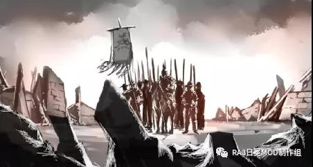
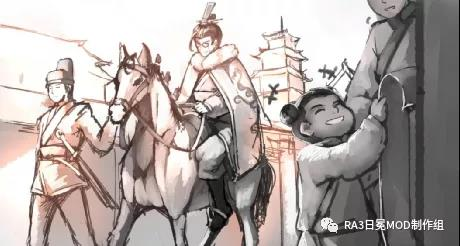
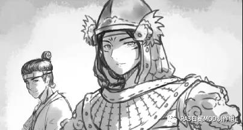
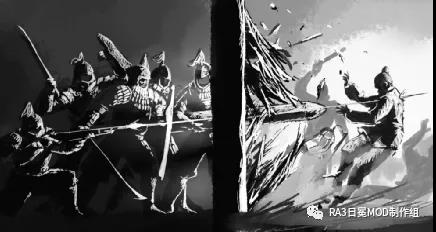
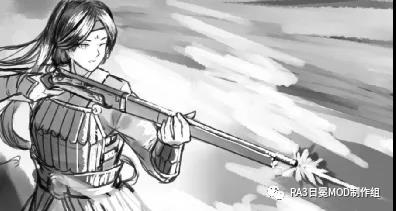

# 燕之离歌

雪虐风饕，一支燕军正艰难北行，五千多人的队伍在茫茫雪海中若隐若现。山路一片寂静，只能零星听见甲胄摩擦的声音。

数日雪中急行军，士兵们已然筋疲力竭，但在将军的催赶下，只得继续前行，虽想抱怨两声，但谁想在身心交瘁之时再被肆虐的北风灌一肚子的寒气呢？

“将军！”几名骑兵打马而来，他们的脸遮得严严实实，而裸露的皮肤上即便抹着一层油脂，却依然被寒风吹得发紫，“再走十里路就是驿站，我军是否稍作歇息？”

身后的队伍中，只见几名士兵正奋力的推着一辆陷进泥雪中的大车，军靴也深深没入了泥泞，可那车却依旧丝毫不动。

将军紧锁眉头，回道：“准了，去那儿修整一番，但你等先去帮把手，把车拖出来。”

霜风凄紧，大雪纷飞，短短十里路竟走了快一个时辰。将军策马上前，不由得皱眉——

驿站残破的屋檐已被厚厚的积雪压得摇摇欲坠，火坑中仅剩的微弱火苗在寒风中摇曳着，看着随时可能熄灭。前来迎接的，也只有个拄着拐的瘸子。门框旁，一个衣衫褴褛的老人扒着门柱才勉强站立，身后还缩着个冻得直哆嗦的孩子，看着比长刀高不了多少。

“其他人呢，都去哪了？”将军问。

“跑了，跑的动的都跑了。”

“跑了？”

“以前啊……还有点发下来的钱粮，后来就见不到饷钱了，再往后……”

“再往后什么？！”这瘸子有气无力的样子着实让副将有些恼。

“……再往后连粮食也没了。”他空洞洞的目光中只剩茫然，仿佛自己已然置身事外。

“驿丞呢？”

“上官典当了驿站的东西和我们撑了数月，最后说是要变卖驿马再撑些时日，可把那三匹马牵走后就没了音信……”

“我估摸着是混杂在流民的队伍里往南逃荒了。”副将说道。

将军只是摇了摇头。

稍作休整，部队重新启程，赶往预定宿营的村寨。天色见晚，空气中隐隐弥漫着丝缕焦土的气息，从山路上望去，远处只剩一片死寂，一丁点火光也看不见。

前往探查的斥候们归来，领头的斥候只沮丧的摇摇头道：“将军，又一个……死绝的。”

他们从南阳府出发勤王，跋涉千里欲驰援燕京，可渡过黄河后没多久，这样满目疮痍的惨况便接踵而至——沉重的积雪掩埋了焦黑的茅草与木片，只剩下突兀的残垣断壁，横尸遍野却无人收殓，病死、饿死、冻死的人横七竖八，种种惨像刺痛着将士们的心，军心在不断动摇。

“叫医官挑几个胆大心细的兄弟，把能埋的都埋了吧。”将军发出了一声低沉的叹息。

几名士兵挖了一个浅坑，将能找到的几十具遗骸堆在坑中，撒上石灰、覆上薄土、盖上积雪。医官抬眼看向灰蒙蒙的天，叹道：“白骨…露於野，千里无鸡鸣……”

将军伸手，盯着落在掌中消融的雪花，道：“雪小了些，明日抓紧赶路，争取十日之内到燕京。”

……

而在千里之外的福州，漂泊许久的船队缓缓驶入港口，被称作“殿下”的男子裹紧了大衣，望着雪花纷飞的海港惊道：“怪事，福州怎么飘这么大的雪？”

随从们也不明所以，“这天道真是奇了怪，冷就冷吧，但从未见过这儿下大雪的。”

“上岸转转吧，这心上胆子放下了，竟这么想回金陵啊。要紧事物吩咐下赶紧采买起来，歇息两日咱们便继续北上。”

侍从官招呼着水手们绑好缆绳，叮嘱道：“这还没到金陵，都悠着点，宿醉者小心挨罚。”随后他拿出几枚银质的通宝，“去找个票号兑成散钱用，都散了吧。”

男子微笑着看着兴高采烈的水手们，道：“先去街上走两圈再找个酒楼。”

雪花如柳絮般飘落，街边的榕树也被白色点缀，临近除夕，走在灯红酒绿的港城大街上，喜庆气氛迎面而来，这让漂泊在海外数年的众人久违的感受到了回家的亲切与舒心。

“后日出发，除夕前应该能赶回京城。”男子看出了随从们的心思，说道，随后径直走进了一家酒楼，对迎面走来的店小二招呼道：“你们这的拿手菜都上一遍吧。”

“殿下，不需寻个雅间？”随从小声问道。

“不必了，就在这。”

身处厅堂往往可以听到食客们的“高谈阔论”，就餐同时静听百姓谈及大至天南地北朝堂国事、小到街头趣闻家庭琐事，男子觉得这着实是个划得来的选择。

“……话说回来，老兄，你不是要借钱吗，现在还作打算不？”

“当然，我这边货和船都备好了，还差点钱招批水手、整点火铳小炮，愁死我了。”

“那正巧，前些日子我看海福票号放的贷正愁没人借呢，要不去试试？”

“唉，可我再没什么可担保的了，不知人家愿不愿贷啊。二十条鸟铳四门小铁炮，加起来怕至少也得七十两银子了。”

“那也去试试呗，货撂那等着落灰不成？”

“也罢，那明日我趁早就去瞅瞅。唉对了，老弟，你近来生意如何啊？”

“嗐，这年头，我这小本买卖可不好搞了啊，货倒是不愁卖不出去，这年头天道怪，皮毛可卖的好得很嘞，每回贩的马就更不用说了……可这北国近来也不行了，兵荒马乱的，西域也被蒙人夺了，怕是没的机会收货喽。”

“这般严重吗？”

“可不是嘛，前些时候让我家阿杜去弄马，几个月都没回来，可把我吓坏了。不过有惊无险，后来阿杜牵着三匹马哭丧着脸回来了，一问，说是转了一圈就弄到这俩像样的马，我再一细看，你猜怎招？好家伙，他把北国的驿马给牵回来了！之前听说北国的皇帝死战场上了，看这情况估计八九不离十，你说这北边情况能好吗？我看样子也得转行喽，以后得多请教请教下海的经验，不知这海外行商危险几否啊……”

邻桌的两位商人看着像是多日未见的老友，听他们的侃侃而谈，年轻男子若有所思。

“殿下，要是他们知道了咱们在大食直接扫清了那帮子祸患，怕是都要争先恐后抢着下海吧。”

“呵，那倒不至于，总归会有胆小的。”

直到住进了客栈，他还是有些放不下方才所闻之事——北燕的皇帝驾崩了，还是死于沙场之上？

“去街上打探一下吧，看看此事是否可信，咱们的身份不要露，免得惹上麻烦。”

稍后，回来的随从们落实了此事，男子不免有些多虑——保不齐父皇那边要有大动作了，他独自站在窗边眺望着灯火通明的港城，一心只想赶紧返回京城。

“赶快吩咐下去，咱们明天就启程回京！”

……

又是大雪又是逆风，待他们踏上金陵港之时，已是那年的除夕夜了。

不用想，大家都已迫不及待的想要述职后回家。在万里之遥的异国他乡待了足足两年，逢此佳节，他们归家心切的心情自然被这浓厚的节日气氛激起。

看着急不可耐的众人，男子有些不满：“急什么，大军原本尚得在安南再驻留两个月，你等能随我提前归国就不错了，还急这几个时辰？”

驾马穿梭在金陵大街之上，家家户户都已挂上了对联，张贴的门神像也是五花八门——手执尖兵、神荼郁垒驱邪挡煞；豹头环眼，虬髯钟馗怒目发威……

有些人家已经挂好了灯笼，而有些人还正不紧不慢的搭着板凳；六部的官员们也已下衙回家，争取不落下短短七天休沐的每一刻钟，各部衙门里也只剩下几个留下值班的倒霉蛋；被过年气氛包围的感觉让男子倍感舒心，但随着华丽的宫墙映入眼帘，他的心头又有几分忐忑。

皇宫南墙已经挂满了鲜红的大灯笼，之前得了消息的内侍和守卫们早就做好了迎接的准备。

“恭迎太子殿下回京。”众人躬身作揖。

步入皇宫，侍从官与随从们要前往东宫述职。太子一边思索着接下来的问答，一边在内侍们的陪同下来到了广明宫，作为寝宫，虽说不比前朝各殿，但依旧装点得金碧辉煌。

“太子殿下到～”

快步走进宫殿的太子与皇帝目光相碰，他上前两步，行礼道：“儿臣拜见父皇。”

“无需多礼，”皇帝摆摆手，“你仓促回京，一路风尘仆仆，且去沐浴更衣。”

“谢过父皇，但儿臣愿以国事为先，以大食景况禀告于您。

皇帝满意地点点头，“那便详细讲讲，这二年在大食景况如何？”

“回父皇，大食如今亦是四战之地，虽不甚安稳，海路与陆路商道依就繁盛，商船络绎不绝。数百年来，我大楚海商贩运之货，上有瓷器、丝绸之类奢侈之作，下抵茶叶、药材、铜镜之类起居饮食之物，利润颇丰。如父皇所知，其沿岸港城小国见过我大楚水师之威，无不臣服。”

皇帝示意了下身旁侍官，随即有宫女为太子递上了热茶。

有些口干舌燥的太子轻呡数口，接着讲道：“利益携纷争而来，我国海商与大食北方势力亦冲突不断。我大楚水师在附近游弋之时，则安；水师交接返航之时，则乱。儿臣随大军刚抵大食之时，路上商路多为北边叛乱势力所截，商人货匣积聚海港却无路可贩。

此等势力内多为大食内陆旧贵族与其余异族，儿臣抵达后半年，贼人竟集结大军号称十万，气势汹汹直扑港城小国可卫特，意图洗劫财货。我海外军团不过四千之众，儿臣遂与可卫特之君协商，向商人募集资金筹建雇佣军，得两万人马。

加之水师来援，安庆伯令五千佣兵协助水师援防港城，又令其余大军迂回，儿臣则亲率海外军团作战，待敌军攻城之时击敌侧后，激战半日，新式的火器阵列应对骑兵卓有成效，遂大败敌军。然我军骑兵不多，无力围歼残兵败将。

随后敌军重整来战，我军寡不敌众，所募之军军心不稳，幸有豪商倾囊重赏才稳住不溃。海外军团以中流砥柱之势死战不退，战至黄昏，万幸我军大炮毙其将，安庆伯当机立断令全军反击，直此才定乾坤。

此后敌军再无力量觊觎，一蹶不振，儿臣认为大局已定，遂便提前归国复命，免得父皇担忧。”

陈述之时，太子注意到皇帝有一丝紧张，此刻回想当时的经历，他其实同样有些后怕。

“此役可谓大捷，”皇帝点点头，瞟了一眼旁边的白玉镇纸，赞道：“倒是未曾料到面对此等逆风之局，你还能临阵不惧，沉着应战。”

“父皇谬赞了。”

随后，皇帝同太子谈了谈近来的局势，言毕，他把那份来自北燕的求援国书递给了太子，“此乃北国求援之信，看看吧。虽然上次蒙人南下已是三百多年前的事了，但蒙古大军凶名犹在。自后金崛起后，这北国便打着以蒙制金的算盘，没想到养虎自噬，丟了西域乃至河西走廊不说，现在连燕京都怕是岌岌可危了。蒙人即将进军中原，江淮两地、楚地群情激愤，自发募集物资，亦有县官号召百姓组建义军，意图北行抗蒙。”

“父皇，这是您默许的吧。”太子还在看那份国书。

“正是，民意不可阻，朕已令当地驻军调拨军械，集中看管训练这些义军。此外，首批北援大军已在五河县集结完成，待军械粮草征调充裕，即可越过国界。”

“唔…儿臣以为，义军各自为战实属不妥，他们缺乏操练、亦无战阵经验，不如一并编入北援大军，充作后备。”

“如此也好，”皇帝点点头，把一旁的白玉镇纸拿了起来，“上前来，这镇纸赏你了…你长进不少，朕心甚慰。”

太子上前双手捧住那沉甸甸的精致镇纸，随即躬身道谢。

“去吧，换身行头，家宴要开始了。”

……

酣畅淋漓洗浴一番后，太子步入升平楼，此时已然日落，高大楼阁却在一座座灯台上的大蜡烛照耀下恍如白昼。京城之中的皇室成员大都到场，最后来的自然是皇帝与皇后了。

觥筹交错，鼓乐齐鸣，太子应付着宴会之事，但思绪早已沉浸在本国北援之事中，他已然意识到事情没那么简单。他敷衍了姐妹们的问候与弟弟的发问，连皇后关切的目光也未察觉，只是沉浸在自己的假想与推演中。

“宪涟，你留下。”

太子这才发现，宴席已经散了。

待其他人离去，皇帝才起身，负手走向庭院：“随我出去走走。”

一个稍显迟缓的背影和一个矫健的背影，缓缓穿梭在宫殿之间。

“知道我当初为何遣你去海外吗？”

太子摇头。

皇帝在自问自答：“先帝曾嘱托我以北伐之事，自登基以来，我时刻等待着内外交困的北国的最孱弱之时，十年前，他们在萨尔浒大败而归，群臣进谏应趁机挥师北伐，一举拿下燕国，我拒绝了，你可知为何？”

太子不假思索的回道：“那时的北国已算是步入死路，但百足之虫死而不僵，北伐看似趁虚而入，可实际上并非最佳时机。且若讨伐北国，明面上违背楚燕二国之和约，恐有‘趁人之危，胜之不武’之嫌，即便夺取燕地，也难以得燕人之心，此为内忧。与此同时，北国能为金人所败，那后金也绝非等闲之辈，势必对北方虎视眈眈，此为外患。若出兵北伐，即便覆灭燕国，内有燕人作乱，外有金人威胁，必然骑虎难下。”

“不错。随后北国要求我国增加出口，我应允了，但却对不少奸商趁机哄抬售价的行径视若罔闻。此举，我有一箭三雕之意，你看出几点了？”

“同意加大出口，却无视奸商私自涨价，父亲意在对燕国放血。而奸商们的所作所为也早已记录在案，待时机成熟随时可以一举拿下，新帐旧帐一起算。”太子沉吟片刻，“孩儿只想到这两点。”

皇帝笑了笑，“商人再势大，也不过只是商人，他们想要谋求更大的利益，自然要牵扯上心术不正的官员。他们在悄悄结网，可君者洞若观火，却不急一时之快，待那些大鱼小鱼悉数下水之时，方可雷霆一击，一网打尽。当然，是要尽数惩戒，亦或是留几个施恩，就要看你的抉择了。”

“谨遵父亲教诲。”太子觉得皇帝似乎在全盘托出他的谋划，就像在引领着他分析棋局一般。

“转眼间又过了些年，北国大疫，又恰逢大旱，我觉着时机将至，但又恐一统天下后动荡不安。北燕亡国之臣定有意图复国之人，我朝中同样不乏心术不正之徒，况此时又有蒙古大军觊觎中原。如此纷繁复杂，我精力又已不如从前，恐怕我都难以应对，我走后，这繁杂局势交付于你，你可能支撑？一个继位不久，没有根基，缺乏治国经验的新帝？”

皇帝轻叹一声，“所以不可不谨慎……于是才有了遣你出海之举。

我想着，安庆伯忠心，又擅治军，于军中威望不低，留作你的人定然无误。你与他征战海外，想来亦能切身学习一二，如今看来你着实收获颇丰。”

太子明白，皇帝在考虑组建他登基以后的班底。

“大食局势安定以后，自然减少了海商们的损失，各大票号也少了些压力，你只需借此名义略减商税，便可获得大多商帮的支持。

而如今，北燕可谓大厦将倾，又是未曾有过的公主继位，值此良机，正是出手的最佳时刻。我国出兵北逐蒙人，既可广收天下民心，又可以此为由要求联姻，适时，我大楚重兵压境，北国内无所依、外无所援，只得妥协，举国为嫁礼。你意如何？”

太子还没从皇帝所述中回过神来，下意识的附和道：“甚好，孩儿依父亲之意。”

二人踱步到了小湖边，皇帝行走在前，太子跟在后面，他觉得皇帝的韬略高瞻远瞩，但今日将其全盘托出是何意呢？

“父亲，我觉得，她好歹也是皇帝，我还只是…怕是不妥吧？”

“你无需操心此事，”皇帝好像料到了太子会问一般，他摆摆手，“自去吧，朕…乏了。

……

城楼之上，女皇凝视着城外——辅兵和民夫们在加紧构筑额外的城防体系，他们沿着护城河开掘了三道壕沟，又在内侧构筑一道羊马墙。最初计划修筑五沟双墙，可碍于人手不足，最后只得退而求其次，构筑三沟一墙。

兵部统计下来，整个燕京城之中，战兵只有两万七千，辅兵与民夫合计合计三万四千；

户部尚书说，国库银两告罄，仅剩十余万两，囤积的粮食也只够全城军民省吃俭用两个月之需，而柴禾与木炭，兴许只够一个月用的。

缺人力、缺钱财、缺粮草、缺柴禾，一切已然陷入死局，让皇帝有心无力。

她沿城墙巡查一周，士气并不低落，但也绝对称不上高昂，士兵们只是在履行着自己从军入伍的誓言罢了，亦或是说，只是在做着自己每月领到的一两银子和三十斤粮食相对应的活而已。

但这样的士气能维持多久，恐怕还是个未知数。

半月前早朝时，她曾向大臣们提议，向士绅国戚加征赋税。但是却仅有寥寥数人应和，或者说，重臣们尽数否决了她的想法。

“陛下，士绅国戚们为国守财，不宜加征呐。”

首相同样摇头拒绝，他深知对皇帝腹诽心谤本已不少，此时若触犯这些有权有势的大户人家，再立新敌，恐难免会导致更为混乱的局面。

女皇走下城墙，短叹一声。这么多天过去了，唯一的好消息便是南楚的首批北援大军已经开拨，但多久能到呢？能赶在燕京失陷之前吗？

“陛下！”突然，一名脸色惊惶的官吏疾步跑来。不要多想，一定又是一个坏消息。

“陛下，紫荆关遭敌军猛攻！怕是独木难支……此外，辽东得报，蒙军一偏师与奴儿干女真合兵一路，约莫五六万人，已与蒙军主力汇合，总计不下十五万人马已达居庸关，随时可能来攻。”

……

当燕京宣布戒严、把外城的百姓尽数撤入城内、时刻准备守城作战之时，万里之外，一只船队抵达了安南。

近些天的海上的确不宜航行，下船的一行人之中，携带着南楚皇帝圣旨的内侍脸色苍白，多半是晕船所致。他们也不换马，就这么一路走进了不远处的玄玑卫营地。

玄玑卫，即海外军团的正式称呼。

营地一进门的左手边便是靶场，一帮子手持燧发枪和火绳枪的士兵好像正在比试什么。

“十发中五，如何？”

“玛的，算老子输了。”

“不过如此，我还曾十中六呢。”

“那你倒是来试试啊，我赌五钱银子，你不行。”

“赌就赌，何惧之有？！”

“来，银子放这。”

右手边则是练武场，身披重甲的士兵们正在操练，他们手持卸了枪尖的长枪，长枪头上包裹着沾了红漆的破布。

“中了中了，瞧见没，那红印子？”

“高兴个屁，配合好了吗？敌骑若破阵，当先砍马腿，再砍人。”

“扑街哟，手铳只能打一次，你急着用什么，是遇到斧头破不了的甲了还是没力气了？！”

出迎的副将看到领头的内侍饶有兴致地看着士兵们的训练，也不打断，就静静站在一旁。

“陈将军，咱家去监过不少军，可今日亲眼目睹了玄玑卫的操练，依然令人眼前一亮。”

“多谢中官称赞，冬练三九、夏练三伏，三日一小操、半月一大练，玄玑卫从不含糊。”副将拱手行礼。

“甚好，那么…”内侍站直了身子，清了清嗓子，“陛下有旨，玄玑卫即刻启程，同所属船队一并前往松江府吴淞口待命。这是勘合书信，请陈将军亲启。”

“臣领命。”副将开启信封，细致的浏览了一遍后欣喜道：“诸位，有活干了。”

“今明两日内装载完物资，三日后出发！”

……

数日后，第一批北援大军早已开拨，作为主力的第二批北援部队总计二十五万，也已在扬州集结完成，正在进行最后的磨合与准备，预计一个月后出征。

主将们也得动身前往军中了，临行前，皇帝亲自召见太子及其他随军出征的将领与文官。看着一身戎装的太子，皇帝不由感到十分欣慰。

“北征之事非一朝一夕之功，切记不可急于一时。此次大战，定国公为主帅，统帅三军；太子为副将，节制玄玑卫，但不可擅自行事。”

掌管几十万人马的大军着实不易，指挥作战只是冰山一角——从兵马调动、到粮草辎重、再到行军宿营均为兵家之道，相当复杂。

皇帝深明此理，太子亦很清楚，主帅的重担自然只有经验丰富的老将才可担任，他淡淡道：

“授定国公以‘总制军务征北大将军’印，授皇太子以‘参画军务征北将军’印。”

“臣等遵旨。”

“近来天下风云激荡，然我大楚承平多年，人口兴旺、国库充盈，诸卿可无后顾之忧，步步为营、稳扎稳打，扬我大楚之威。第三批大军也已开始征调，可为后援。”

皇帝已然定下北援的基调——稳中求胜。

定国公作揖道：“陛下，举国之力为后援，此战虽尚未开始，臣却已有五分把握。”

“如此，甚好。”

“燕京已为蒙古大军所困，儿臣建言提早开拨，”太子担忧道，“时不我待。”

……

遥远北方的大地上，一道道壕沟倒刺死死勒住高耸的城墙。

广阔的天地间已然没有一缕烟火气，阴云黑沉沉地压了下来，压得人喘不过气来。鹰鹫盘旋在城池之上，仿佛已然嗅到了即将到来的死亡气息。

城墙上、广场上、大街上，士兵们在集结待命，每个人都不敢多发出一点声响，生怕错过了重要的命令。

而就在城外不足十里的地方，十多万蒙古大军的营篷铺天盖地，营地里，壮汉们围着篝火饮酒啖炙，仿佛燕京已然势在必得。

面对亲卫与大臣们近乎哀求的反对，女皇仍然坚持要亲临战场，毕竟在这几乎绝望的时刻，只要是能让众人燃起一丝希望的事，她都会义无反顾地去做。她甚至再度前往天坛祭祀那古老的天神与其忠犬，祈望大燕能再次获得天神的垂青，一转颓势，转危为安。

望着茫然无措的百姓们，她也有些迷茫了。

“天神……真的还会庇佑大燕吗？”

“所谓‘尽人事听天命’，我们能做的唯有固守京城，其余的事，就交由上天评判吧，官家。”走在女皇后面的统领坚定道。

官家？

对于这个许久未曾听过的称呼，皇帝微叹了口气，“就当那只是个遥远的传说吧。”她暗自对自己说。

作为被先帝安排辅佐女皇的心腹，司空昭曦自然能揣测到女皇的思虑，在如此境遇之下，她身上的担子太过沉重了，而这一切，本不该由她承担。

大敌当前，从城墙之上到市井之间，从朝堂之上到民间百姓，众人看似已做好了准备，但这并不意味着他们是在效忠这位亘古未有的皇帝，他们效忠的或是大燕；或是在效忠那个几百年前缔下的“汉人护汉”的信条；亦或是，只效忠于他们的私利罢了。

现在她所能倚仗的，或许只有那先帝的遗诏与誓死效忠她的镇玺骠骑直了。偌大的燕京城，本应同仇敌忾，上下一心击退来敌，而此时却连“人和”都难以做到。

尽管司空昭曦劝谏皇帝只着甲佩剑即可，女皇还是坚持全副武装的走出了皇宫，骑着一匹白色骏马来到了北城，身着龙袍、外披札甲、左腰挎长剑、右腰系手铳，这样的打扮即使是在尚武的燕国也是从未有过的。

夕霞门下，女官搀着皇帝下马，她正欲踏上城墙巡查防务，亲临一线鼓舞士气，以壮军威，向将士们证明，大燕的新帝不是一个柔弱不堪的傀儡花瓶。但经验不足让她有些踌躇，“身着铠甲，仿佛略显得朕贪生怕死，卸甲巡视，却又显得有些不合时宜。”

“陛下多虑了，战场上刀剑无情，着甲是必须的。”女官出言安慰道。

“此言无错，陛下久居深宫，初临疆场，披坚执锐，将士见此自会为陛下所感召。”

统领在前引路，一行人登上城墙，他指着不远处的宽大建筑，对皇帝说：“这前面就是城楼，是整段城墙中最高的地方，在那里，敌军动向可一览无遗。”

“圣上驾到！”随从的内侍喊道。

城楼内的几名军官正围着城防图商议，闻言，有人不满道：“得，那小丫头皇帝来了。”

“来就来呗，别乱下令就行。”

城楼外，女皇一行人遇到了匆匆赶来出迎的几名将领。

“臣、丁武，参见陛下！”一位苍髯如戟的营指挥使躬身，与众人一同行礼，他平静道：“恕末将甲胄在身，不便跪礼。”

“免礼。”皇帝摆摆手，打量了一下这位看着不卑不亢的将领，自然知道他们只是不服罢了，她于军中不得人心一事早已心知肚明。

“陛下，这边请。”将领侧身道。

城墙上，士兵们大都哈着气，蜷缩在垛口下打颤。军械奇缺，只有少数老兵和军官才配上了札甲或是鳞甲，大部分士兵只穿着半身布面甲，更有甚者、身上的甲胄已遍是缝补痕迹，怎么看都是从库房中找出来翻新的旧货。

有些人的目光满是漠然与空洞，全然不见数百年前、他们的前辈们无时无刻的斗志昂扬。

“士气如此，如何抵挡连父皇的精锐都能击垮的敌人？”越想就越没有信心的她索性便不再去想了。

人群缓缓走进了城楼，数名军官已经等候多时了，“末将参见陛下，陛下万岁。”

将士们单膝下跪抱拳行礼，皇帝轻轻挥手道：“都起来吧。”

她走到窗旁，远眺着郊外漫山遍野的营帐，“情况如何？”

“回陛下，敌军已三面包围燕京，只留出了城南。臣等驻防的夕霞门现有一营兵马，战兵八百，辅兵九百，所属骑兵已经被上官调走统一指挥了，此处只有步军。”丁指挥使回道。

“你等且先自报家门吧。”皇帝调转视线，看向后面的几名将领。

“下官赵山，营中参画，参见陛下”左边的年轻文官回道。

旁边的几位将军也随即垂首行礼。

“长枪队队官赵炳之，参见陛下。”

“鸟铳队队官马石，参见陛下。”

…

“守城多日，各位将军辛苦了。”女皇点点头。

众人赶忙惶然称不敢当。

“纵使敌军围城，燕京依旧固若金汤，此皆为众将士之功，望诸位全力以赴，待退敌以后，朕当不吝封赏，犒赏三军，与众位将士畅饮。”皇帝微微昂首，顿了顿，本想接着说先前想好的豪言壮语——

众位的英勇，定能让天神知晓，予以加护。那时，诸位必将如先祖一样，摧枯拉朽大破敌军。

但这些话都被咽了下去，最后化作了一句：“上天会记住此役，大燕会记住此役。”

言毕，在场的气氛却并没有像她预想的那样沸腾起来，反而陷入了悄然的寂静。

在场的众人闻言心里大都五味陈杂。

惊讶——是因为这位他们原以为只是个久居深宫的公主竟能披甲亲临城楼鼓舞大家。

五味陈杂——是因为这他们知道接下来的守城战会有多么的绝望，称之为九死一生亦不为过。

女皇从短时冷场的尴尬中回过神来，她能感觉到自己砰砰乱跳的心，显然，此处不同于朝堂，这难免让她倍感紧张，正想着该说些什么。

“臣万死不辞！”旁边的统领一声高喊打破了尴尬的局面。他的声音让所有人都回过神来，也纷纷应和，城楼内的寂静的空气霎时喧闹了起来。

女皇左手扶着剑鞘，右手叉腰，她闭眼深吸了一口气，在一片喧闹中，似乎有些话一直卡在喉咙里却迟迟说不出来。最后，她的眼神坚定下来。

“诸位…………”

轰———

突如其来的一身炮响惊住了城楼里的所有人，也让女皇想说的话再次被卡在喉咙里。

“不对头啊。”丁武转身走向窗口。

轰——轰——轰——轰鸣不息，炮弹接连不断击打在城墙之上。

“当心！！！”

嘣———哗啦———

剧烈的震动从城墙深处传来，霎时间地动山摇。天花板的碎屑被震得纷纷而下，人群顿时乱作一团，呼喊声哀嚎声混杂在尘土飞扬的空气中。

这一轮的炮击，目标是主城的前方，瓮城的箭楼。

“保护陛下！”

在场的骠骑直士兵们纷纷冲向女皇，把她迅速围了起来，欲护送她离开城墙。

赵山擦了擦脸上的灰，趴在窗口上举起望远镜望了望，突然大喊到：“有大家伙，要开炮了，快准备！”

城楼上的一名士兵趴在护栏上大喊：“敌军来袭！攻城车！有攻城车！！！”

“娘的，这回玩真的啊？”丁指挥使已经进入了状态，他毫不在意仍然在场的皇帝，利落地把腰间的长刀拔出。

“慌什么？稍安勿躁，你们先去整顿部队，组织隐蔽，待炮击结束后即刻在墙上集结，后续事宜静观其变，且听本官指挥。你，快下墙交待民夫们烧水准备救护伤患。”

“得令！”在场的气氛紧张到极点，将士们迅速散开前往各自的部队，很快这城楼便只剩下几名士兵、丁指挥使、皇帝以及她的侍从。

“陛下，请随我去安全之处，此处保不准也会被击中。”司空昭曦躬身请示道。

“不用了！”女皇坚定的摇头，“太祖曾言，‘国战当前，只图畏缩苟活则天下人心皆去’，那朕今日便见识一番何为国战。”女皇斜睨了一眼统领，用上位者的语气命令道：“随朕来。”

统领愣住了，他第一次、第一次在这个女孩的眼中看到一团熊熊燃烧的火焰。他仿佛看到了之前效忠的、那位命途多舛的皇帝。而眼前这人似乎变得愈来愈熟悉，他亲眼见证着这个女孩的成长，现在，那个女孩已越来越像一位合格的帝王。

“臣、领命！”他单膝下跪，脑中闪现出多年前的那场面，龙图腾之下，伫立良久的先帝目光鉴定，转头道：“朕，想让她……成为朕的剑……”。

他虽面色一如既往波澜不惊，但此时，他的内心充盈无比，他的忠诚，正属于大燕的皇帝。

燕京已全面沦为战场，两支经验丰富到毒辣的军队展开了新一轮的博弈，一边是传承数千年的汉军，一边是曾经饮马莱茵河的铁骑。

站在主城楼上的女皇望着远处蒙军兵马前排列井然的炮阵，炮火掩护下，攻城车缓缓逼近城墙。

“从未有过的情况。”赞画赵山返回了城楼，“原先都只是小股部队在城下袭扰，还从没有发现他们竟有这么多大炮。”

丁武倒很庆幸皇帝没有想插手乱指挥的意思，他摩梭着寒光麟麟的长刀，“之前的屡次袭扰，是疲军之计。”

“至于大炮，大概是先前在站战场上掳获的吧。光是咱们对面的，本官估计不下二十门。”赵赞画补充道。

“不好说，毕竟女真人也会铸炮，且看吧。”

攻城车愈发逼近，炮击随即停止，但此时瓮城的箭楼那坚实的砖墙已经被铁弹砸的千疮百孔。

顶楼的士兵传来了消息：“盾车四十余辆，步卒千人。”

“敌军接近，全军准备！”指挥使令道:“他们意在清除拒马和羊马墙的阻碍。”

即便炮击还在继续，将领们还是带领士兵们迅速登上城墙，等待着后续的命令。

伴随着从天际线边传出的一阵阵号角声，在盾车的遮蔽下，敌军开始相继开进，佩刀的步卒们在前，弓箭手在后，他们驱使着从附近村镇掳掠来的百姓填平陷马坑、铲平羊马墙。

显然，十室九空的京畿已剩不下多少百姓，许多蒙古士兵也混杂在清理城防工事的队伍中。

丁指挥使抽起了旱烟，他左手端着细长的烟枪，右手拿着望远镜，一边观察一边抽起了烟。

“火炮、床弩准备，”他微微眯眼，“打他们的盾车。”

皇帝不喜欢烟味，但对丁指挥使逢战必抽烟的癖好也没说什么，只偏了偏头。

她对那些衣衫褴褛的百姓们的境遇痛心疾首，先祖曾言的信条，更是让她犹豫而痛苦。但显然，这种情况下没有所谓的最优解，最后只能化作一句哀叹：

“都是大燕的百姓……”

“可是，京城中的百姓更多。”赞画摇摇头，“战阵之上最要不得的就是妇人之仁，仁慈只会落得自取灭亡的下场。”

说完他猛地意识到他这可是在跟皇帝说话，立刻请罪道：“陛下恕罪，下官失言了。”

“无碍，你等专心指挥。”

箭楼顶层，眼神好的士兵数着事先插在地上的一根根标定杆，向身旁的军官汇报着敌军的距离。

“五百步！”望风的士兵大喊道。

“四百步！”

“再等等。”

“指挥使？！再不……”赵赞画见指挥使依然无动于衷，急道。

“三百步！”

丁武收好了烟枪，这才令道：“打！”

早已等候多时的炮手们立即点火，火炮轰鸣的同时，一座座巨大的双弓床弩也随即发射出一片携着炸药包的粗大箭矢。

用火炮发射开花弹的风险自然是极大的，因此燕京城防也保留了不少床弩，这些本应被火炮淘汰的老将们却由此续命。

其箭矢前端绑有火药包，虽然射程上不如火炮，但贵在稳定安全。而相比起笨重麻烦的三弓床弩，这些双弓床弩装有轮子，不仅更易上弦，且便于机动，一次能发射两支开花箭。

一颗颗铁弹以肉眼难辨的速度砸向三百步开外的敌军，落地即见血肉横飞，其余势不减，又在地面上弹跳几次，每一次弹跳都再度带来一阵哀嚎。

一排足有一人长、两指粗的箭矢紧随其后，深深的刺入冻土与盾车，箭尾还在微微颤抖着，那薄铁片制成的箭羽还似乎反射着晚冬早晨的微弱阳光，随后便是一连串爆破声。

硝烟弥漫，可在望远镜里看的清清楚楚——烟雾中，敌军还在前进。

硝烟散去之时，盾车已迫近两百步，那些在南楚被称为佛郎机炮的子母铳炮开火了。

更近了！

一箱箱的火箭架了起来，三十六发的、六十四发的、一百发的。

一片黑压压的箭矢拖着淡淡的尾烟，如带来死亡的鸦群一般，以一个完美的弧线冲向开进中的蒙军……以及裹挟于其中的百姓，一阵木板受击后发出的啪啪响声不绝于耳，其中还夹杂着几声惨叫与呼救。敌军开进的速度也越来越慢，最终停滞下来。

他们在残余盾车的掩护下，竟迎着的枪林弹雨冒死清除外围的铁蒺藜，焚毁拒马。弓箭手们也挽弓搭箭，不时从盾车探出来向城墙上抛射。

铺天盖地的箭雨直冲城墙。

“掩护！”墙上的军官们大喊着，士兵们赶忙紧贴女儿墙，携盾者则举盾掩护，但仍有人躲闪不及中箭，城墙上瞬间混乱起来。

“他们倒是有备而来，这帮混蛋。”鸟铳队的队官马石扶着女儿墙向远处看着，然后转头下令：“准备～”，随即把哨子含在嘴里。

手持鸟铳的士兵们已然把火绳夹扳到位，然后轻轻吹着燃着的火头。

“哔-哔-哔-”带尖利的哨声响起后，接踵而至的便是排山倒海的砰砰声，以及弥漫的烟雾。

“换！”

按照燕军的操典，城防战时的鸟铳应三人一组，第一个人负责射击，第二个人负责重新装填，第三个人负责捣紧并复位火绳，再把准备好的火绳枪递给第一个人。

从远处传来的惨叫声与连绵不绝的枪炮声、爆炸声混杂在一起，直击每一个人的内心，也震慑着每一个人的灵魂。

皇帝自然对此情此景深感震撼，第一次直面真正的军阵、真正的战场，往日只见于书中的兵法韬略正在被交战双方活灵活现地应用着，战场上的一兵一卒仿佛共同构成了一台战争机器，把兵法与计谋加工成鲜血与死亡。

女皇望着下面黑压压的人群，禁不住问道：“丁指挥使，现在如何是好？”

“陛下无需操心，看着声势浩大罢了，他们撑不了多久，”指挥使回道。

兵器交响曲仍在继续，一排排响亮的炮声交织着清脆的鸟铳声，在那白烟弥漫之际，无数大铁弹、小铅子构成的弹雨不断倾洒向城墙下的敌军。

又有两辆盾车被火炮发射的铁弹直接击中，霍然一个窟窿，盾车后的士兵亦被拦腰折断，炮弹落地面后弹起，贴地从盾牌之下冲向敌军，霎时血肉飞溅，被砸中的敌人应声倒下，密集的人群中出现了几条笔直的血路。

另一辆盾车被铁弹砸中的同时，插在上面的一支开花箭也恰好引爆，飞溅木片将附近的士兵击得满身是血。

不知过了多久，敌军渐渐不再射箭还击，刀枪胁迫下的百姓们早已崩溃，而参与清理工事的蒙古士兵也没好到哪去。突然几声号响，还能动的士兵边将倒在地上哀嚎的幸存者拖住，在剩余盾车的掩护中争先恐后的撤出战场，伤者的血被沿路被拖出一条长长的血迹。

枪炮声渐停，城墙下只剩下沾满血迹的破碎尸块与散碎的防御工事，北风吹过，血腥味和若隐若现的焦糊味随之笼罩了整个燕京。

“这…退敌了？”女皇有些不确定的问道。

“陛下英明，敌军已退，我军该准备下去修补工事了。”丁武觉得面色苍白的皇帝还算不错，不仅全程坐镇前线，而且初次见此血腥场景也没有吐，倒是不负燕国皇帝的身份。

“速查，前方箭楼情况如何。”女皇看着前方的箭楼，回忆起刚刚的炮击，她依旧心有余悸。

“敌军再度来袭！”一名望风的士兵大喊了一声，几支响箭被射上了天，响箭发出的凄厉哨声让所有人的精神又立刻紧张起来，只见远处又是一片黑压压的人群开始向前开进。

通过望远镜，赵山此时看见，那黑压压的人群停在了二百步外，他们开始原地挖土堆山。更远处，似乎闪耀起了火光和浓烟。

“小心！”赵山惊恐地挤出两个字并退了半步，这让一旁的统领没有丝毫犹豫，猛地转身将女皇与侍从推开。

“蹲下！”不知是谁在大喊。

紧接着，雷霆一般延绵的炮声响彻云霄，还未等这令人胆寒的声音消停，十几道黑球夹杂着划过天际的沉闷响声以极快的速度冲向城墙。

而这轮炮击下，遭殃的已不仅仅有主城楼前方的箭楼，一发铁弹好巧不巧的掠过箭楼屋檐，击中了城楼。几斤重的铁弹撞在厚实的砖墙上，沉闷的声音仿佛在人的心头敲了一棒。

皇帝感觉自己的心被震地跳到了嗓子眼。箭楼中，木屑、碎砖、鲜血、残肢霎时飞溅在空中，砸在城墙上的士卒身上。

就在此时，百名蒙古骑兵队形松散的冲到了弓箭射程内，向千疮百孔的箭楼抛射着火箭，带火的箭矢如雨点般落下。

“箭楼是砖墙造的，一时半会点不着，”丁指挥使摆摆手，“但是先把水准备好，天干物燥的，谁他娘的也说不准什么时候火势起来。”

……

就这样，几天过去了。

那些垒起的土坡已经成形，上面的一门门火炮向燕京城墙上的箭楼、城垛猛轰；不知多少骑兵轮番上阵，阵前总有数百骑兵在奔行中放箭。

他们组成一片黑压压的人海佯装进攻，待守军的大炮弓弩开火放箭时又迅速后撤，随后，又一批骑兵冲进阵前，不断消耗着燕京的守军。

燕京的坚固着实有目共睹，高大宽敞的城墙、纷繁复杂的瓮城都是这座城的底气所在。可是如今燕京守军除了死守孤城，已没有别的、更好的办法应对蒙人，且越拖就越是如此，这便是闭门守城的弊端。

“困守孤城，势难坚守”。

女皇小时候翻看兵书之时就习得这点，几天下来，对其的理解着实越发切实深刻。只可惜现在卫戍燕京的燕军，一无出城列阵迎战之勇气，二无主动出击之兵力，兵法所述的破局之法，恐也难以实施了。

宏伟宽厚的主城墙之上，一座座原本庞大的箭楼此时早已残破不堪。被铁弹轮番轰击后，无数支带火的箭矢终究还是点燃了它们——砖石着不了火、但是木制的梁檐早已经受不住长期炙烤。

这一天的傍晚，统领悄然走出了皇城。

几名骠骑直的士兵暗中与他汇合，他们请示道：“万事俱备，何时动手？”

“现在几时了？”

“子时刚过。”

“好，那…即刻出发！”

子时已过，满打满算到现在，燕京已被包围了足有一个月之久。

一处大院外，密谍和军士们潜伏在黑暗之中，等候良久。统领和带队的皇城司副指挥使正在作行动前最后的部署。

“你的人看住偏门和后门，两旁的大墙也得派人，我的人强攻。”

“就依你所言。”

“另一家，准备好了没？”

“都就绪了。”

这时，院内的狗开始狂吠了起来，骂骂咧咧的人声也随即传来。

“叫什么叫！”

“是不是有动静？”

“你，去外边查看一番。”

司空昭曦和副指挥使对视一眼，喊道：“动手！”

外面的士兵们整齐划一的点燃火把，正门前，一根快要有腰粗的钝头撞木砸开了大门，两名持盾的士兵一左一右先行冲入，他们身后拿鸟铳的士兵直接开枪射倒了来查看动静的仆役，外围弓箭手们翻上了院墙，一支支弓弩瞄准着对面的屋子。

“皇城司拿人，所有人抱头跪地，违者杀无赦！”

拥入院中的镇玺骠骑直士兵和皇城司的人都在喊着皇城司的名号，这让一旁的皇城司副指挥使哭笑不得，他无奈道：“本以为咱们就算是锦衣夜行的那一类人了，想不到你们更为低调。”

“你们的名号管用，听闻能止小儿夜啼呢。”统领调侃了一句，便跟随着其余人走进了大院，他们对其中正发生的冲突并不太关心，只是专在乎寻找此行的目标。

院内的冲突都在他们的预料之内——十几名看着刚从睡梦中醒来的家丁、仆役提着刀，手忙脚乱的往外冲，却被士兵三下两下撂倒在地。的确，这种程度的抵抗在士兵们看来就是寻死。

“立刻弃刀跪地！”

“放箭！”

“当心，有铳！”

一阵混乱以后，士兵们迅速踏过尸体，闯进了屋子。

“带走！”

统领看到，一名持盾的士兵心有余悸的摸着自己的鳞甲——一颗铅弹穿透了盾牌，余势不减，又击穿了鳞片，幸而最后被最里边的锁子甲阻挡。

旁边，他们此行的“大鱼”也被五花大绑带了出来，带队的军士骂道：“娘的，这厮刚已经在焚烧书信了，得亏旁边有个茶壶，否则怕是要烧掉大半。”

看完湿漉漉的书信，统领朝跪在地上的人淡淡道：“不愧是你，真可谓‘忠臣’！”

瞄了几眼书信的副指挥使面色一变，他抱拳道：“老弟，这事急不可待，本官得即刻向军队示警，加强戒备。”

……

待天色微明，当女皇和主要的大臣们已经等候在朝堂之时，本该上朝的两位重臣却莫名缺席。

皇帝冷着脸一言不发，大臣们小声议论了起来，都在揣测发生了什么。

不久，侍卫们架着两人进入大殿，再一瞧，这不正是那两位重臣？

几脚下去，还试图挣扎的两人只得跪在朝堂之中。

“启禀陛下，兵部右侍郎周言、真定县伯胡渭带到！”统领和皇城司指挥使上前禀报道。

“已查证，二人私通鞑虏，人赃并获！”

在群臣的惊呼声和斥责声之中，女皇站了起来，柳眉倒竖，冷言道：“你二人通虏谋叛，居心何在？”

“周侍郎，想我大燕待你不薄，身居高位不尽忠职守，却做出此等十恶不赦之事……”

“真定伯，朕年少时也曾听闻过你先祖的英勇事迹，时至今日，你所为之事，可对得起祖宗？！”

真定伯胡渭涕零不能言，而兵部侍郎周言眼中却仍充满着不甘，“呵，你一介女流，也想学武则天篡唐改周吗？无耻之尤，这必然是篡改了先帝的遗诏！”

下面的皇城司指挥使阴森道：“周言，本官这里可是查到，你这私通的行径可是从前些年就开始了呀。”

“我无罪！无罪！你一个公主如何能继皇帝位，成何体统！你这个贱人，你不得好死，你……”借口被揭穿的他歇斯底里的咒骂着。

统领上前一步，连带着刀鞘抽出了刀，刀鞘拍在他的嘴上，吐出来的牙齿掉了一地。

到了判决的时候，首相示意女皇从重处置，但结果还是差强人意。

“周言，斩首，弃尸西市！三族之内，下狱。再有，抄了他的家！”女皇厌恶的看了他一眼。

“真定伯，去了他的爵位，收回丹书铁券，斩监候！”

“其余人等，只诛首恶，余者查抄家产，尽数充军。”

谋逆之大罪，居然只诛首恶并流放三族，判处真定伯的斩监候则更像是威胁他家拿钱赎人。

乱世用重典啊陛下，首相轻叹一声，皇帝的处置还是显得过于仁慈，或者说，涉政未深，但此时再劝阻就是在动摇皇帝的威信。

“陛下，下属谋叛，臣失察，有罪。”兵部尚书出班请罪。

“你无罪，退下吧。”

……

长期消耗下，如今燕京城已只有两万多士兵防守，许多地段只有少数人士兵和辅兵巡逻，漏洞百出但这也是缺少人力的无奈之举。在这帮叛徒们将燕京城防的遗漏之处全数透露给了敌军的情况下，众人已不知如何应对是好。

“和义门，朝阳门，东直门，永定门四处遭敌猛攻！”

蒙古大军同时攻击城东、城东北的四处大门，在牵制守军兵力的同时，直接找准了朝阳门北的一处弱点，在一排排盾车的掩护下，数不胜数的敌军踏过了冰封的护城河，他们身后还跟着许多架云梯车。

“他们这是…要强攻，”一个队官惊道，“快求援，速去！速去！”

负责防守这段城墙的两百多名燕军使尽浑身解数，长刀、长枪、弓弩、火铳、震天雷、滚木……但是攻城梯已经架了上来，头部的倒钩死死勾住了城墙，随着第一名敌兵攀上城墙，这段城墙的陷落已是不可避免。

越来越多的敌军攀上城墙，一个个燕军士兵只得丢下其它城防器材，拔刀加入了战斗……

一队又一队从其它方向赶来支援的燕军和登上城墙的蒙军士兵混战在一起，飞溅而出的鲜血散发着热气，却很快就在早晨凄冷的霜风中凝结。

厮杀中，不知是谁引爆了炸弹，亦或是不慎点燃了它们，人群中连环的爆炸给本就混乱不堪的城墙再添狼藉。

渐渐的，此消彼长的燕军的抵抗愈发无力，敌军开始试图占领城楼。

“陛下亲至！”不知是谁的声音从远处飘来。

“上！把他们赶下去！”远处，带队的禁军军官拔刀喊道，随皇帝而来的两百名禁军旋即加入战斗，试图一鼓作气击溃已经登楼的敌军。

这一切，都发生在女皇的面前，死亡与杀戮是如此贴近。被侍从簇拥着的皇帝呼吸越来越急促，脑中无数的记忆就此闪过，与血腥的现实交织，不断地冲击着她的灵魂，她的左手扶着刀鞘，右手逐渐紧握佩剑的剑柄。

不远处，一个女真士兵被禁军的长枪刺倒，他摔倒在禁军的身后，血液喷溅在石砖上，染出了一片红色的走道，他双眼紧睁地喘着大气，在地上抽搐着，但手中依旧紧握长刀，要冲那禁军砍去。

“陛下！不可……”

皇帝忽然推开前面的侍从，大家惊恐万分，但如此近距离的搏杀，早已让他们腿软呆滞，不知所措。

她无视阻拦，踩着血迹铺成的“红毯”，皇帝拔出佩剑，对准那敌人的喉咙。长剑微挑，寒光闪烁，时间仿佛凝结在此时，撕杀声与哀嚎声逐渐在她耳边消散，她的面前，似乎站着一个熟悉的身影。

他饱经风霜，他伟岸如山，他是她的记忆里一座能阻挡太阳的高山，他曾经是她最厌恶的人，也是现在她最渴望了解的人。

他慢慢走近，伸出右手，扶住了她抓紧的佩剑，引导着她将长剑刺进敌人的喉咙。随即，他如灰尘般飞散消失，只留下热泪已经溢出眼眶的她与那片白幕退却后重现的战场。

“死！”女皇拔出了染血的剑，轻喝道，她感觉有一股热血冲涌而上，来源于血脉深处的尚武精神让她霎时拥有了直面地狱的勇气。

皇帝还想上前，但随即被众人拉住了，她冷冷的回眸，与她四目相视的统领眼神坚定，显然，他不能让皇帝参与搏杀，没人能承担这个风险。

“陛下，从继位起，你就被戴上了一具枷锁，你的身心不再属于你。身为九五之尊，你秉承了大燕的意志，你即是大燕、大燕即是你。”

这是继位的那天，他一字一句告诫女皇的话语，现在又一次回响在她的耳边。

司空昭曦看了眼女官，嘱托道：“护好陛下。”随即率领其余人冲向敌军，他不能犹豫，如果没有把敌军赶下城墙，那一样要完蛋。

此时此刻，城外的战场上，几辆楼车上站满了弓手，正向城墙上疯狂射箭，而中间靠后的一辆楼车上，几个头领正在指挥着后续大军源源不断的支援攻城，站在最中间盔甲最为华丽的敌首竟还在把头盔摘下来把玩，并大笑了起来。他们知道，登墙之后，守军已失去远程作战的能力，城墙沿线的几门佛郎机炮也因为发生的白刃战而无人使用，他们把指挥车挑衅般地开到了比弓箭射程稍远的地方，仿佛早已胜券在握。

城楼上的女皇看着远处挑衅的敌首，她敏锐地察觉到，这个距离，并不是什么都不能做。皇帝从侍从的手中取过了一个锦盒，从中取出一支精致的燧发枪。

“陛下！使不得！”有内侍劝道。

“滚开！”皇帝呵斥道，然后挣脱旁人的拦阻，她解开身上碍事的的护腕和护颈。裙甲下的龙袍虽然沾着血迹，但飘逸依旧。

多久没有用过它了呢？怕是有一两年了吧。

她咬破纸包，立刻回忆起了这熟悉的硝石与硫磺的气息。往发火处倒了一点火药，把剩下的火药和铅弹塞入枪口，抽出通条捅实……

四周充斥着双方士兵的喊杀声与谩骂声，浓烟缭绕中还不时飞来几支箭矢。难免紧张的女皇手在颤抖，连续试了三下都没有把通条重新插回去，她暗骂一声，干脆松开了手，任由通条落地，随即举枪瞄准。

不远处，司空昭曦两刀结果了一个敌人，但是反手一刀却卡在了另一个敌人的腰间，他拔了两下无果，随即弃刀，拔出了短剑，下意识的扭头却看见皇帝正举枪瞄准。

“陛下！？”他现在只想把皇帝的随从们暴揍一顿。

皇帝双脚跨开，左手紧紧地端着护木，但在这样的距离进行瞄准，她心里并没有底，每一次呼吸都让火铳微微颤抖，她努力平息着呼吸。

旁边的士兵努力为统领创造了有利的环境，长枪逼退了两个敌人的攻击，统领趁机上前，靠左手的臂甲硬接了一刀，随即一剑击杀了那个敌人，他抽身回望，见皇帝正在瞄准，禁不住喊道：“陛下，行随心至！”

女皇恍然间遐想起了年少时第一次开枪的情景，她深吸了一口气。一百步的距离……她放空了心境，把外界的喧嚣与自身隔绝开来。

她轻轻扣下了扳机———

燧石撞在火台上，引燃了发射药。

“砰！”

一束火光喷射而出，从城楼的一个空旷的角落飞向中间正在开进的楼车，铅弹穿透了皮甲，那个上一秒还在大呼小叫指挥攻城的敌首突然不吭声了，胸前喷出鲜红的血柱直接洒在在楼车上，晃了两下便从楼车之上跌落下来。

“敌酋已毙！”有侍卫大喊，随即随从们都高呼了起来。

“杀！”

“大燕万岁！！”

“把他们赶下去！”

“万胜！”

燕军骤然亢奋起来，疯狂地冲击着城墙上的敌军。

远处的指挥楼车发生了骚动，不久便领着其他几座楼车缓缓退回远处，其他敌军部队也发现了异样，纷纷开始退却。

骠骑直的士兵们如同长矛一般破开了敌军的战线，城上的燕军随即紧跟节奏，开始了风卷残云般的反击。

皇帝的肩上好似插着一支箭矢，旁边的随从们吓得魂不守舍。

“都没破甲，慌什么。”她把箭拔下来，随手丢掉，然后看向了远处。

喊杀声渐渐停了下来，城墙下，刚刚攻城的蒙古大军正如同潮水般退去。但这并不意味着进攻就此停歇，果然，部队撤退后不久，敌方大炮便继续将一枚枚铁弹砸在了这号称坚若磐石的城墙上，那百来号骑兵再次上阵，一阵齐射后点燃了城下十几辆楼车、云梯的残骸，裸露的木制结构瞬时剧烈燃烧，巨大的火焰顺势蔓延到城墙之上。

“救火！”

“快备水来！”

“陛下，此段城墙后是一处藏兵洞，”军官指着墙边，“厚度要比其它地方薄两成多，”

正常的藏兵洞不会这么构筑，但这里邻近朝阳门，必然是作朝阳门的瓮城备用。

女皇点头道：“立刻抽调军队与器械在此待命，一旦城墙垮塌，立即填补。”

回到宫中，得知皇帝不顾劝阻手刃一人、还毙杀敌酋，众臣齐齐规劝。还有人对统领怒道：“身为陛下亲卫，如此危险之举，你怎能放任？倘若那箭偏几寸，我大燕危矣。”

首相也无奈的叹道：“陛下莽撞了，万幸毫发无损，再不可如此冒险了。”

“诸卿何必如此，”皇帝撇撇嘴，“古往今来，我大燕将士身中数箭却依然奋勇搏杀者比比皆是……”

群臣汗颜。

当议题转移到城防上时，即便今日小胜，今日的气氛却依然凝重。兵部尚书担忧道：“以火焚墙，又用大炮轰击，那段城墙…不知能否撑得住，一旦城墙有恙，蒙军骑兵便可冲入城中。”

“今日我军合计折损九百余人，”有人报道，“城中再无兵可补，如此下去……”

“臣今日巡查各军，士气已不复当初，”一位将军急切道，“不知南楚援军何时抵达。”

“出城的信使已不下十队，可估计难逃截杀，哎……”

“敌军围三缺一，又连日袭扰，我军士气逐日下滑，今日敌军猛攻损失颇大，却又无兵可补，怕是坚守无望。”

“现在突围如何？”不知是谁在发问。

这些话让皇帝很不满，她摆摆手，指着地图道：“南国援军再慢，此刻必然已过滹沱河，快的话可能已抵易水河畔。”

“只怕中途遇截，南国援军可能会列阵行军，如此只会更慢。”有将领忧虑道。

“可此刻言败为时尚早，再有动摇守城决心者……”女皇好像冷笑了一声，“大殿外杖责，死活勿论。”

……

没日没夜的炮击下，那段坑坑洼洼的城墙在烈火的烟熏火燎下早已变了色，地上散落着大小不一的铁弹，这段所谓“薄弱处”的城墙依然不负众望的挺立着，但能坚持多久却仍是个未知数。

时间一天天过去，当病重卧床的工部尚书得知那段城墙终于坚持不住时，已经又是半个月后了。

“比老夫料想的还要坚实牢靠啊。”他叹道。

其实，厚实的城墙只是崩落了几处、形成了小豁口而已，它的坚实程度让人望而生畏。但敌军借着崩落的砖墙与攻城车的残骸，堆起了土堆。

这一日，在城墙豁口的激战一直持续到了黄昏，敌军手脚并用攀爬着土坡，拼命想突破豁口，却被豁口两旁与城内的部队一次又一次的击退。

双方的尸骸几乎堆满了这一整段坍塌的城墙，杀红了眼的炮手甚至把火炮推到十几步的距离发射霰弹，然后怀揣着炸弹和步兵一起搏杀。

“陛下，敌人退了！”一个身前身后插着六七支箭矢的队官喊道。

皇帝看见他欢呼了几句后便瘫倒在地，靠在了旁边的一辆两轮枪车上，以刀拄地却再也没有起来。枪车前边伸出的六根长枪上，像是串肉串一般趴着几具尸骸。

不知过了多久，当太阳隐入地平线后，天色彻底黯淡下来了。

女皇回到了深宫之中，她在沉思着，精致的面庞在烛光的映照下显得有些飘渺，她沙哑的声音传了出来，很轻，但门外的女官闻之，已是泪眼婆娑。

“父亲，我…尽力了。”

援军，心心念念的援军，何时能到啊？

徘徊于房间之中，女皇轻声道:

“白日煌煌有时暮。城空守，柳飘絮。画角扬声，烽烟千里路。料峭宿春寒意重，深刺骨。高殿里，笙休住。

满地红销不知数。芳菲谢，坠凝露。太白经天，岂曾料，胡马长入。山水穷尽，可有花明处?斜晖落尽等闲度，泪空流。南风杨，起明庶。”

司空昭曦离开了寝宫，准备再巡查一番，但有人叫住了他。

“你的手……要紧吗？”循声望去，是皇帝的贴身女官。

统领摇摇头，“只是衣服开了口子，我无碍。”

……

与此同时，易水河南，激战后的战场狼藉一片。

就在不久前，一支蒙军成功伏击了楚军的前锋，但很快被反应过来的楚军击退。

而现在，士兵和民夫们在打扫战场，伙夫们在准备晚饭，医官们在救治伤患。

烈酒、罂粟、鲜血的味道混杂在诊治伤兵的帐篷区，哀嚎与闷哼声中，军医们分工明确，刀伤、箭伤、内伤分别救治。

银针在亮堂堂的火把的映照下闪闪发光，接上刚刚蒸过的桑白皮细线，然后在皮开肉绽处穿针走线；铁钳在熊熊燃烧的火盆燎过，剪断了箭杆，再拔出箭头。

流淌下来的鲜红液体汇集成一摊又一摊的血泊，散发出让人难忍的腥味。

“娘的，别说，蒙古人还真难缠。”巡查战场的军官懊恼道。

旁边的另一名军官点头，“是啊，若不是反应及时，前锋怕是要折损大半。”

“这样也好，”军官对远处若隐若现的哀嚎声充耳不闻，“大战前给全军敲了回警钟，省得之后掉以轻心。”

“战果核查得如何了？”

“还在清算，合计折了六七百号人，”军官想了想，“敌军少说也折了五百骑。”

“明日渡河需万分警惕，倘若渡河时仓促接敌，那就悬了。”

“是啊，半渡而击，不可不防。”

第一批出发的北援大军准备第二天渡过易水河，大帐内，领军的主将已开始策划接下来的具体战略。

“紫荆关仍在敌手，若直援燕京，则将呈腹背受敌之势，不妥……我军当兵分两路，左路军直扑紫荆关，将之夺回；右路军向涞水、新城进发，阻敌南下。”

“如此我军稳扎稳打，确保左翼无恙，又可阻敌大军沿白沟河长驱直入，”副将赞同道，“之后随机应变，视情况选择驰援燕京或是固守以等待后续大军。”

见众人没有异议，将军点头道：“那便准备起来，明日一早全军出发。”

旁边的参画出班，“将军，此乃大战，本官不才，但仍作诗一首祝大军凯旋，献丑了。”

“那本将倒是期待你的佳作。”将军笑了笑。

赞画清了清嗓子，朗声道：

“甲光煌煌动凌霄，军威浩浩起春潮。行至中流复击楫，重铸金瓯迎熙昭！”

将军抚着胡须，赞道：“好诗！”他环视一圈，众人皆士气昂扬，便满意地走出了营帐。望着这仍未解冻的易水河，思绪却仿佛回到了千年以前，只见太子丹与高渐离击筑长歌，相送荆轲。

此次北援，能否顺利？

……

时间在指尖流淌着，但对于燕京城中的人来说，每一刻都是煎熬。

晚上的皇城已不复光明，因为全城的柴禾和蜡烛都要告罄了。

“陛下，不能再指望南国援军前来解围了。”首相坚定的看向女皇，“大燕的根基绝不可断送于此……臣以为，我们当考虑突围之事。此时必须立刻排班，再过几日，恐怕就无力突围了。”

首相见皇帝的眼中仍有犹豫之色，也知晓皇帝在纠结什么，不禁急道：

“事已至此，万万不可在意一城一池之得失，纵使帝都也未免不可暂弃。

陛下记得否？前唐，国都六陷、天子九迁。

燕京坚守至今，然各地州府再无力勤王，南国援军亦未赶来，无人解围仍能如此死守二月，此刻从容突围绝不损大燕体统！”

女皇捂着头，挥了挥手，“卿们且去吧，容朕想想再做决断。”

皇帝都这么说了，首相也不能再劝，只得默默离去。

第二日，蒙古大军没有进攻，或许是那一段可称为“伤心岭”的断墙攻防战的震撼到了他们的缘故——双方合计至少有将近两千名将士阵亡于此，从堆积如山的遗体中汇集的鲜血、于城墙豁口上滴落，被严寒冻成了红色的冰凌，在晨光的照射下反映着淡红的光辉，让人感受到贯彻灵魂的寒意。

第三日的午夜，西山。

万余人的队伍已经舍弃了全部辎重，在山间竭力行进着。皇帝驻足在半山腰，她看向远处火光冲天的燕京城，已然泪湿衣襟，眼中满是不甘与落寂。

“这里…仍会是大燕的都城。”

她不敢去想这座雄城的下场，恍然间又再次回忆起那久远的神话，那个曾经让她的先祖所向披靡的神话，她看向被映照的火红的夜空，星辰隐耀，只剩那孤零零的玉弓。

> 原稿：宁海
>
> 监修：满城、平海
>
> 诗词：平海
>
> 插画：满城
