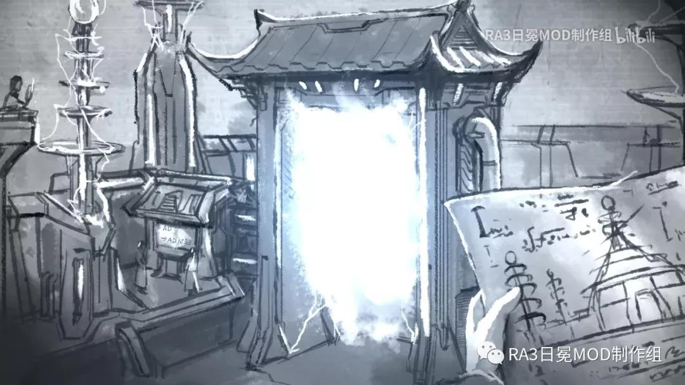
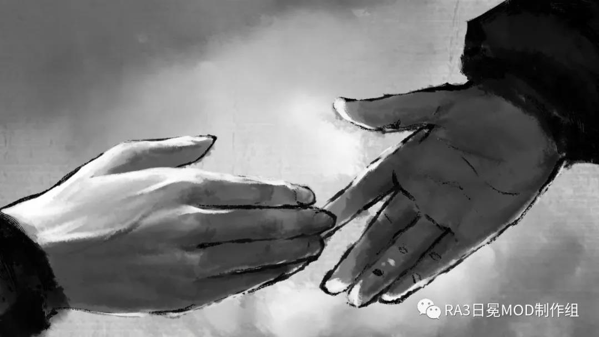

# 神州起源

天命，如水中月化为一阵涟漪，似镜中花碎作一地晶莹。绚烂樱花散落于庭院，虽有幻灭，更有不忿随之而生。

旭日帝国虽因战败而不得不向盟军与苏联同时投降，但由于通过两者的互斗而逃避了大多制裁，帝国终究是以不那么狼狈的姿态退出了它本就不该参与的大战；而在若干年后，当前苏联边境的军阀试图进犯帝国时，达郎天皇用胜利向他明处与暗中的敌人展示了，旭日帝国尚且留存的一战之力。

但当达郎天皇打算进一步震慑俄国入侵者时，在海参崴，盟军占领办公室的强力“调停”让方才回味了旧日荣耀的他惊怒不已，只是太平洋上游弋的庞大盟军舰队群使他不得不冷静下来，授意帝国将军撤军。

即使拥有了超级要塞这等强大的决战兵器，纵然存在着真正意义上战无不胜的帝国将军，达郎还是被迫承认帝国的力量仍无法与盟军相匹敌。

实际上，在这个时间点，美利坚与欧盟联手打造的世界格局已然定型；依靠其在全球范围内所拥有的众多本土与海外基地，蓝色巨鹰在未来科技银色光辉的笼罩下从包括政治经济军事在内的全方面压制着以东亚为中心的“非蓝色区域”。若不出现“源自宇宙的绝对意志”——盟军理事会发言人如是说——同盟国的敌人定然会在封锁完成后的不久彻底瓦解，甚至不需要同盟国再掀战事。

这难道意味着国际上居于不上不下地位的帝国选择了偃旗息鼓吗？

不，居于中间地位的帝国恰恰不会自认为应当接受现实，而是自觉应该继续挑战。

痴迷技术兵器的达郎选择去寻找制造最为强大的武器——强大到能够同时改写过去与未来的武器。

在“大战”中，帝国兵锋曾一度直指莫斯科，先期潜入的忍者因此得以在因前线溃败而混乱的莫斯科机要部门中窃取了关于时间机器几乎全套图纸的副本；不过由于并没能找到任何有效的说明文件，那架可能承载了关键信息的双刃也坠毁在了郊区被摧毁的工业区里尸骨无存，那时候的帝国高层仅仅把其当做某种疯狂的末日武器。

但在西方世界爆出西格玛协调器的丑闻后，此前一直将时间机器作为无稽之谈的达郎，现在也开始重新考虑此事的可行性。

他首先暗中指示帝国的研究所对时间机器的图纸进行全方面的解析，并要求帝国情报网收集以一切与西格玛协调器和时间机器相关的情报——考虑到自己手下的亲卫部队曾经为了“镇压内乱”而与盟军那名指挥官的直属功勋部队合作过一段时间，这并不是什么难事。

其中的具体过程略去不提，但最后的结果是：在苏联的图纸资料、盟军的现时科研信息与帝国强大的机械工程与纳米材料技术的综合之下，达郎和帝国的研究团体成功参透了时间机器的原理，并制作出了能够让帝国缔造属于自己的天命的——时空之门。

在做好所有先期工作后，达郎开始了他的迂回作战：既然正面击败盟军是几乎不可能的，那就摧毁他们强大的根源。

在北九州的秘密基地，能量遵循不可思议的理论模型的指引，在不可思议的传导回路中构造出了不可思议的奇异点，让过去与现实在此处重合。

达郎就站在这连通命运的节点上。

他选择干涉公元 1259 年。

达郎天皇和他的扈从逆时间长河而上；在满目疮痍的华夏大地上，他们冲破了时空的隔离——在钓鱼城外，用纳米虫群构成的护盾救下本应在此处死去的蒙哥。

看着近在咫尺的飞石被挡下，骇然之余，蒙古大汗立即下令收兵——与那些突然出现的拥有非凡神力的“天神”相比，一座城的得失又算得了什么呢？

在城外大营，蒙哥礼待“天神”和“天兵”们；这些“天神”说着古怪的语言，而他们身边的物什似乎将这些语言变成了一种古怪但仍听得懂的蒙古话，这使得这位黄金家族的正统大汗愈发恭敬。

“天神”说，先祖为西方欧罗巴蛮族的恶行所愤怒；因为，蛮族们要为了他们奇怪的偶像而将先祖的天国玷污；而天神们也看不下去这种暴行，要为先祖们主持正义。

蒙哥对此将信将疑，但当“天神”赐予他们“神兵”时，一切怀疑都暂且被抛之脑后……

刀枪弓弩不入而又轻若无物的“银光甲”，无坚不摧的大砲，以及真正意义上削铁如泥的“银光剑”。有这些“神兵”相助，在蒙古大军面前，骑士、雇佣军、城市民兵一触即溃。

蒙哥试图博得不可捉摸的天神的青睐，好为他的南征和东征准备；因此在“神的旨意”下，所有应当对占领区施加的管制手段被全部取消，所有应当驻留在当地的留存兵力集体开拔——前进，前进；朝着神谕中存在的极西之海，不计代价的前进。

神之鞭挥下，海之北山以西的土地被铁蹄踏遍，城堡与教堂都淹没在了火海中；欧洲大陆的人们在空前的压力下纷纷选择乘船远航，试图逃往不列颠群岛甚至……更远的地方。而在当时的航海技术下，这无异于集体自尽。

达郎满意地看着这一切；然而他也知道，即使是有“神风”阻拦，此时他的祖先是肯定无法阻拦这样的蒙古人的……即使夺去他们的神兵。

于是，在大汗在为西征庆功的大宴上，当蒙哥提到要东征和南下时，达郎向蒙哥伸出了手，蒙哥则惊喜而恭敬地接过……他的死亡。

在一阵闪光之后，蒙古大汗便不复存在，同时消失的还有他并不在场的兄弟忽必烈、阿里不哥等人。也就是在这一时刻，在亚欧大陆的东部，所有可以被划分为蒙古统治阶级中高层的人都被消灭了。

在众人惊惶的注视中，达郎挥了挥手，分发给蒙古部队的纳米装备一瞬化为飞灰；然后，他和他的扈从将这个无比庞大且扭曲的帝国倒塌前的最后余音抛诸脑后，消失在时空通道中。

时间线就此分出了新的历史走向，并一往无前的刷新着日、月、年的数字，直到——数百年后。

> 文案：心控、阿尔法
